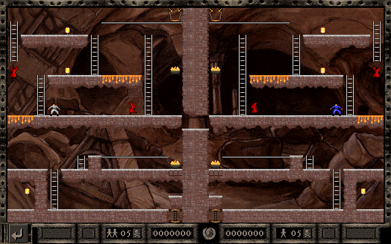

## Level 021
STAGE1 
- [Schematic](pngs_schema/021_s.png)
- <a href="pngs_labeled/LR2_SLITE_2P - 021 - DARK - STAGE1.png">Labeled image</a>
  

## Level 022
STAGE3 
- [Schematic](pngs_schema/022_s.png)
- <a href="pngs_labeled/LR2_SLITE_2P - 022 - DARK - STAGE3.png">Labeled image</a>
  

## Level 023
2-3 UNISON 
- [Schematic](pngs_schema/023_s.png)
- <a href="pngs_labeled/LR2_SLITE_2P - 023 - ANCI - 2-3 UNISON.png">Labeled image</a>
  

