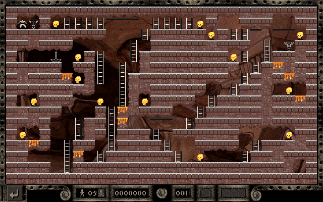

## Level 001
STAGE20 
- [Schematic](pngs_schema/001_s.png)
- <a href="pngs_labeled/LR2_SLITE_THxP - 001 - ANCI - STAGE20.png">Labeled image</a>
  

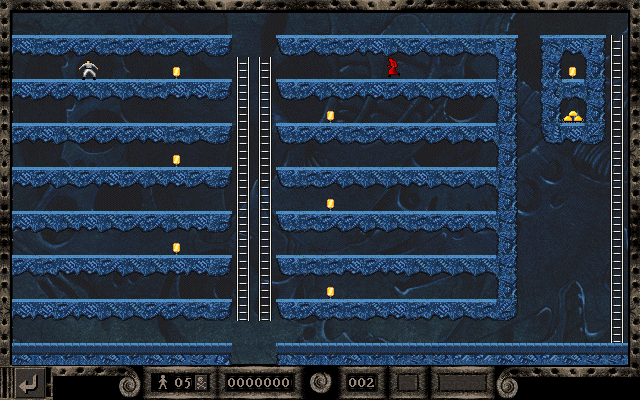

## Level 002
1-2 EASY 
- [Schematic](pngs_schema/002_s.png)
- <a href="pngs_labeled/LR2_SLITE_THxP - 002 - DARK - 1-2 EASY.png">Labeled image</a>
  

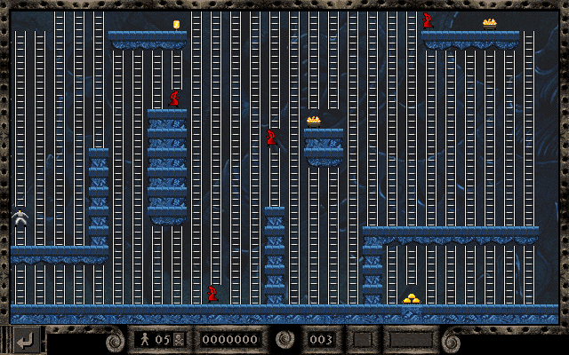

## Level 003
1-3 RADDER 
- [Schematic](pngs_schema/003_s.png)
- <a href="pngs_labeled/LR2_SLITE_THxP - 003 - DARK - 1-3 RADDER.png">Labeled image</a>
  

## Level 004
1-4 NORMAL 
- [Schematic](pngs_schema/004_s.png)
- <a href="pngs_labeled/LR2_SLITE_THxP - 004 - DARK - 1-4 NORMAL.png">Labeled image</a>
  

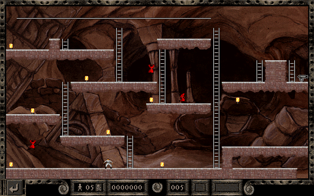

## Level 005
1-5 CAN'T BURY 
- [Schematic](pngs_schema/005_s.png)
- <a href="pngs_labeled/LR2_SLITE_THxP - 005 - ANCI - 1-5 CAN'T BURY.png">Labeled image</a>
  

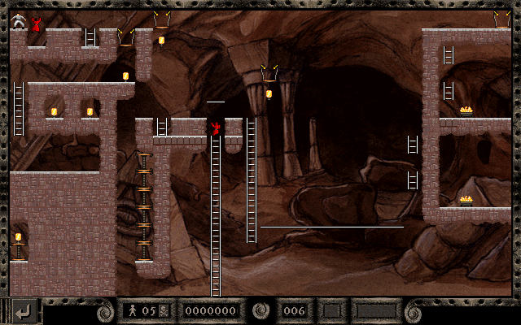

## Level 006
2-1 GAMBLE 
- [Schematic](pngs_schema/006_s.png)
- <a href="pngs_labeled/LR2_SLITE_THxP - 006 - ANCI - 2-1 GAMBLE.png">Labeled image</a>
  

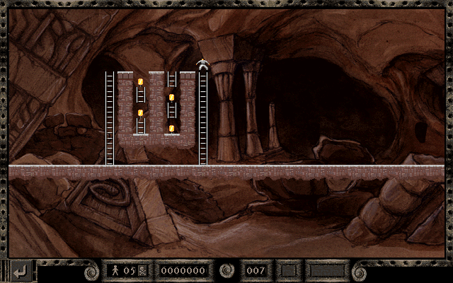

## Level 007
2-2 TECHNICAL 
- [Schematic](pngs_schema/007_s.png)
- <a href="pngs_labeled/LR2_SLITE_THxP - 007 - ANCI - 2-2 TECHNICAL.png">Labeled image</a>
  

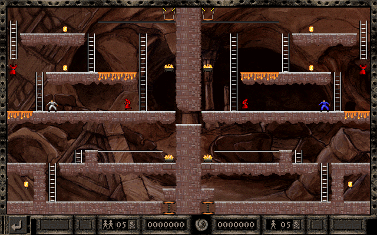

## Level 008
2-3 UNISON 
- [Schematic](pngs_schema/008_s.png)
- <a href="pngs_labeled/LR2_SLITE_THxP - 008 - ANCI - 2-3 UNISON.png">Labeled image</a>
  

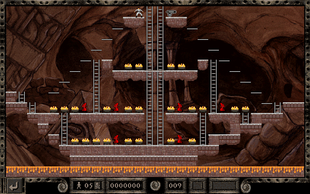

## Level 009
2-4 SHIP 
- [Schematic](pngs_schema/009_s.png)
- <a href="pngs_labeled/LR2_SLITE_THxP - 009 - ANCI - 2-4 SHIP.png">Labeled image</a>
  

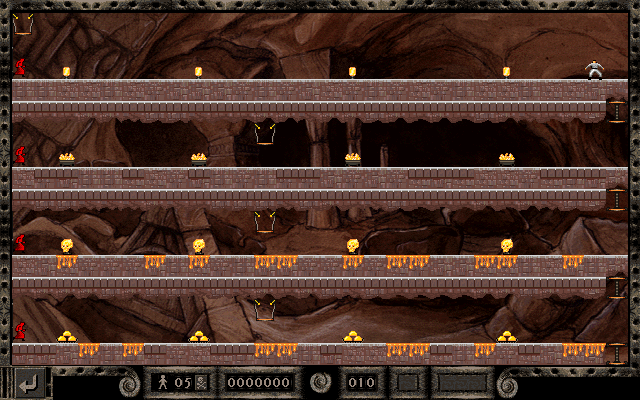

## Level 010
2-5 RUNAWAY! 
- [Schematic](pngs_schema/010_s.png)
- <a href="pngs_labeled/LR2_SLITE_THxP - 010 - ANCI - 2-5 RUNAWAY.png">Labeled image</a>
  

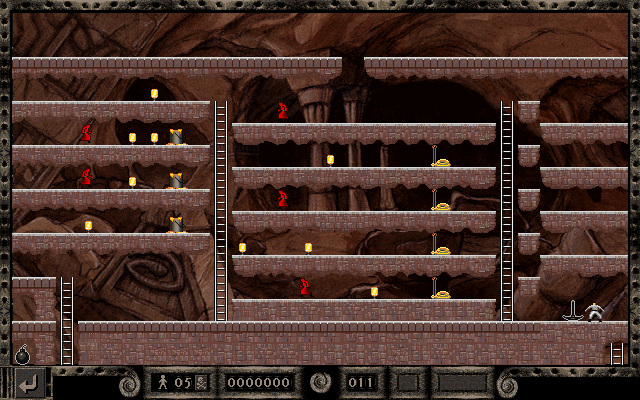

## Level 011
3-1 RENSA 
- [Schematic](pngs_schema/011_s.png)
- <a href="pngs_labeled/LR2_SLITE_THxP - 011 - ANCI - 3-1 RENSA.png">Labeled image</a>
  

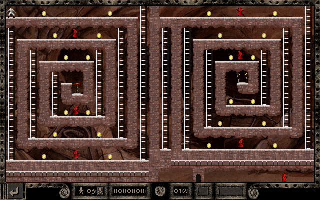

## Level 012
3-2 GURU^2 
- [Schematic](pngs_schema/012_s.png)
- <a href="pngs_labeled/LR2_SLITE_THxP - 012 - ANCI - 3-2 GURU^2.png">Labeled image</a>
  

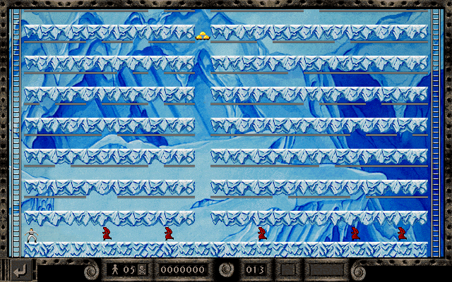

## Level 013
3-3 FAKE 
- [Schematic](pngs_schema/013_s.png)
- <a href="pngs_labeled/LR2_SLITE_THxP - 013 - ICEW - 3-3 FAKE.png">Labeled image</a>
  

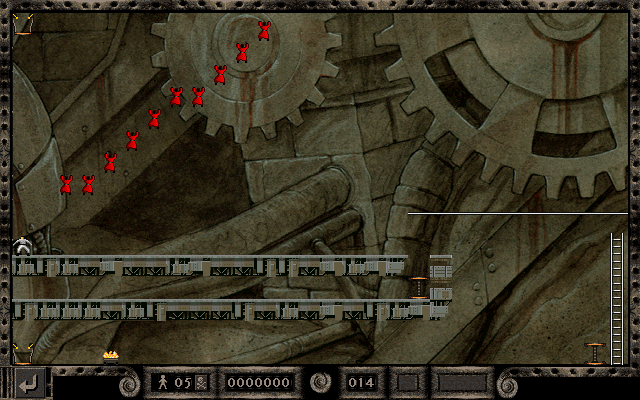

## Level 014
3-4 SHORTEST 
- [Schematic](pngs_schema/014_s.png)
- <a href="pngs_labeled/LR2_SLITE_THxP - 014 - INDU - 3-4 SHORTEST.png">Labeled image</a>
  

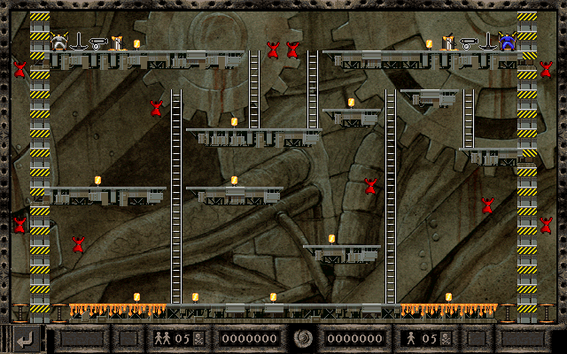

## Level 015
3-5 SEAL 
- [Schematic](pngs_schema/015_s.png)
- <a href="pngs_labeled/LR2_SLITE_THxP - 015 - INDU - 3-5 SEAL.png">Labeled image</a>
  

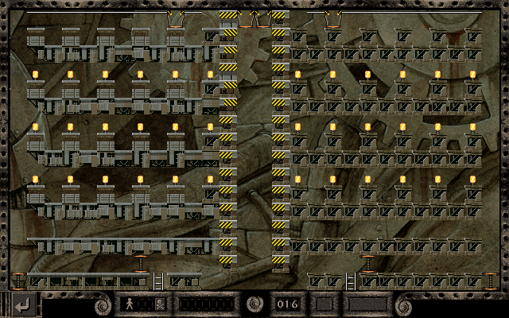

## Level 016
4-1 CONTROLL 
- [Schematic](pngs_schema/016_s.png)
- <a href="pngs_labeled/LR2_SLITE_THxP - 016 - INDU - 4-1 CONTROLL.png">Labeled image</a>
  

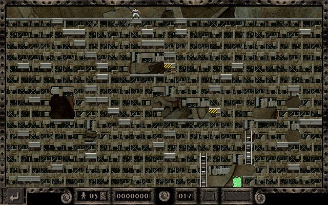

## Level 017
DIG DIG 
- [Schematic](pngs_schema/017_s.png)
- <a href="pngs_labeled/LR2_SLITE_THxP - 017 - INDU - DIG DIG.png">Labeled image</a>
  

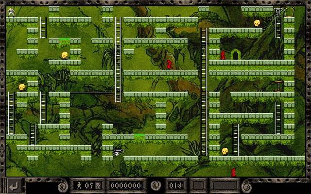

## Level 018
JUNGLE CRUISE 
- [Schematic](pngs_schema/018_s.png)
- <a href="pngs_labeled/LR2_SLITE_THxP - 018 - MOSS - JUNGLE CRUISE.png">Labeled image</a>
  

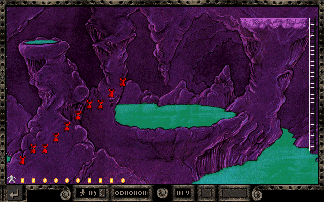

## Level 019
NIAGALA 
- [Schematic](pngs_schema/019_s.png)
- <a href="pngs_labeled/LR2_SLITE_THxP - 019 - PHOS - NIAGALA.png">Labeled image</a>
  

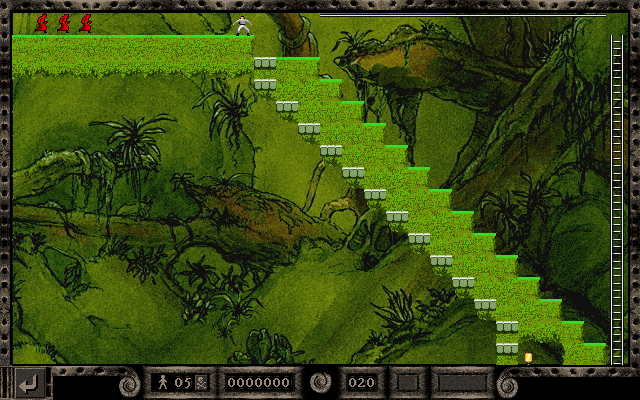

## Level 020
STAIRWAY TO HEAVEN 
- [Schematic](pngs_schema/020_s.png)
- <a href="pngs_labeled/LR2_SLITE_THxP - 020 - MOSS - STAIRWAY TO HEAVEN.png">Labeled image</a>
  

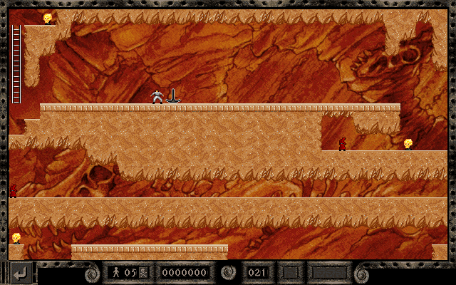

## Level 021
SUBTURAINIAN 
- [Schematic](pngs_schema/021_s.png)
- <a href="pngs_labeled/LR2_SLITE_THxP - 021 - FOSS - SUBTURAINIAN.png">Labeled image</a>
  

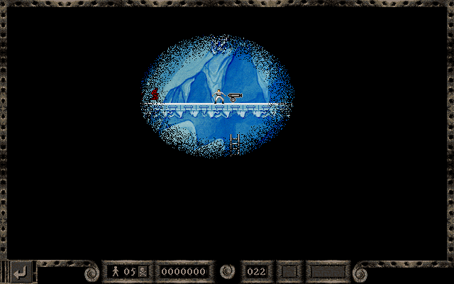

## Level 022
WINTER MATERIAL 
- [Schematic](pngs_schema/022_s.png)
- <a href="pngs_labeled/LR2_SLITE_THxP - 022 - ICEW - WINTER MATERIAL.png">Labeled image</a>
  

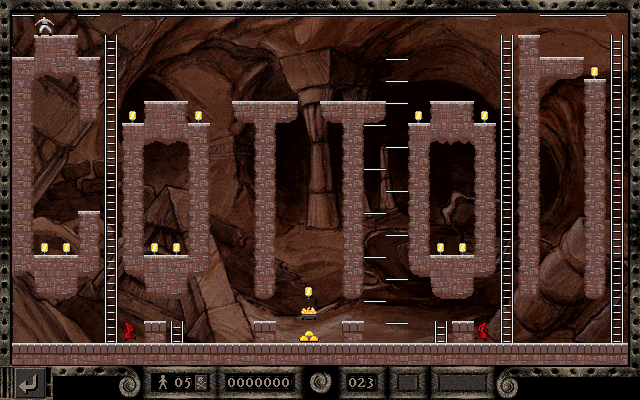

## Level 023
COTTON 
- [Schematic](pngs_schema/023_s.png)
- <a href="pngs_labeled/LR2_SLITE_THxP - 023 - ANCI - COTTON.png">Labeled image</a>
  

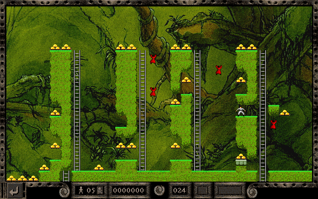

## Level 024
FROM EMPIRE!! 01 
- [Schematic](pngs_schema/024_s.png)
- <a href="pngs_labeled/LR2_SLITE_THxP - 024 - MOSS - FROM EMPIRE 01.png">Labeled image</a>
  

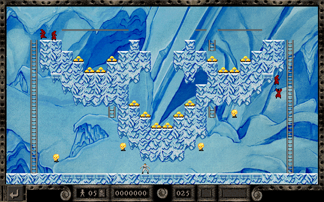

## Level 025
FROM EMPIRE!! 02 
- [Schematic](pngs_schema/025_s.png)
- <a href="pngs_labeled/LR2_SLITE_THxP - 025 - ICEW - FROM EMPIRE 02.png">Labeled image</a>
  

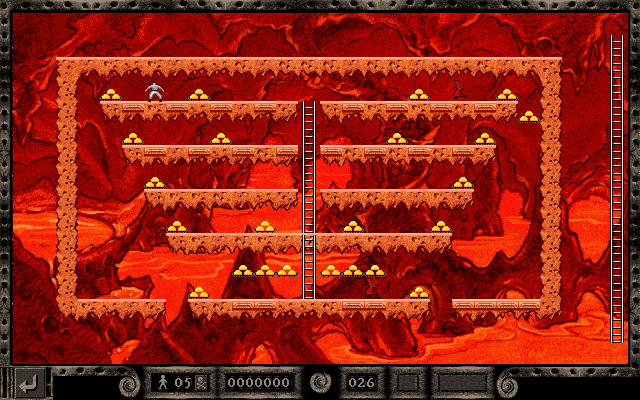

## Level 026
FROM EMPIRE!! 03 
- [Schematic](pngs_schema/026_s.png)
- <a href="pngs_labeled/LR2_SLITE_THxP - 026 - LAVA - FROM EMPIRE 03.png">Labeled image</a>
  

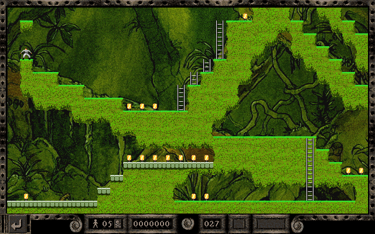

## Level 027
MISSION 1 
- [Schematic](pngs_schema/027_s.png)
- <a href="pngs_labeled/LR2_SLITE_THxP - 027 - MOSS - MISSION 1.png">Labeled image</a>
  

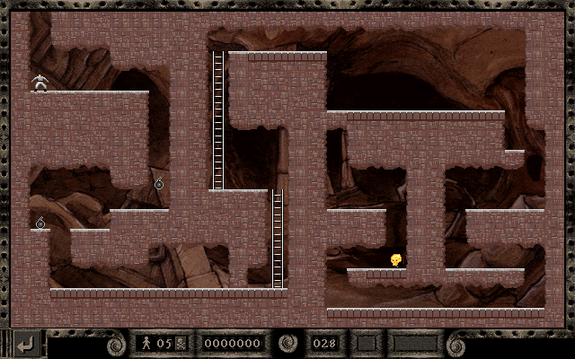

## Level 028
MISSION 2 
- [Schematic](pngs_schema/028_s.png)
- <a href="pngs_labeled/LR2_SLITE_THxP - 028 - ANCI - MISSION 2.png">Labeled image</a>
  

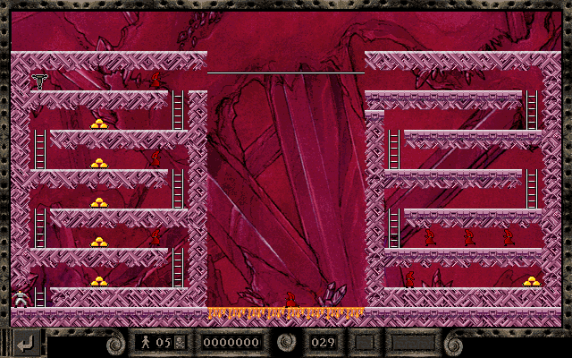

## Level 029
MISSION 3 
- [Schematic](pngs_schema/029_s.png)
- <a href="pngs_labeled/LR2_SLITE_THxP - 029 - CRYS - MISSION 3.png">Labeled image</a>
  

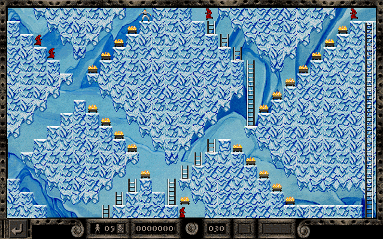

## Level 030
MISSION 4 
- [Schematic](pngs_schema/030_s.png)
- <a href="pngs_labeled/LR2_SLITE_THxP - 030 - ICEW - MISSION 4.png">Labeled image</a>
  

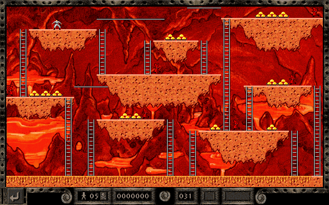

## Level 031
MISSION 5 
- [Schematic](pngs_schema/031_s.png)
- <a href="pngs_labeled/LR2_SLITE_THxP - 031 - LAVA - MISSION 5.png">Labeled image</a>
  

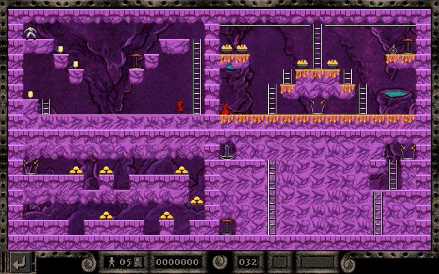

## Level 032
MISSION 6 
- [Schematic](pngs_schema/032_s.png)
- <a href="pngs_labeled/LR2_SLITE_THxP - 032 - PHOS - MISSION 6.png">Labeled image</a>
  

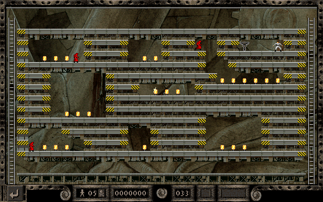

## Level 033
MISSION 7 
- [Schematic](pngs_schema/033_s.png)
- <a href="pngs_labeled/LR2_SLITE_THxP - 033 - INDU - MISSION 7.png">Labeled image</a>
  

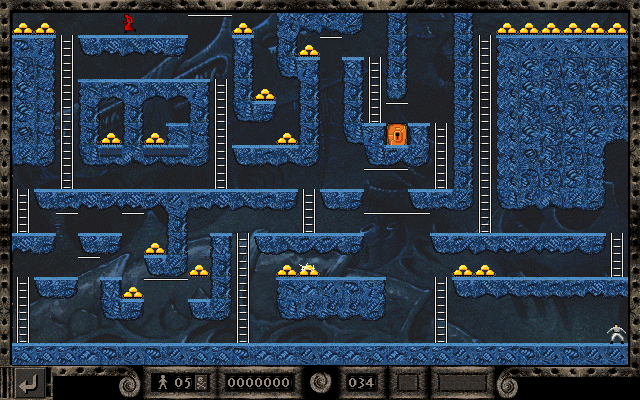

## Level 034
MISSION 8 
- [Schematic](pngs_schema/034_s.png)
- <a href="pngs_labeled/LR2_SLITE_THxP - 034 - DARK - MISSION 8.png">Labeled image</a>
  

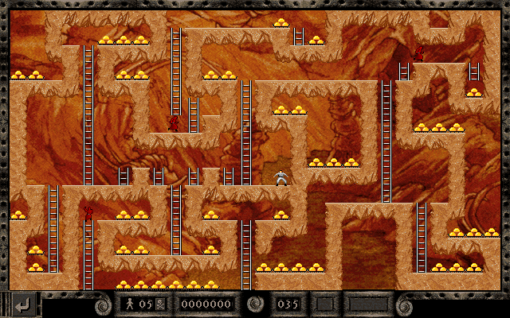

## Level 035
MISSION 9 
- [Schematic](pngs_schema/035_s.png)
- <a href="pngs_labeled/LR2_SLITE_THxP - 035 - FOSS - MISSION 9.png">Labeled image</a>
  

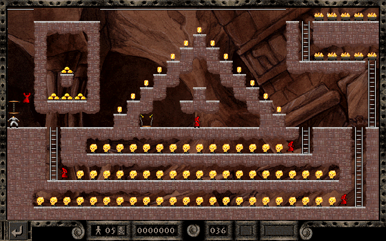

## Level 036
MISSION 10 
- [Schematic](pngs_schema/036_s.png)
- <a href="pngs_labeled/LR2_SLITE_THxP - 036 - ANCI - MISSION 10.png">Labeled image</a>
  

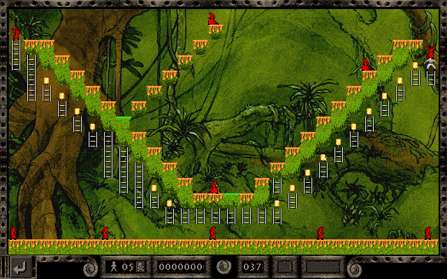

## Level 037
MISSION 11 
- [Schematic](pngs_schema/037_s.png)
- <a href="pngs_labeled/LR2_SLITE_THxP - 037 - MOSS - MISSION 11.png">Labeled image</a>
  

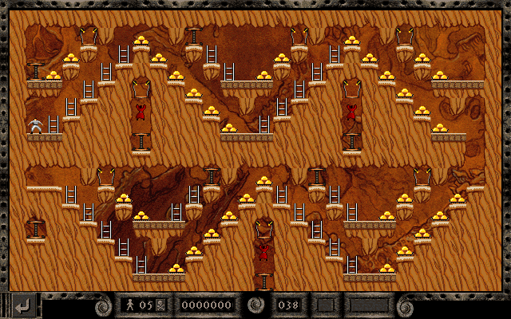

## Level 038
MISSION 12 
- [Schematic](pngs_schema/038_s.png)
- <a href="pngs_labeled/LR2_SLITE_THxP - 038 - FUNG - MISSION 12.png">Labeled image</a>
  

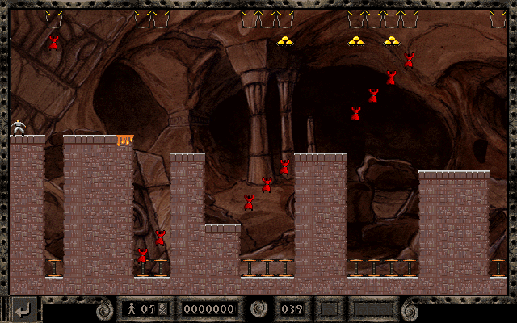

## Level 039
MISSION 13 
- [Schematic](pngs_schema/039_s.png)
- <a href="pngs_labeled/LR2_SLITE_THxP - 039 - ANCI - MISSION 13.png">Labeled image</a>
  

## Level 040
MISSION 14 
- [Schematic](pngs_schema/040_s.png)
- <a href="pngs_labeled/LR2_SLITE_THxP - 040 - CRYS - MISSION 14.png">Labeled image</a>
  

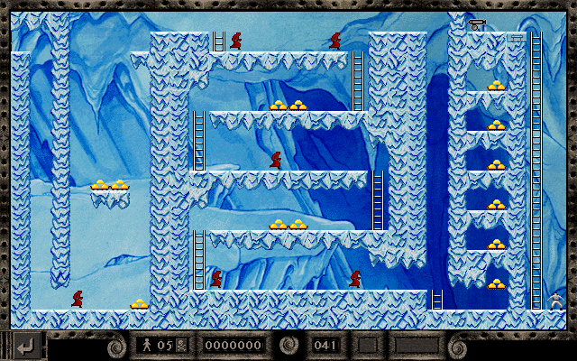

## Level 041
MISSION 15 
- [Schematic](pngs_schema/041_s.png)
- <a href="pngs_labeled/LR2_SLITE_THxP - 041 - ICEW - MISSION 15.png">Labeled image</a>
  

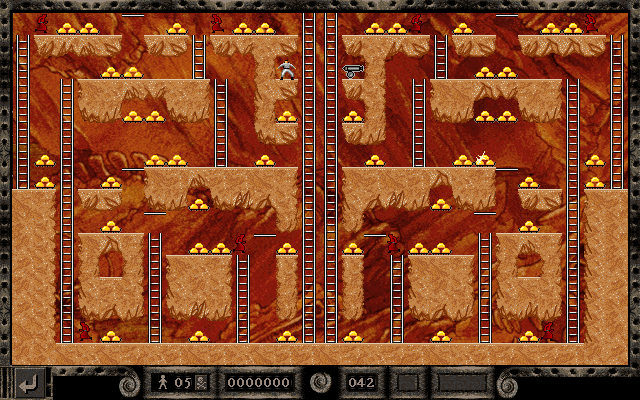

## Level 042
MISSION 16 
- [Schematic](pngs_schema/042_s.png)
- <a href="pngs_labeled/LR2_SLITE_THxP - 042 - FOSS - MISSION 16.png">Labeled image</a>
  

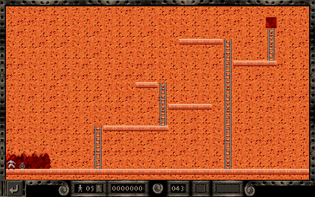

## Level 043
MISSION 17 
- [Schematic](pngs_schema/043_s.png)
- <a href="pngs_labeled/LR2_SLITE_THxP - 043 - LAVA - MISSION 17.png">Labeled image</a>
  

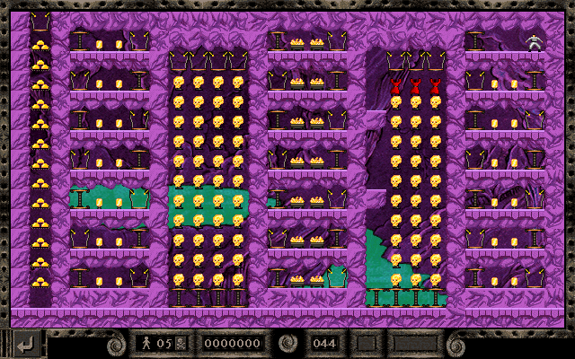

## Level 044
MISSION 18 
- [Schematic](pngs_schema/044_s.png)
- <a href="pngs_labeled/LR2_SLITE_THxP - 044 - PHOS - MISSION 18.png">Labeled image</a>
  

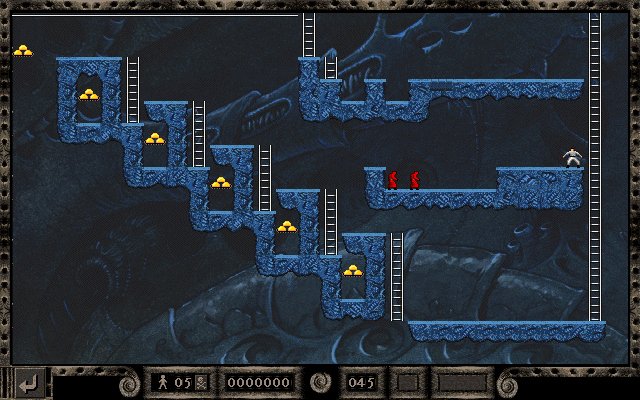

## Level 045
MISSION 19 
- [Schematic](pngs_schema/045_s.png)
- <a href="pngs_labeled/LR2_SLITE_THxP - 045 - DARK - MISSION 19.png">Labeled image</a>
  

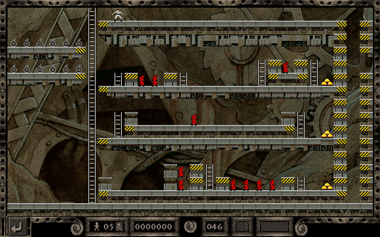

## Level 046
MISSION 20 
- [Schematic](pngs_schema/046_s.png)
- <a href="pngs_labeled/LR2_SLITE_THxP - 046 - INDU - MISSION 20.png">Labeled image</a>
  

## Level 047
STAGE1 
- [Schematic](pngs_schema/047_s.png)
- <a href="pngs_labeled/LR2_SLITE_THxP - 047 - DARK - STAGE1.png">Labeled image</a>
  

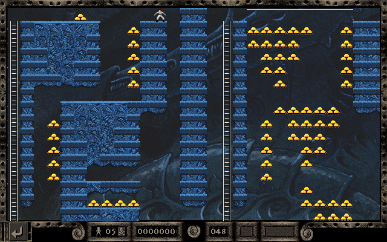

## Level 048
STAGE2 
- [Schematic](pngs_schema/048_s.png)
- <a href="pngs_labeled/LR2_SLITE_THxP - 048 - DARK - STAGE2.png">Labeled image</a>
  

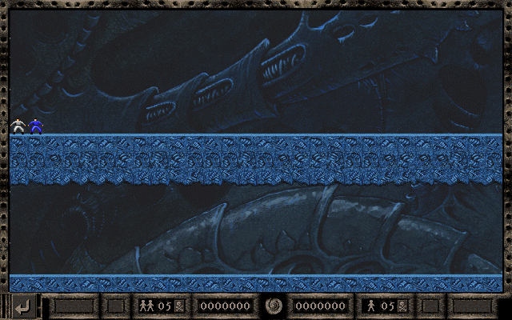

## Level 049
STAGE3 
- [Schematic](pngs_schema/049_s.png)
- <a href="pngs_labeled/LR2_SLITE_THxP - 049 - DARK - STAGE3.png">Labeled image</a>
  

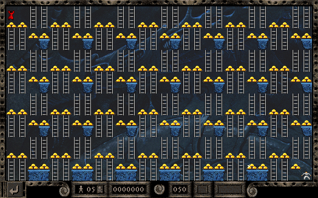

## Level 050
STAGE4 
- [Schematic](pngs_schema/050_s.png)
- <a href="pngs_labeled/LR2_SLITE_THxP - 050 - DARK - STAGE4.png">Labeled image</a>
  

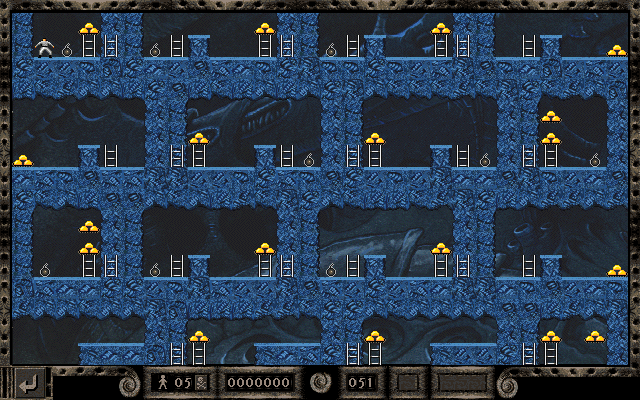

## Level 051
STAGE5 
- [Schematic](pngs_schema/051_s.png)
- <a href="pngs_labeled/LR2_SLITE_THxP - 051 - DARK - STAGE5.png">Labeled image</a>
  

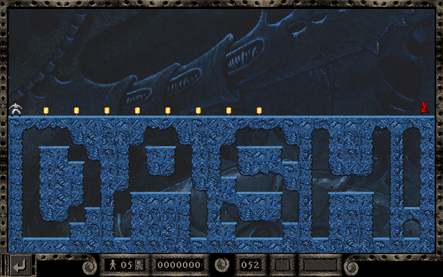

## Level 052
STAGE6 
- [Schematic](pngs_schema/052_s.png)
- <a href="pngs_labeled/LR2_SLITE_THxP - 052 - DARK - STAGE6.png">Labeled image</a>
  

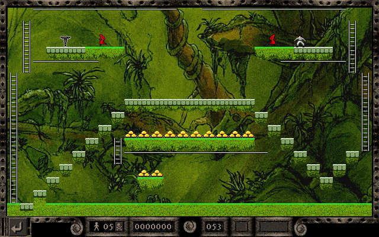

## Level 053
STAGE7 
- [Schematic](pngs_schema/053_s.png)
- <a href="pngs_labeled/LR2_SLITE_THxP - 053 - MOSS - STAGE7.png">Labeled image</a>
  

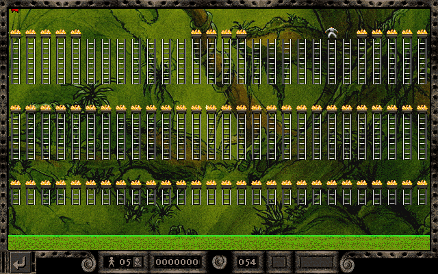

## Level 054
STAGE8 
- [Schematic](pngs_schema/054_s.png)
- <a href="pngs_labeled/LR2_SLITE_THxP - 054 - MOSS - STAGE8.png">Labeled image</a>
  

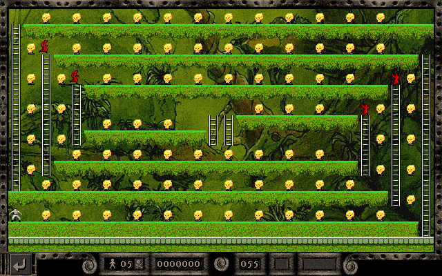

## Level 055
STAGE9 
- [Schematic](pngs_schema/055_s.png)
- <a href="pngs_labeled/LR2_SLITE_THxP - 055 - MOSS - STAGE9.png">Labeled image</a>
  

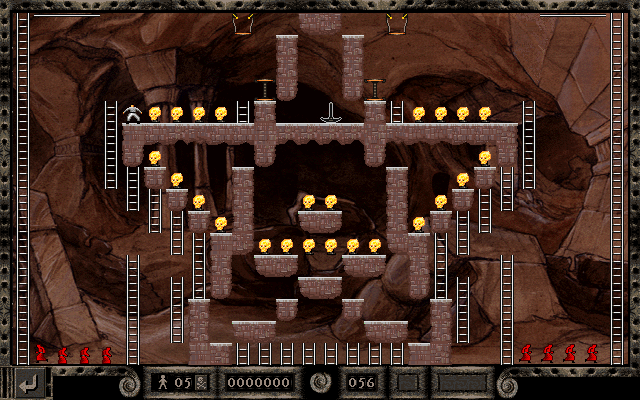

## Level 056
STAGE10 
- [Schematic](pngs_schema/056_s.png)
- <a href="pngs_labeled/LR2_SLITE_THxP - 056 - ANCI - STAGE10.png">Labeled image</a>
  

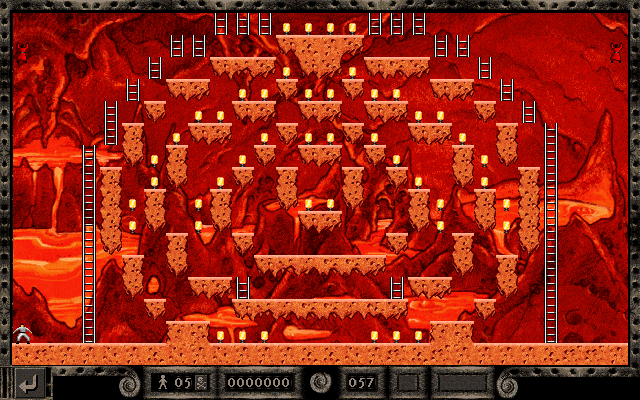

## Level 057
STAGE11 
- [Schematic](pngs_schema/057_s.png)
- <a href="pngs_labeled/LR2_SLITE_THxP - 057 - LAVA - STAGE11.png">Labeled image</a>
  

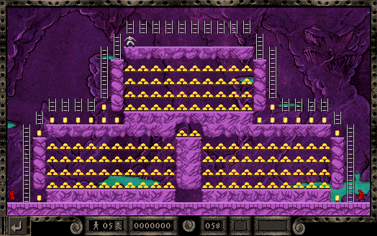

## Level 058
STAGE12 
- [Schematic](pngs_schema/058_s.png)
- <a href="pngs_labeled/LR2_SLITE_THxP - 058 - PHOS - STAGE12.png">Labeled image</a>
  

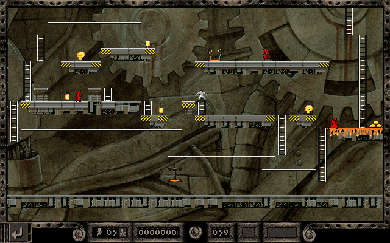

## Level 059
STAGE13 
- [Schematic](pngs_schema/059_s.png)
- <a href="pngs_labeled/LR2_SLITE_THxP - 059 - INDU - STAGE13.png">Labeled image</a>
  

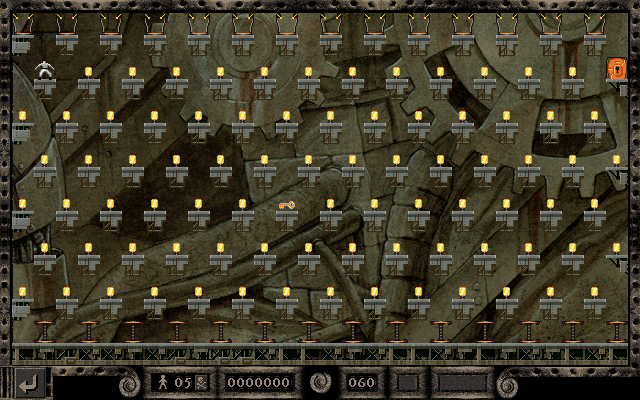

## Level 060
STAGE14 
- [Schematic](pngs_schema/060_s.png)
- <a href="pngs_labeled/LR2_SLITE_THxP - 060 - INDU - STAGE14.png">Labeled image</a>
  

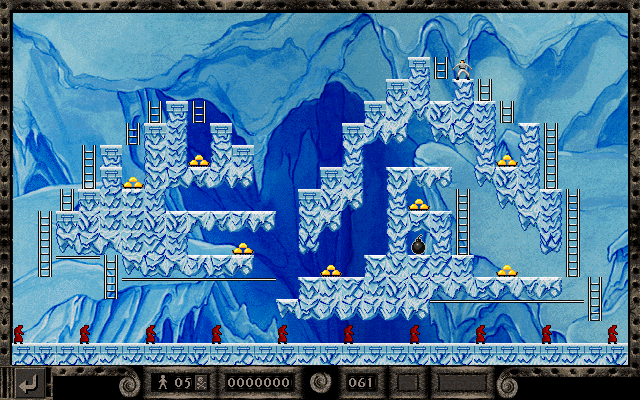

## Level 061
STAGE15 
- [Schematic](pngs_schema/061_s.png)
- <a href="pngs_labeled/LR2_SLITE_THxP - 061 - ICEW - STAGE15.png">Labeled image</a>
  

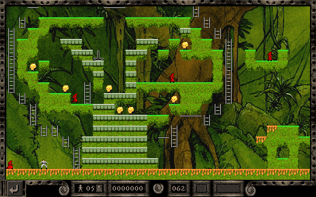

## Level 062
STAGE16 
- [Schematic](pngs_schema/062_s.png)
- <a href="pngs_labeled/LR2_SLITE_THxP - 062 - MOSS - STAGE16.png">Labeled image</a>
  

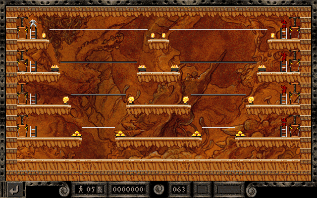

## Level 063
STAGE17 
- [Schematic](pngs_schema/063_s.png)
- <a href="pngs_labeled/LR2_SLITE_THxP - 063 - FUNG - STAGE17.png">Labeled image</a>
  

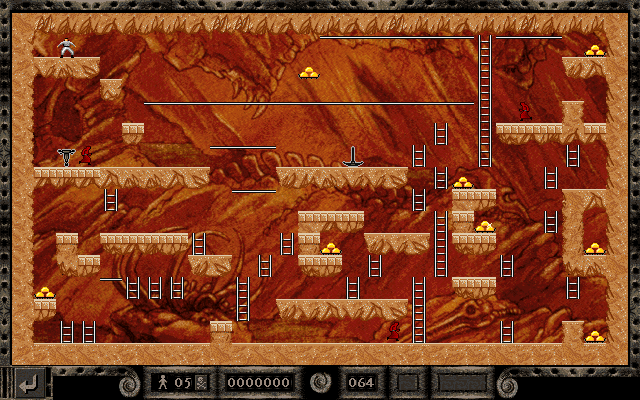

## Level 064
STAGE18 
- [Schematic](pngs_schema/064_s.png)
- <a href="pngs_labeled/LR2_SLITE_THxP - 064 - FOSS - STAGE18.png">Labeled image</a>
  

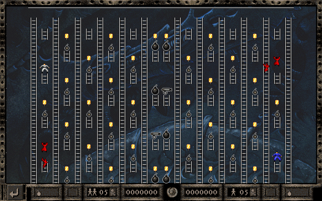

## Level 065
STAGE19 
- [Schematic](pngs_schema/065_s.png)
- <a href="pngs_labeled/LR2_SLITE_THxP - 065 - DARK - STAGE19.png">Labeled image</a>
  

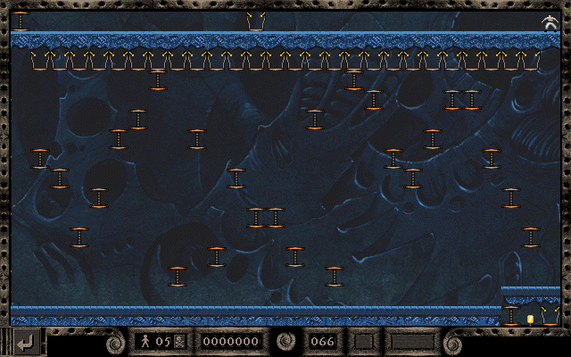

## Level 066
1-1 WARP 
- [Schematic](pngs_schema/066_s.png)
- <a href="pngs_labeled/LR2_SLITE_THxP - 066 - DARK - 1-1 WARP.png">Labeled image</a>
  

