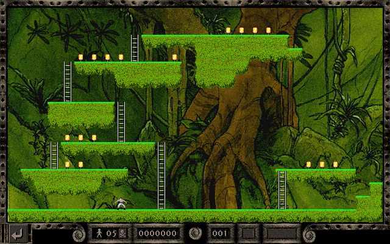

## Level 001
TAKE THE GOLD! 
- [Schematic](pngs_schema/001_s.png)
  

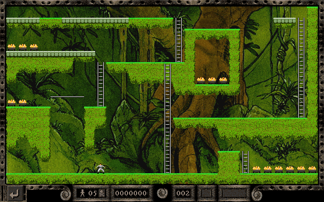

## Level 002
DIG A ROW 
- [Schematic](pngs_schema/002_s.png)
  

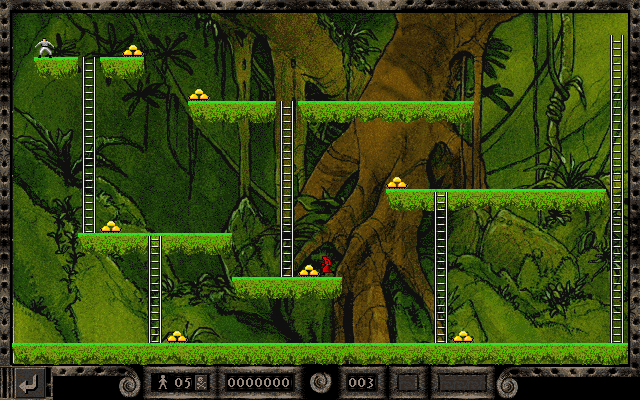

## Level 003
TREE HOUSE 
- [Schematic](pngs_schema/003_s.png)
  

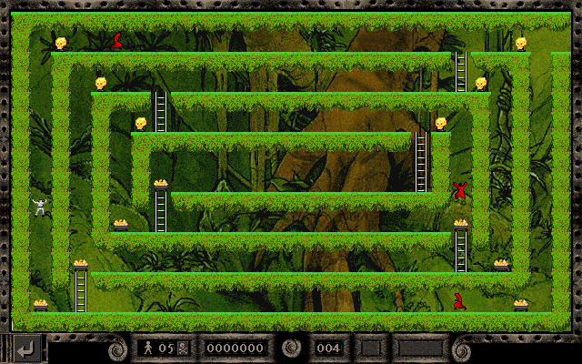

## Level 004
SIMPLE? 
- [Schematic](pngs_schema/004_s.png)
  

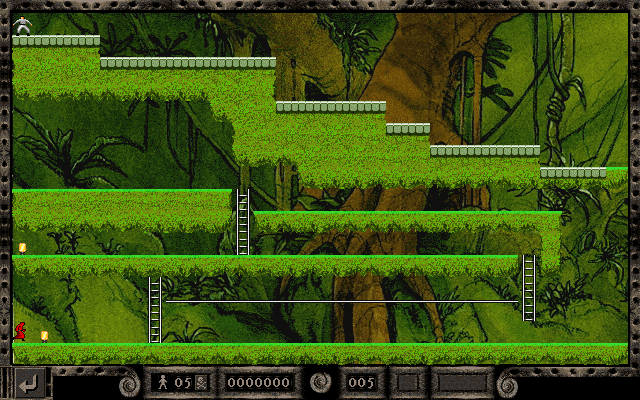

## Level 005
DIG 'N' WAIT 
- [Schematic](pngs_schema/005_s.png)
  

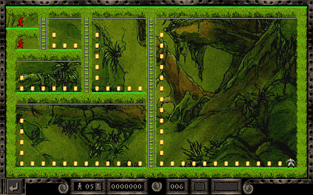

## Level 006
MONDRAIN 
- [Schematic](pngs_schema/006_s.png)
  

## Level 007
HIGH RISE 
- [Schematic](pngs_schema/007_s.png)
  

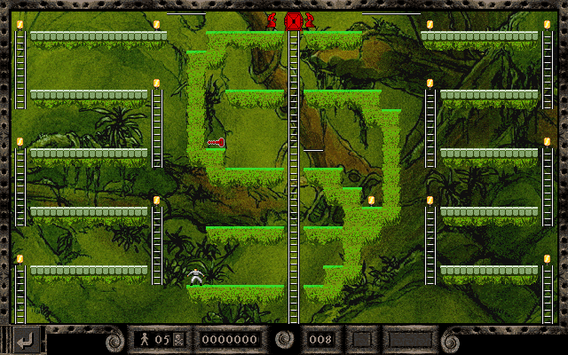

## Level 008
OGRE 
- [Schematic](pngs_schema/008_s.png)
  

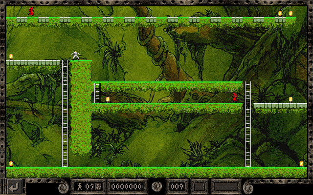

## Level 009
KILL 'EM DELIVERY 
- [Schematic](pngs_schema/009_s.png)
  

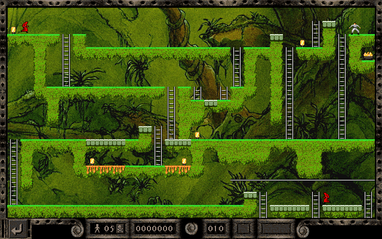

## Level 010
THE LONG WAY AROUND 
- [Schematic](pngs_schema/010_s.png)
  

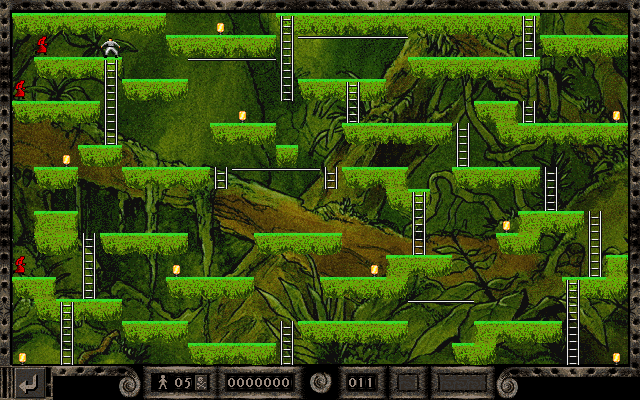

## Level 011
PLATFORM PERFORMANCE 
- [Schematic](pngs_schema/011_s.png)
  

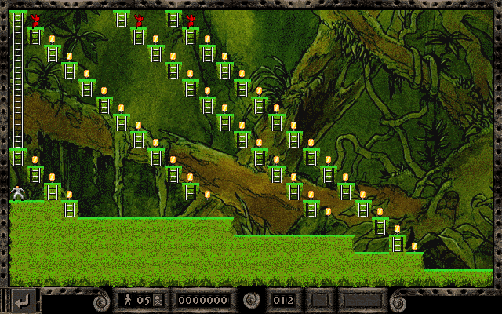

## Level 012
THEY'RE COMING DOWN 
- [Schematic](pngs_schema/012_s.png)
  

## Level 013
WITHIN 
- [Schematic](pngs_schema/013_s.png)
  

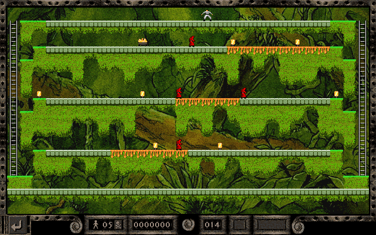

## Level 014
STRANGE ATTRACTION 
- [Schematic](pngs_schema/014_s.png)
  

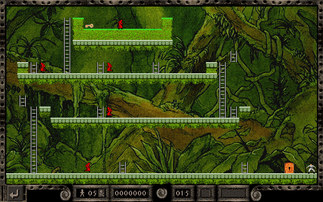

## Level 015
IRONCLAD 
- [Schematic](pngs_schema/015_s.png)
  

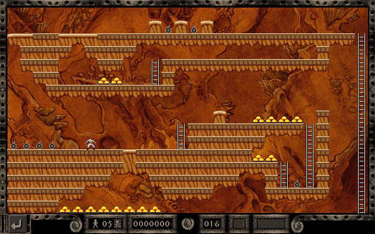

## Level 016
BOMB THRU 
- [Schematic](pngs_schema/016_s.png)
  

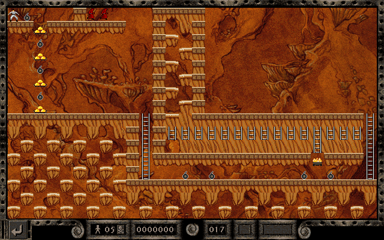

## Level 017
BOMB CHECK 
- [Schematic](pngs_schema/017_s.png)
  

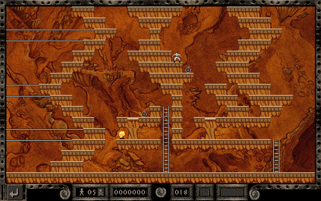

## Level 018
COMPRESSION 
- [Schematic](pngs_schema/018_s.png)
  

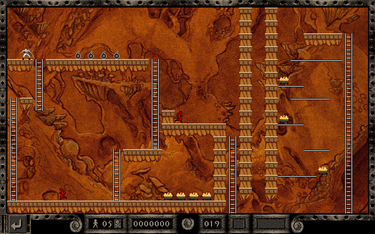

## Level 019
BOMB THE MONK 
- [Schematic](pngs_schema/019_s.png)
  

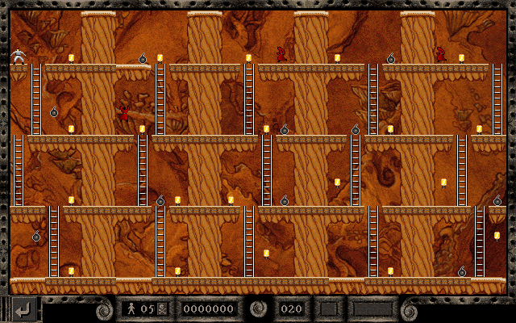

## Level 020
BOMB BAYS 
- [Schematic](pngs_schema/020_s.png)
  

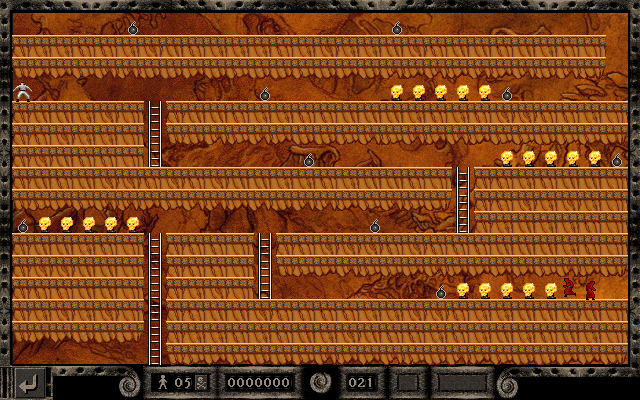

## Level 021
FORTRESS 
- [Schematic](pngs_schema/021_s.png)
  

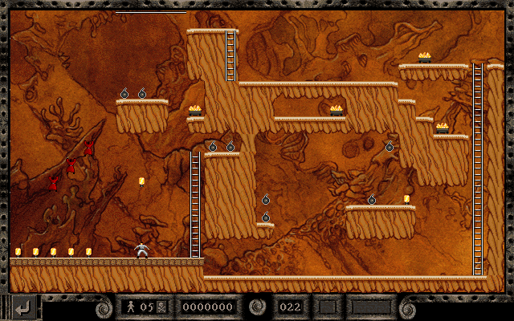

## Level 022
BOMBS AWAY 
- [Schematic](pngs_schema/022_s.png)
  

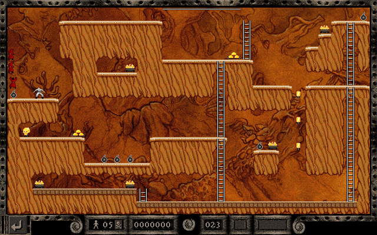

## Level 023
FUN BOMBS 
- [Schematic](pngs_schema/023_s.png)
  

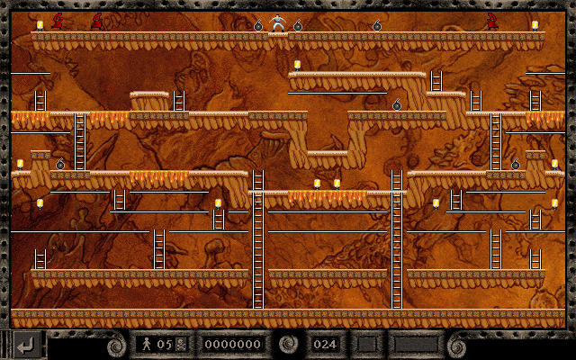

## Level 024
THINK AHEAD 
- [Schematic](pngs_schema/024_s.png)
  

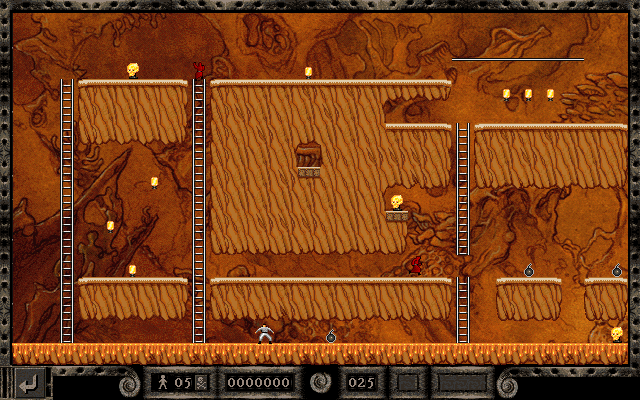

## Level 025
FLYPAPER 
- [Schematic](pngs_schema/025_s.png)
  

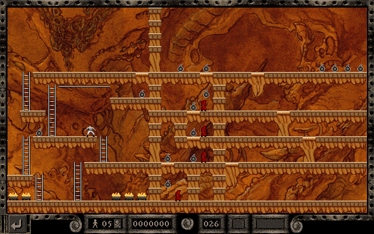

## Level 026
BLAST RADIUS 
- [Schematic](pngs_schema/026_s.png)
  

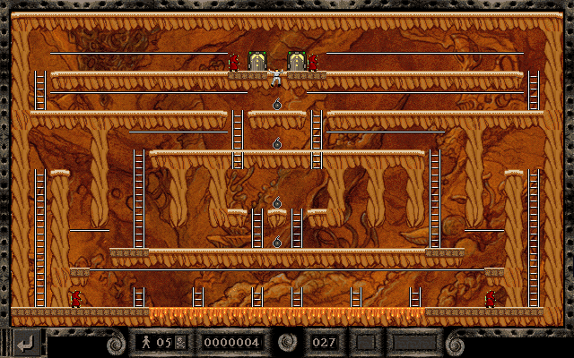

## Level 027
FOLLOW THE FUSES 
- [Schematic](pngs_schema/027_s.png)
  

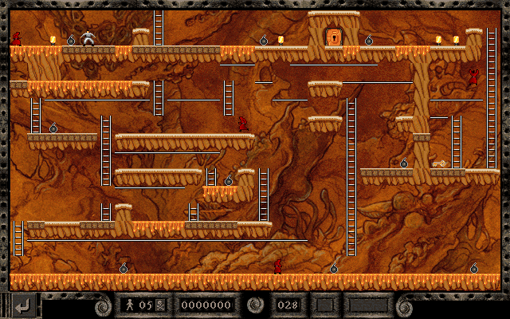

## Level 028
QUICK EYE, SLOW FOOT 
- [Schematic](pngs_schema/028_s.png)
  

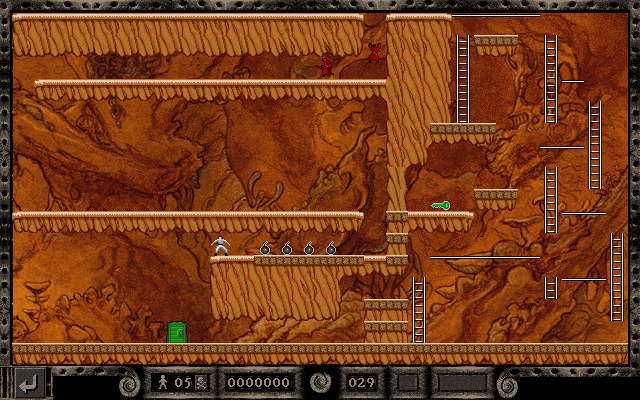

## Level 029
UP BOMB 
- [Schematic](pngs_schema/029_s.png)
  

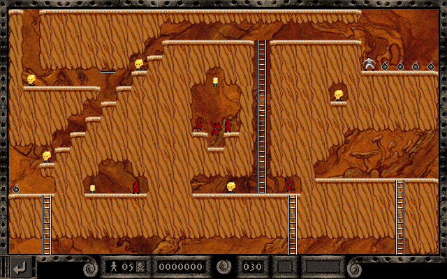

## Level 030
DIG YOUR GRAVE 
- [Schematic](pngs_schema/030_s.png)
  

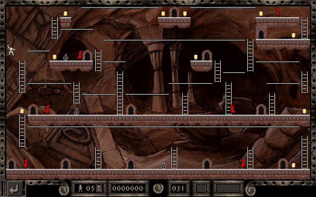

## Level 031
RED LIGHT, GREEN LIGHT 
- [Schematic](pngs_schema/031_s.png)
  

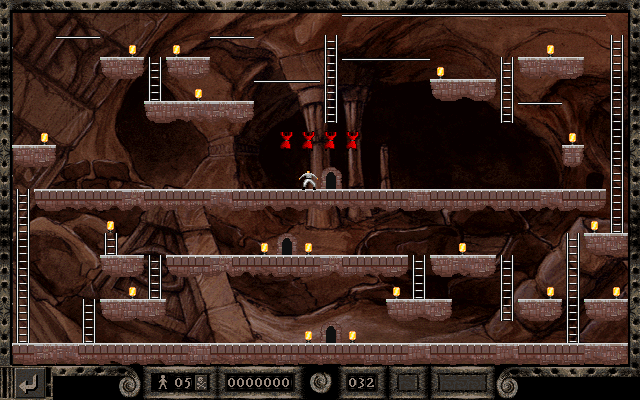

## Level 032
DODGE THE POSSE 
- [Schematic](pngs_schema/032_s.png)
  

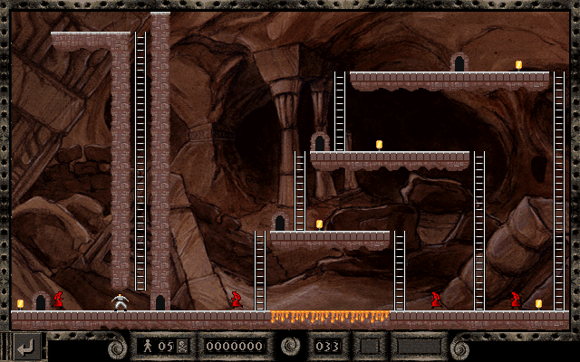

## Level 033
NOW YOU SEE ME 
- [Schematic](pngs_schema/033_s.png)
  

## Level 034
BY THE BOX 
- [Schematic](pngs_schema/034_s.png)
  

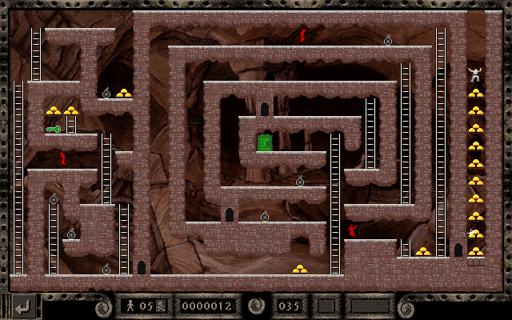

## Level 035
ONE MILE DROP 
- [Schematic](pngs_schema/035_s.png)
  

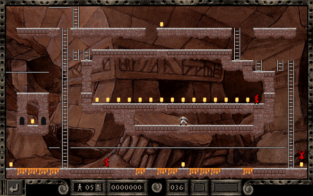

## Level 036
HEY FELLAS! OVER HERE! 
- [Schematic](pngs_schema/036_s.png)
  

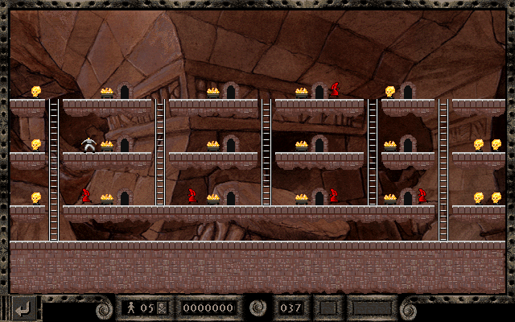

## Level 037
HIDEAWAY CITY 
- [Schematic](pngs_schema/037_s.png)
  

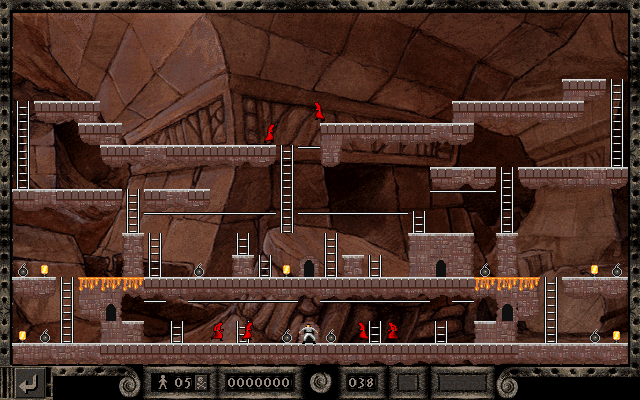

## Level 038
STAY OUTA THE BASEMENT 
- [Schematic](pngs_schema/038_s.png)
  

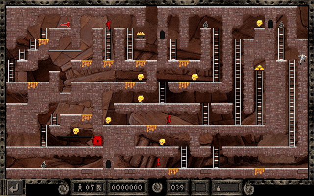

## Level 039
THE BIGGEST DROP 
- [Schematic](pngs_schema/039_s.png)
  

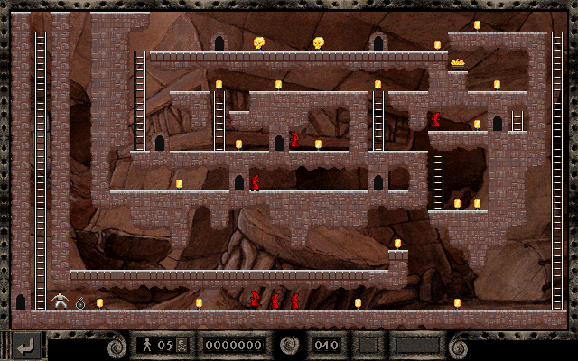

## Level 040
ROUNDUP 
- [Schematic](pngs_schema/040_s.png)
  

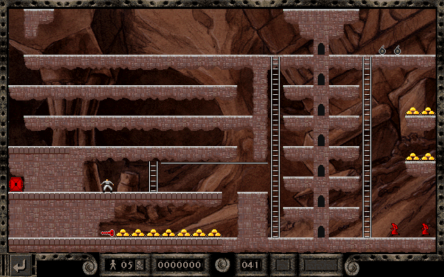

## Level 041
WILD CHASE 
- [Schematic](pngs_schema/041_s.png)
  

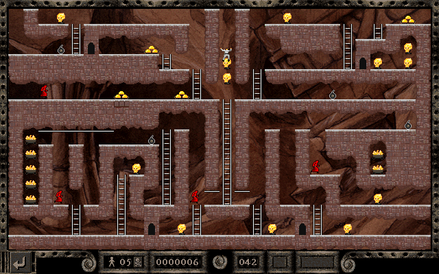

## Level 042
ANOTHER DROP 
- [Schematic](pngs_schema/042_s.png)
  

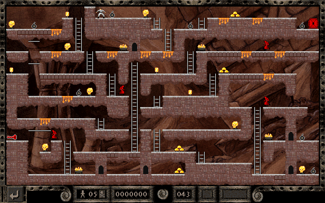

## Level 043
LISTEN 
- [Schematic](pngs_schema/043_s.png)
  

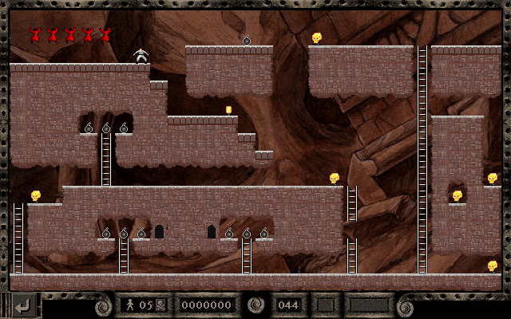

## Level 044
MORE HAPPY BOMBS 
- [Schematic](pngs_schema/044_s.png)
  

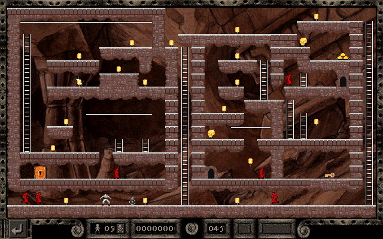

## Level 045
THE RIGHT ATTRACTION 
- [Schematic](pngs_schema/045_s.png)
  

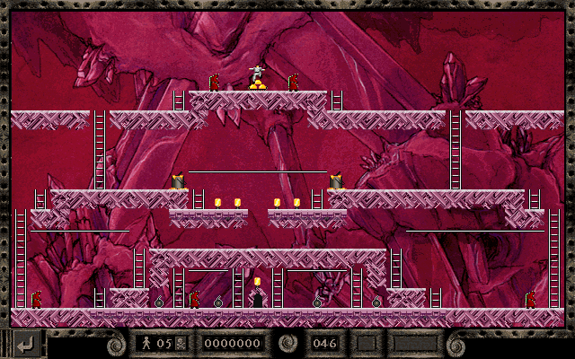

## Level 046
I SAID STAY OUTA THE BASEMENT 
- [Schematic](pngs_schema/046_s.png)
  

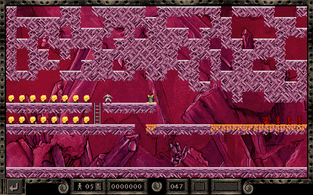

## Level 047
GOOP 'EM DOWN 
- [Schematic](pngs_schema/047_s.png)
  

## Level 048
GOOEY MAZE 
- [Schematic](pngs_schema/048_s.png)
  

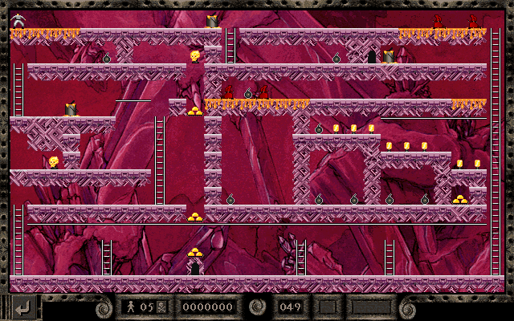

## Level 049
HIDE THE GOO 
- [Schematic](pngs_schema/049_s.png)
  

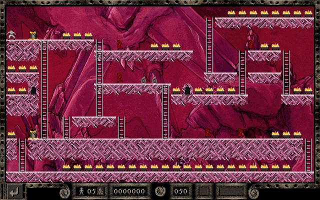

## Level 050
G'ROUND 
- [Schematic](pngs_schema/050_s.png)
  

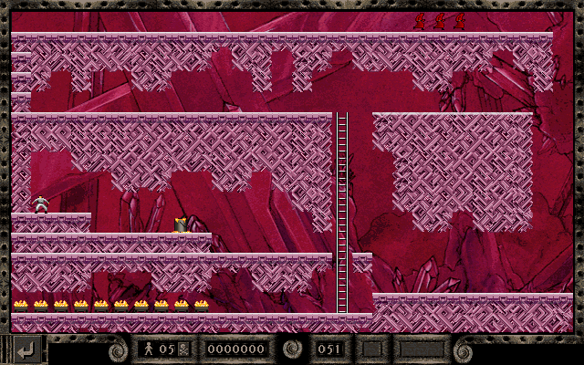

## Level 051
GOO GARBAGE 
- [Schematic](pngs_schema/051_s.png)
  

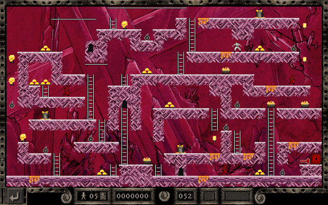

## Level 052
GOO LAND 
- [Schematic](pngs_schema/052_s.png)
  

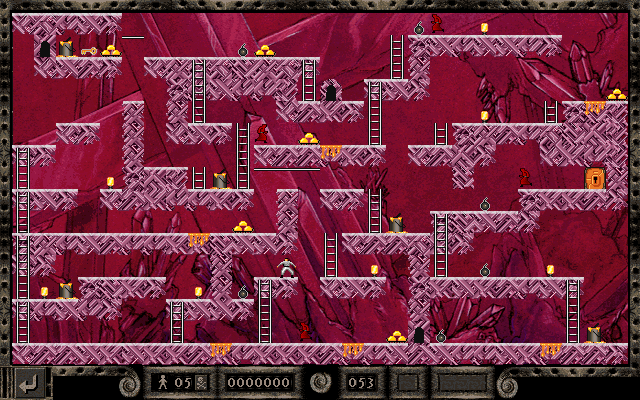

## Level 053
IN THE THICK OF IT 
- [Schematic](pngs_schema/053_s.png)
  

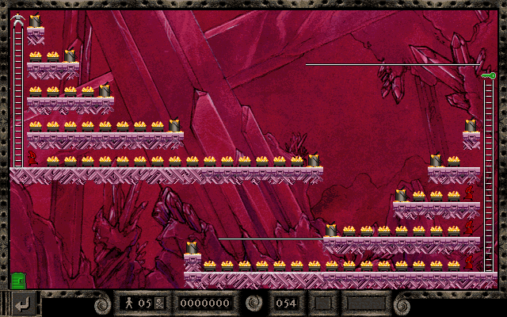

## Level 054
RUN 'N GOO 
- [Schematic](pngs_schema/054_s.png)
  

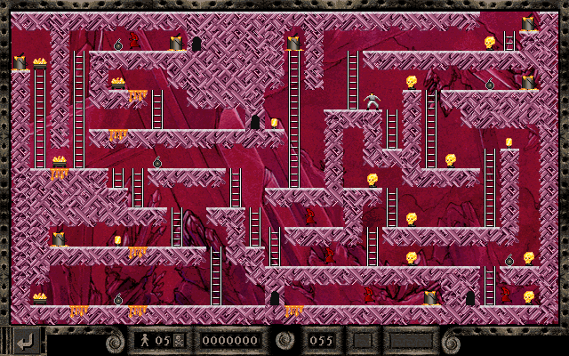

## Level 055
GOO SHELTER 
- [Schematic](pngs_schema/055_s.png)
  

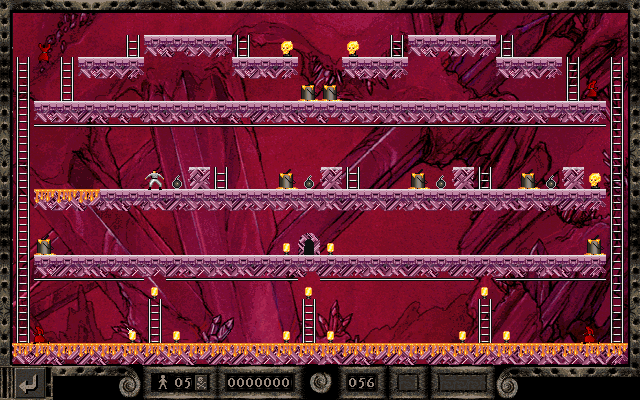

## Level 056
SPLATTER BOMB 
- [Schematic](pngs_schema/056_s.png)
  

## Level 057
HIDE! 
- [Schematic](pngs_schema/057_s.png)
  

## Level 058
GET TO THE DOOR 
- [Schematic](pngs_schema/058_s.png)
  

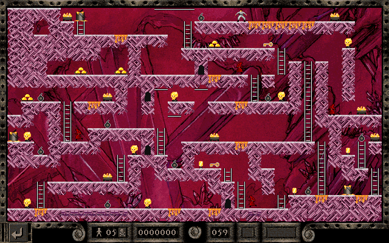

## Level 059
LOOK! 
- [Schematic](pngs_schema/059_s.png)
  

## Level 060
GOO BAGIE 
- [Schematic](pngs_schema/060_s.png)
  

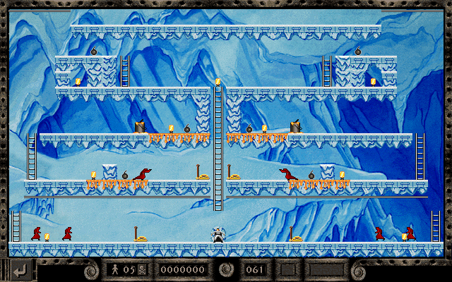

## Level 061
ICE TREE 
- [Schematic](pngs_schema/061_s.png)
  

## Level 062
ROPES AND LADDERS 
- [Schematic](pngs_schema/062_s.png)
  

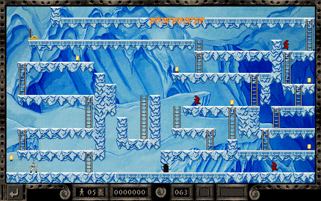

## Level 063
ONE CAPTIVE ENEMY 
- [Schematic](pngs_schema/063_s.png)
  

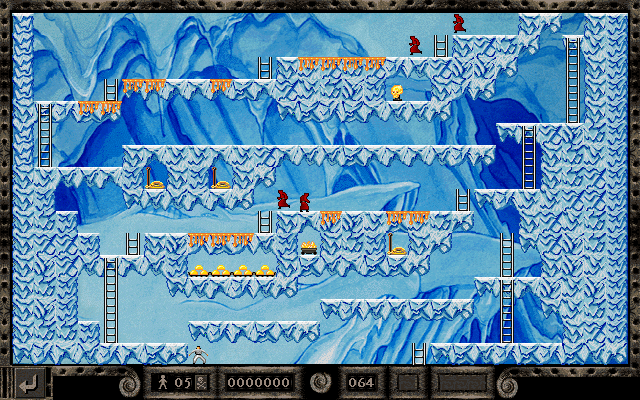

## Level 064
HANG 'EM HIGH 
- [Schematic](pngs_schema/064_s.png)
  

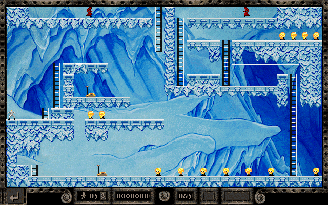

## Level 065
ROPE DUO 
- [Schematic](pngs_schema/065_s.png)
  

## Level 066
TO TRAP OR BE TRAPPED 
- [Schematic](pngs_schema/066_s.png)
  

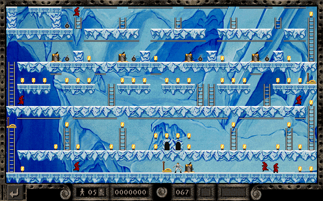

## Level 067
GOLD GALORE 
- [Schematic](pngs_schema/067_s.png)
  

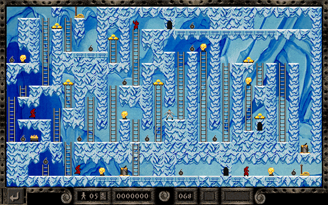

## Level 068
BOMBS IN THE WALL! 
- [Schematic](pngs_schema/068_s.png)
  

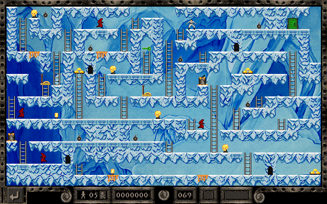

## Level 069
BOMB IN THE WALL 2! 
- [Schematic](pngs_schema/069_s.png)
  

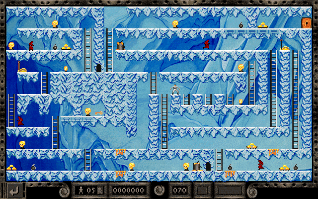

## Level 070
CHILL OUT! 
- [Schematic](pngs_schema/070_s.png)
  

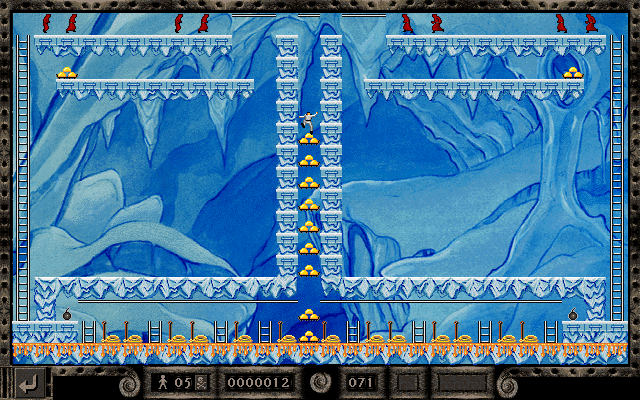

## Level 071
STRING 'EM UP AND BLOW 'EM TO BITS! 
- [Schematic](pngs_schema/071_s.png)
  

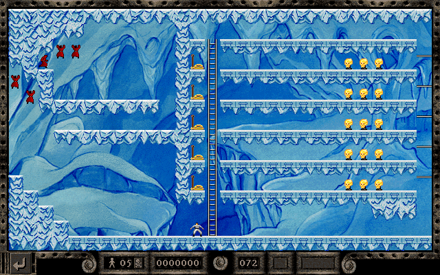

## Level 072
ROPE RODEO 
- [Schematic](pngs_schema/072_s.png)
  

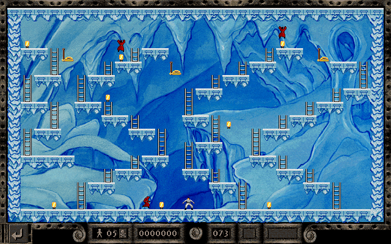

## Level 073
A ROCK AND AN ICY PLACE 
- [Schematic](pngs_schema/073_s.png)
  

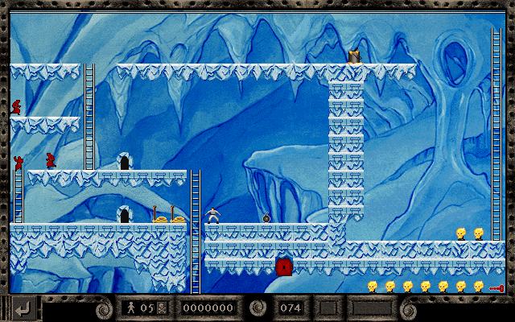

## Level 074
NOT ENOUGH ROPE TRAPS 
- [Schematic](pngs_schema/074_s.png)
  

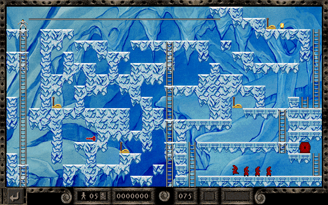

## Level 075
A BUNCH OF SWINGERS 
- [Schematic](pngs_schema/075_s.png)
  

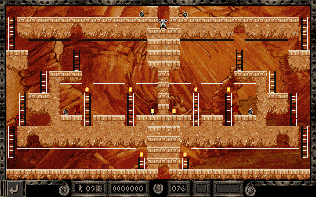

## Level 076
FORTRESS OF FOSSILS 
- [Schematic](pngs_schema/076_s.png)
  

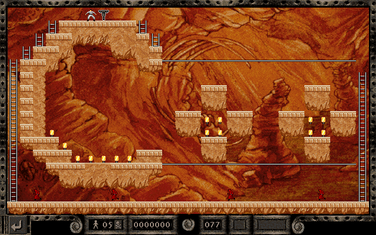

## Level 077
C++ 
- [Schematic](pngs_schema/077_s.png)
  

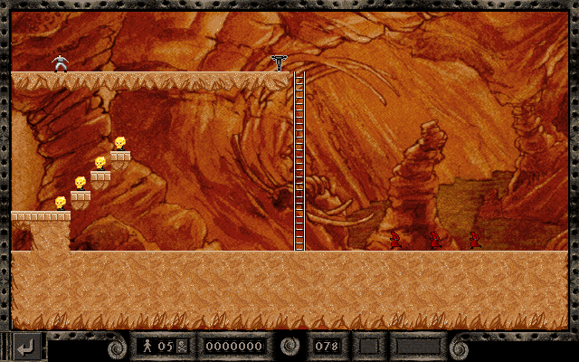

## Level 078
JACK HAMMER INTRO 
- [Schematic](pngs_schema/078_s.png)
  

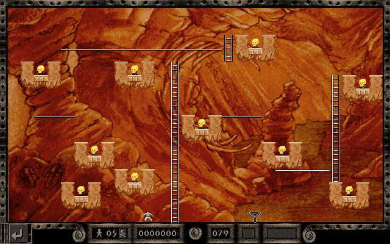

## Level 079
ONE AT A TIME 
- [Schematic](pngs_schema/079_s.png)
  

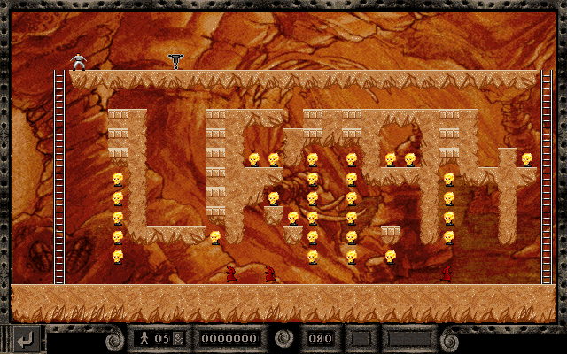

## Level 080
REVEAL 
- [Schematic](pngs_schema/080_s.png)
  

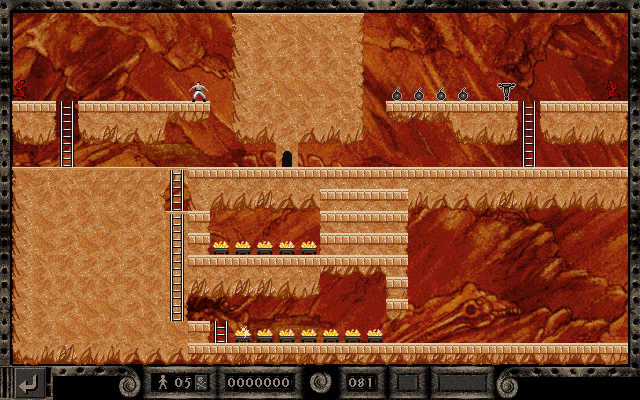

## Level 081
HIDE AND HAMMER 
- [Schematic](pngs_schema/081_s.png)
  

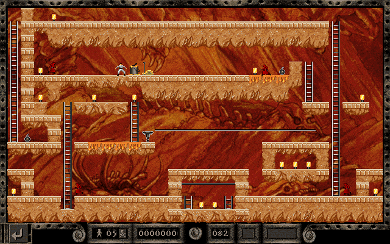

## Level 082
DIG 'N RUN 
- [Schematic](pngs_schema/082_s.png)
  

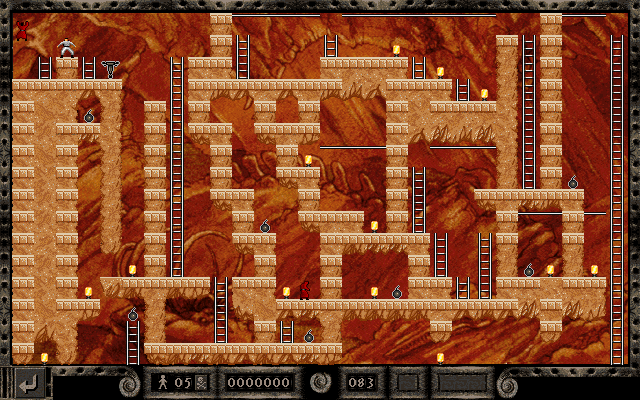

## Level 083
DISORDERLY DIG 
- [Schematic](pngs_schema/083_s.png)
  

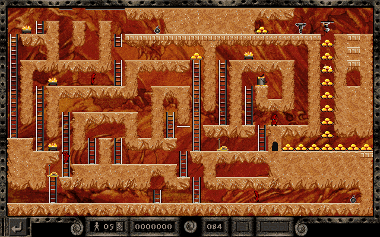

## Level 084
A BIG DROP TOO 
- [Schematic](pngs_schema/084_s.png)
  

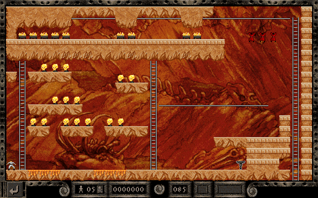

## Level 085
GOOEY GOLD 
- [Schematic](pngs_schema/085_s.png)
  

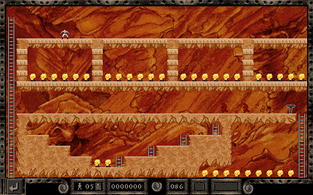

## Level 086
JACK HAMMERS ARE PERMANENT 
- [Schematic](pngs_schema/086_s.png)
  

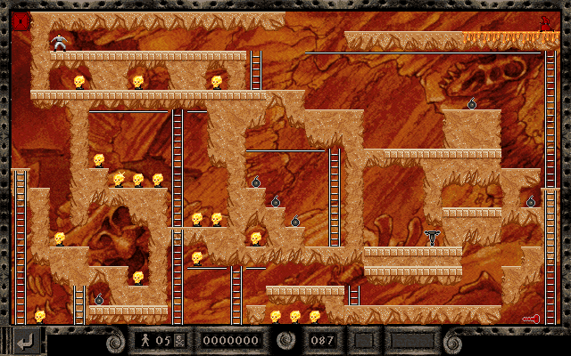

## Level 087
SKULLBOY'S QUARRY 
- [Schematic](pngs_schema/087_s.png)
  

## Level 088
ANT FARM 
- [Schematic](pngs_schema/088_s.png)
  

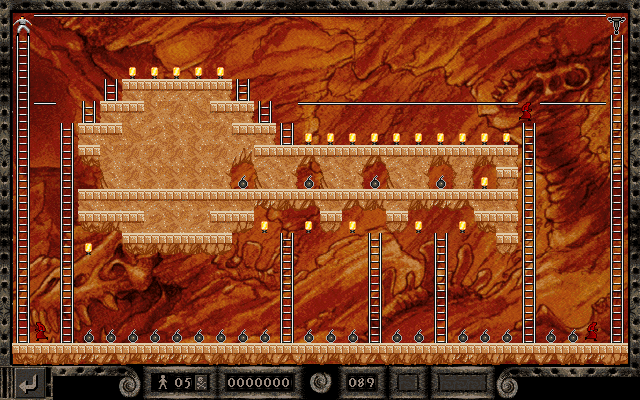

## Level 089
SKELETON KEY 
- [Schematic](pngs_schema/089_s.png)
  

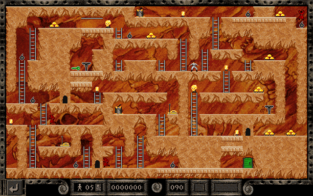

## Level 090
AAHHH!! 
- [Schematic](pngs_schema/090_s.png)
  

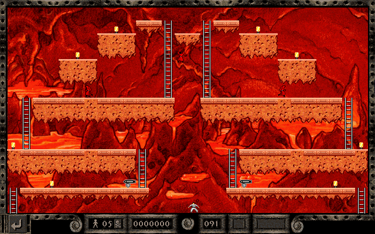

## Level 091
GAS THEM GOOFY 
- [Schematic](pngs_schema/091_s.png)
  

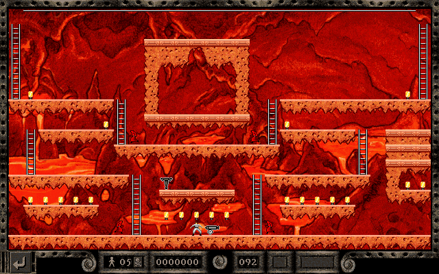

## Level 092
GAS 'EM 
- [Schematic](pngs_schema/092_s.png)
  

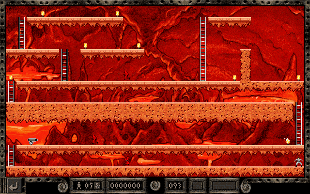

## Level 093
TEXAS GAS 
- [Schematic](pngs_schema/093_s.png)
  

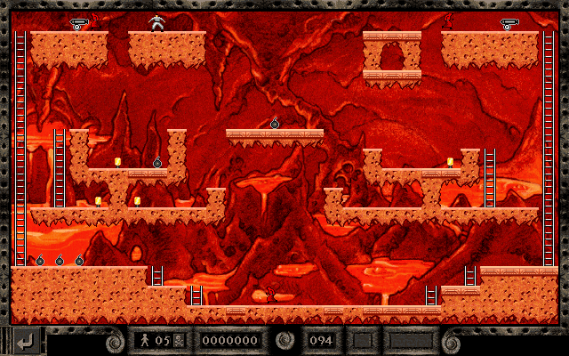

## Level 094
EXPLODING GAS 
- [Schematic](pngs_schema/094_s.png)
  

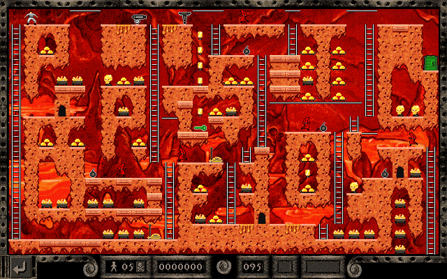

## Level 095
MINER 49ER 
- [Schematic](pngs_schema/095_s.png)
  

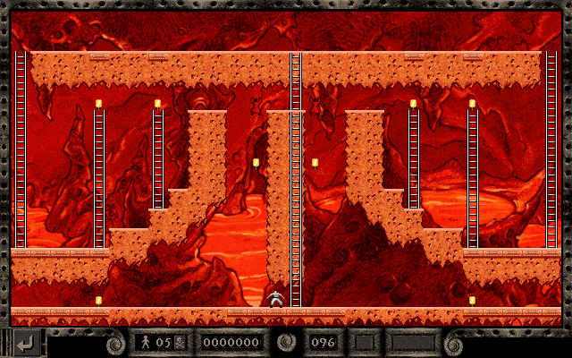

## Level 096
TARI 
- [Schematic](pngs_schema/096_s.png)
  

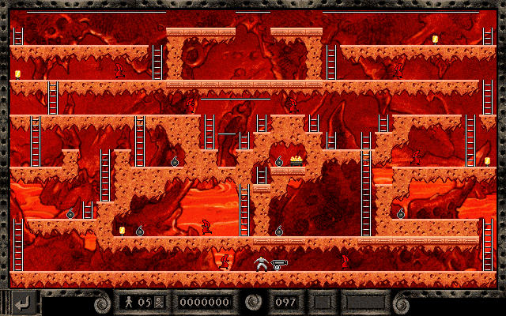

## Level 097
A MESS-O-MONKS 
- [Schematic](pngs_schema/097_s.png)
  

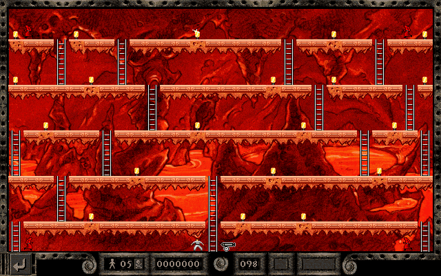

## Level 098
SEE LODE RUN, SEE LODE FALL 
- [Schematic](pngs_schema/098_s.png)
  

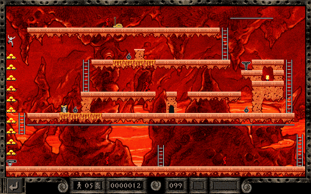

## Level 099
GAS 'ER UP 
- [Schematic](pngs_schema/099_s.png)
  

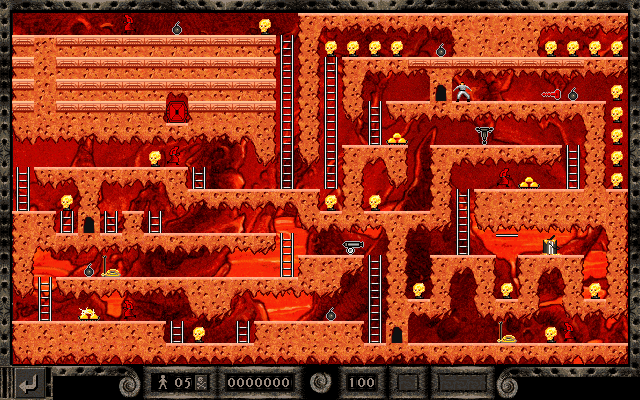

## Level 100
SMOKE 'EM OUT 
- [Schematic](pngs_schema/100_s.png)
  

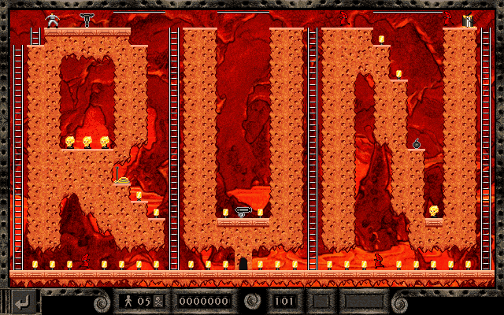

## Level 101
RUN 
- [Schematic](pngs_schema/101_s.png)
  

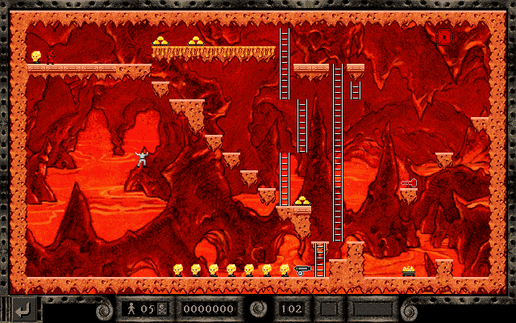

## Level 102
BAD BRAD GAS 
- [Schematic](pngs_schema/102_s.png)
  

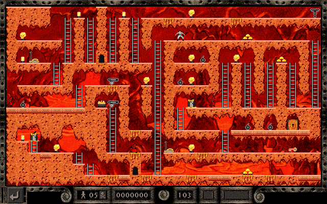

## Level 103
LAVA FARM 
- [Schematic](pngs_schema/103_s.png)
  

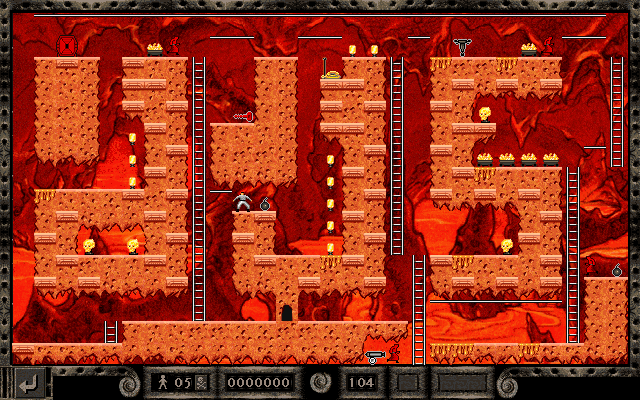

## Level 104
GETTING KINDA WARM IN HERE 
- [Schematic](pngs_schema/104_s.png)
  

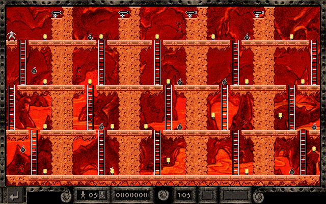

## Level 105
BOMB BAYS II 
- [Schematic](pngs_schema/105_s.png)
  

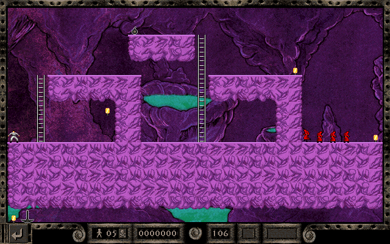

## Level 106
UNINTENTIONAL RESCUE 
- [Schematic](pngs_schema/106_s.png)
  

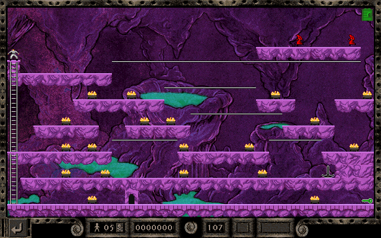

## Level 107
SKULLBOY'S RUN 
- [Schematic](pngs_schema/107_s.png)
  

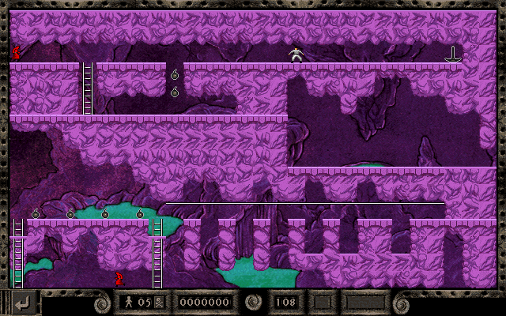

## Level 108
YER BASIC PICKAXE LEVEL 
- [Schematic](pngs_schema/108_s.png)
  

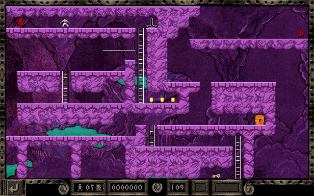

## Level 109
DIRTY DELAY 
- [Schematic](pngs_schema/109_s.png)
  

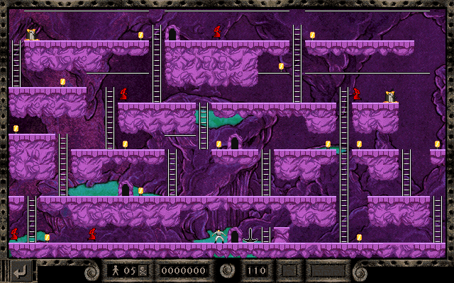

## Level 110
YOU CAN'T PICK YOUR FRIENDS 
- [Schematic](pngs_schema/110_s.png)
  

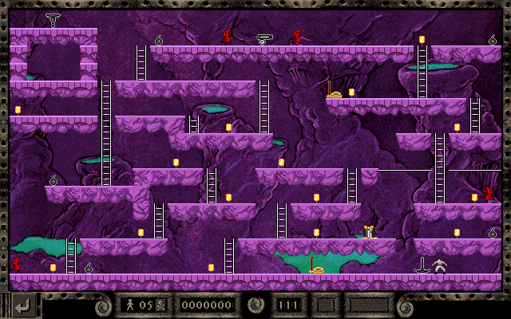

## Level 111
NO TIME TO CHAT 
- [Schematic](pngs_schema/111_s.png)
  

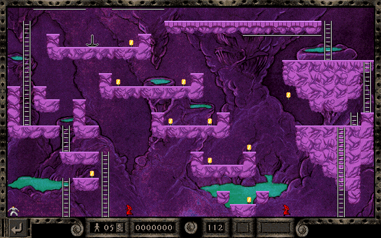

## Level 112
TRAJECTORY 
- [Schematic](pngs_schema/112_s.png)
  

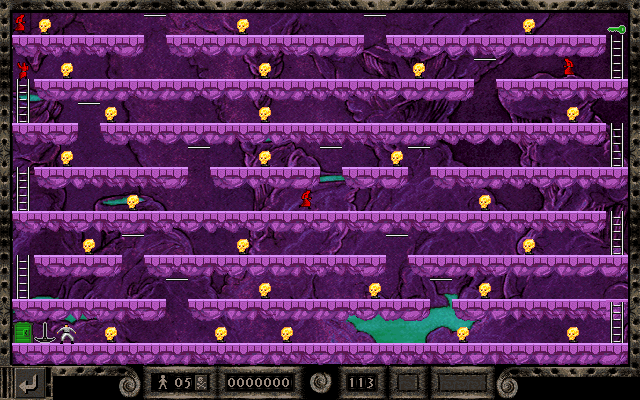

## Level 113
SKULLBOY VAULT 
- [Schematic](pngs_schema/113_s.png)
  

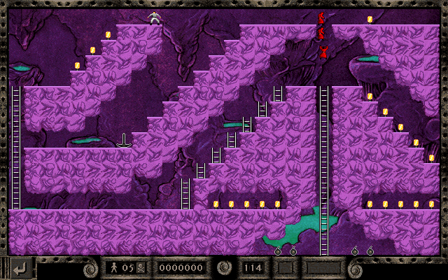

## Level 114
WORKLOAD 
- [Schematic](pngs_schema/114_s.png)
  

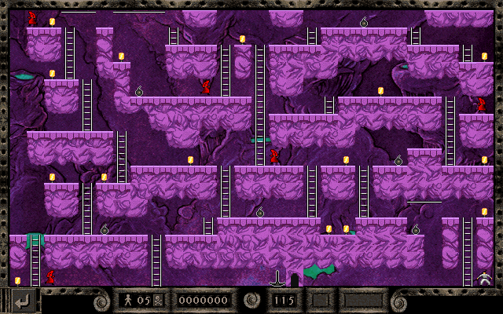

## Level 115
QUIT PICKING AT IT! 
- [Schematic](pngs_schema/115_s.png)
  

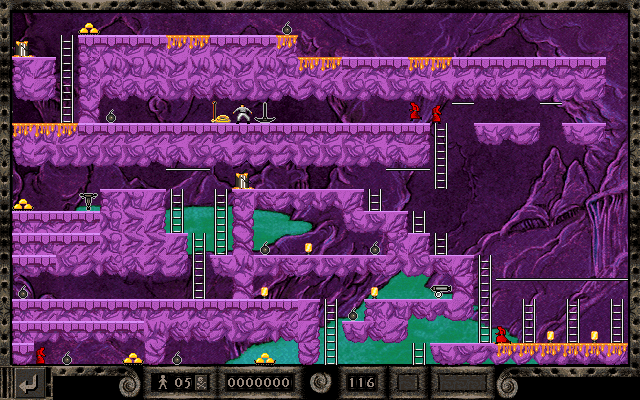

## Level 116
PICK YOUR TOOLS 
- [Schematic](pngs_schema/116_s.png)
  

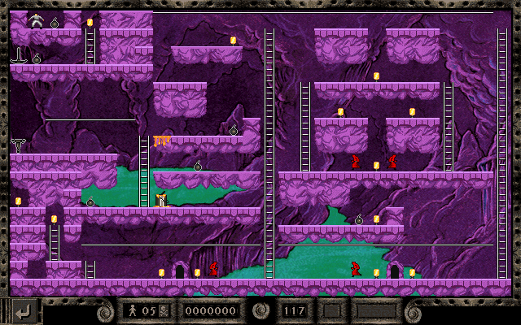

## Level 117
NARROW ESCAPE 
- [Schematic](pngs_schema/117_s.png)
  

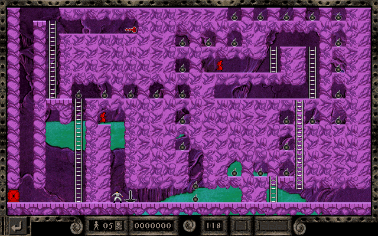

## Level 118
STEP BEHIND 
- [Schematic](pngs_schema/118_s.png)
  

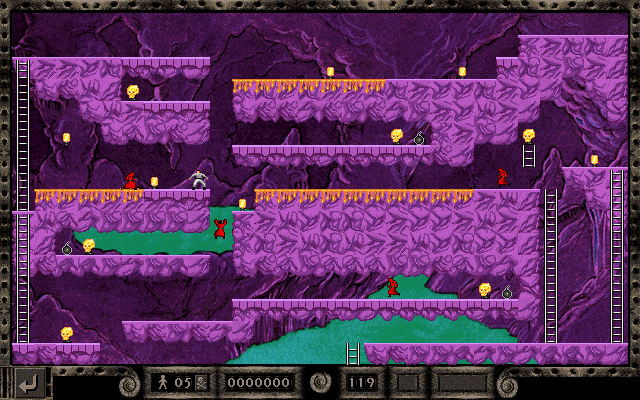

## Level 119
ROUND AND ROUND 
- [Schematic](pngs_schema/119_s.png)
  

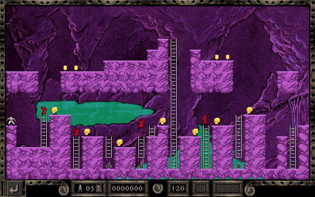

## Level 120
CESSPOOL 
- [Schematic](pngs_schema/120_s.png)
  

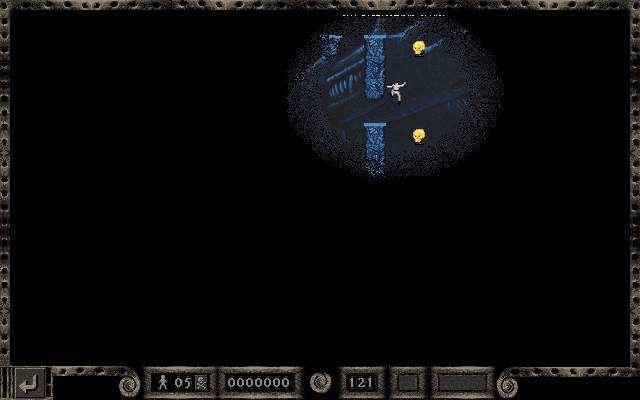

## Level 121
STAB IN THE DARK 
- [Schematic](pngs_schema/121_s.png)
  

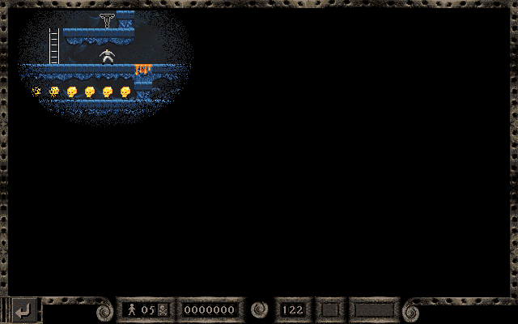

## Level 122
DARK DEDUCTION 
- [Schematic](pngs_schema/122_s.png)
  

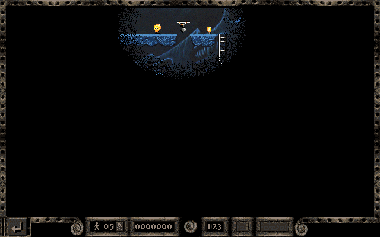

## Level 123
AVOID THE MONKS 
- [Schematic](pngs_schema/123_s.png)
  

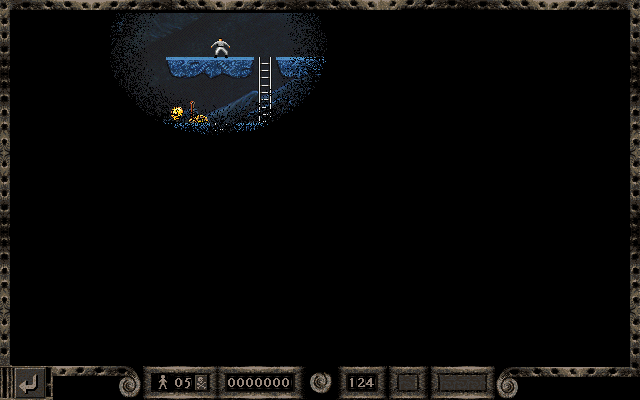

## Level 124
BEWARE OF GOO 
- [Schematic](pngs_schema/124_s.png)
  

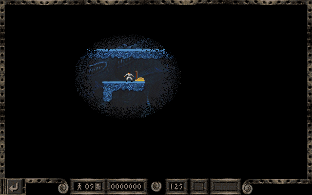

## Level 125
BLACKOUT 
- [Schematic](pngs_schema/125_s.png)
  

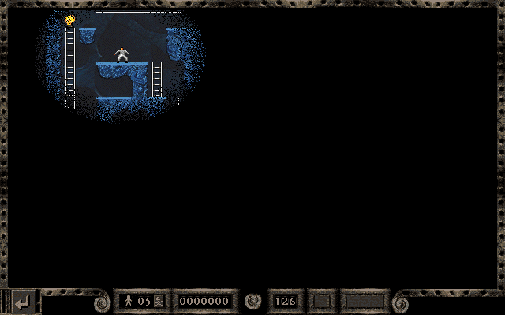

## Level 126
FIND THE DOOR 
- [Schematic](pngs_schema/126_s.png)
  

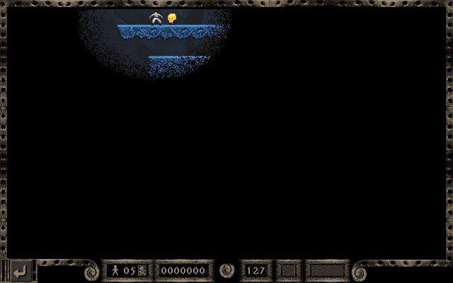

## Level 127
USE THE KEY 
- [Schematic](pngs_schema/127_s.png)
  

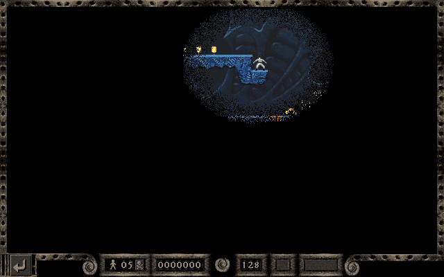

## Level 128
GOLD THEN DOOR 
- [Schematic](pngs_schema/128_s.png)
  

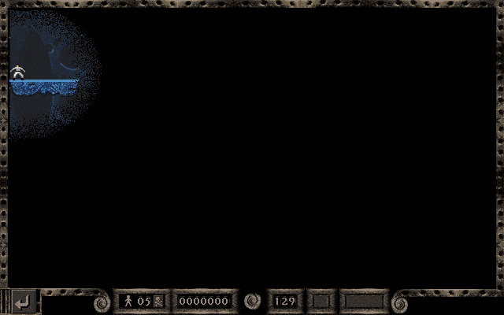

## Level 129
GET THAT GOLD 
- [Schematic](pngs_schema/129_s.png)
  

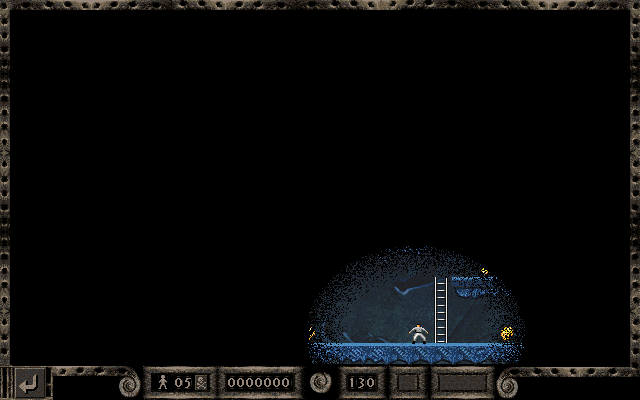

## Level 130
THE DROP 
- [Schematic](pngs_schema/130_s.png)
  

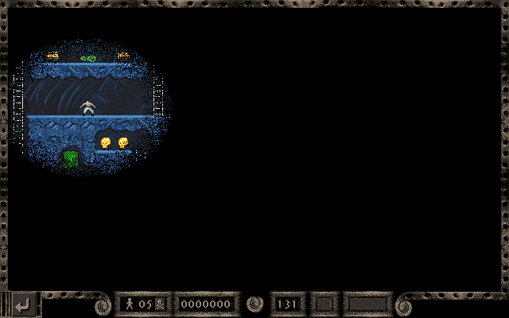

## Level 131
MT. ST. GRIGORY 
- [Schematic](pngs_schema/131_s.png)
  

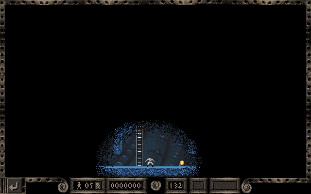

## Level 132
THE CATACOMBS 
- [Schematic](pngs_schema/132_s.png)
  

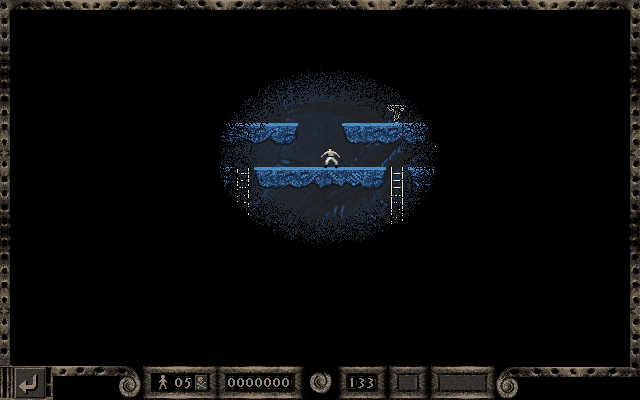

## Level 133
CALL THE PLUMBER 
- [Schematic](pngs_schema/133_s.png)
  

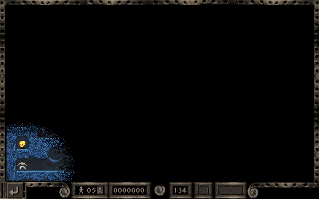

## Level 134
IDOL THREATS 
- [Schematic](pngs_schema/134_s.png)
  

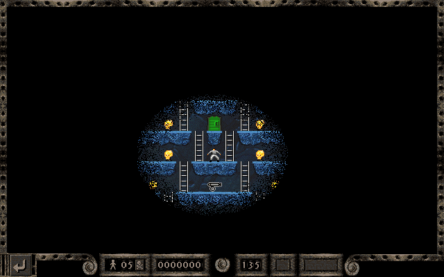

## Level 135
READE'S RUNAROUND 
- [Schematic](pngs_schema/135_s.png)
  

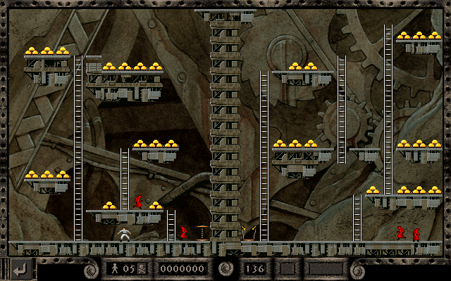

## Level 136
THE NEIGHBORS 
- [Schematic](pngs_schema/136_s.png)
  

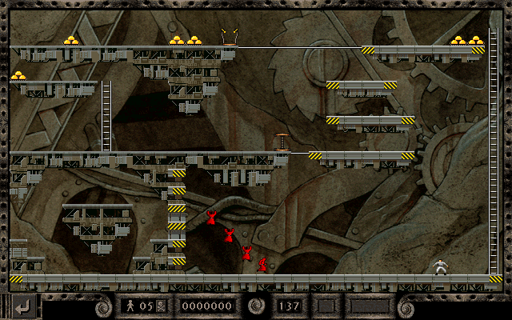

## Level 137
TIGHTROPE 
- [Schematic](pngs_schema/137_s.png)
  

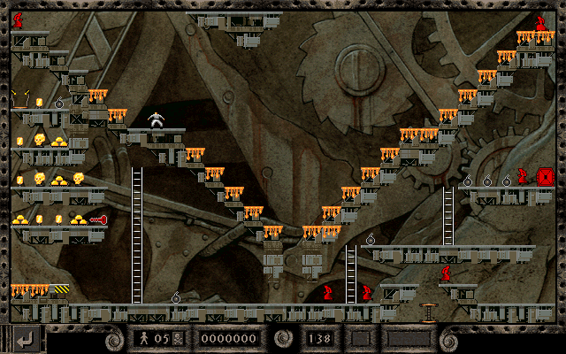

## Level 138
THE GUM FUNNEL 
- [Schematic](pngs_schema/138_s.png)
  

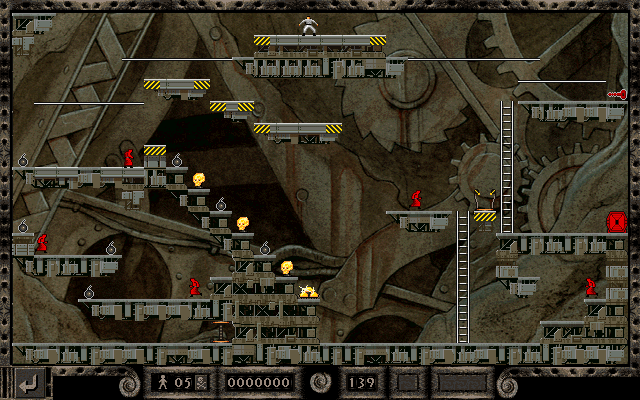

## Level 139
THE MONKEYWRENCH 
- [Schematic](pngs_schema/139_s.png)
  

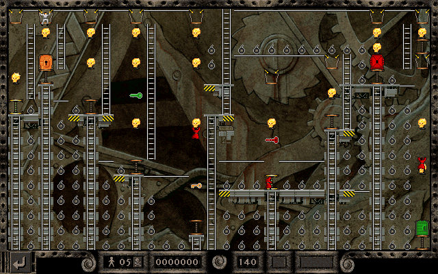

## Level 140
SKULLBOY REVENGE 
- [Schematic](pngs_schema/140_s.png)
  

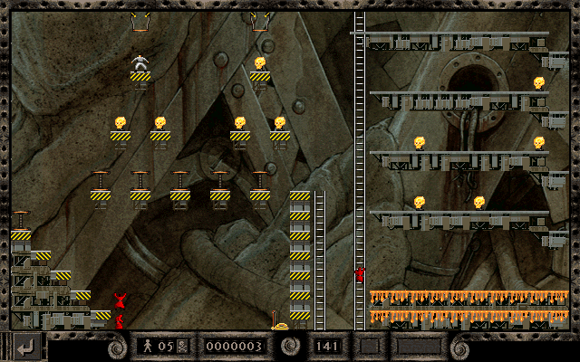

## Level 141
PACHINKO 
- [Schematic](pngs_schema/141_s.png)
  

## Level 142
THE NAME OF THE GAME 
- [Schematic](pngs_schema/142_s.png)
  

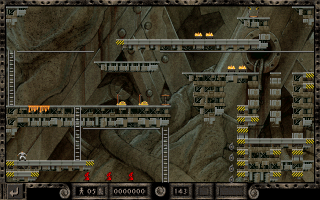

## Level 143
BOMB SURGERY 
- [Schematic](pngs_schema/143_s.png)
  

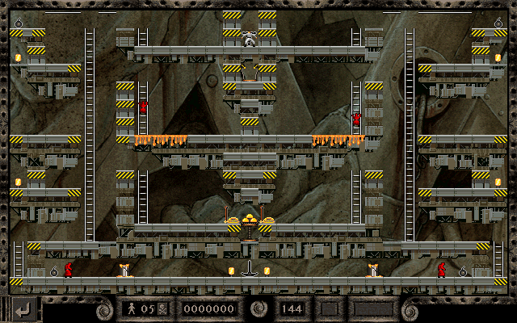

## Level 144
TELEPORTER LOOP 
- [Schematic](pngs_schema/144_s.png)
  

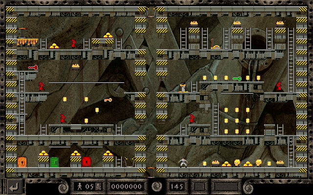

## Level 145
THE BOTTOMLESS PIT 
- [Schematic](pngs_schema/145_s.png)
- Made by Todd Daggert.
  

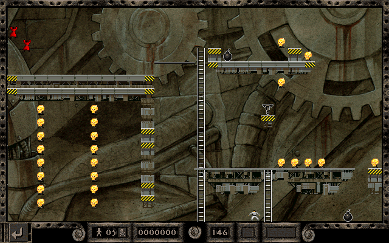

## Level 146
BYE BYE GOLD 
- [Schematic](pngs_schema/146_s.png)
  

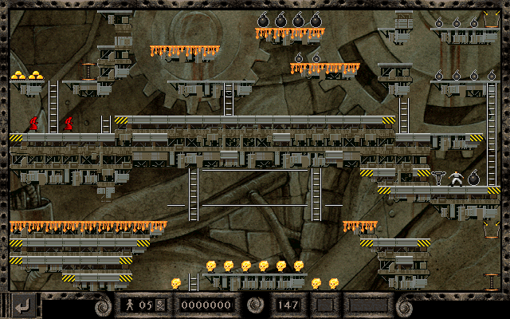

## Level 147
TECHNO BOMBS 
- [Schematic](pngs_schema/147_s.png)
  

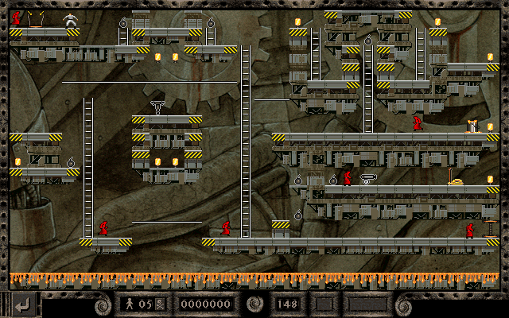

## Level 148
HALF DOME 
- [Schematic](pngs_schema/148_s.png)
  

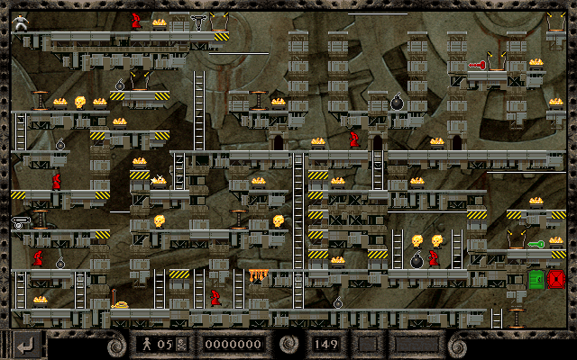

## Level 149
JAKE'S PERIL 
- [Schematic](pngs_schema/149_s.png)
  

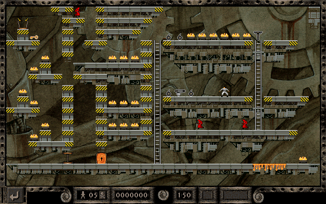

## Level 150
HAMMER HORROR 
- [Schematic](pngs_schema/150_s.png)
  

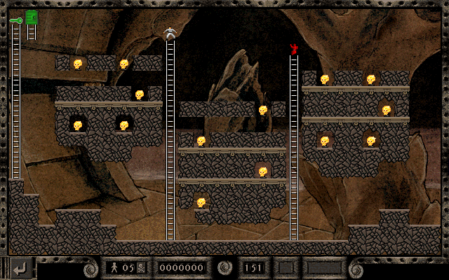

## Level 151
DEATH TRAP 
- [Schematic](pngs_schema/151_s.png)
  

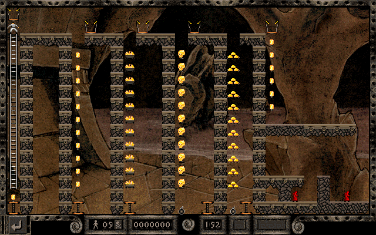

## Level 152
PITVILLE 
- [Schematic](pngs_schema/152_s.png)
  

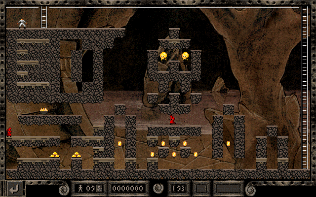

## Level 153
IDOL WORSHIP 
- [Schematic](pngs_schema/153_s.png)
  

## Level 154
FIRST IMPRESSIONS 
- [Schematic](pngs_schema/154_s.png)
  

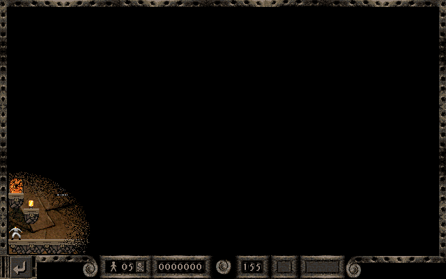

## Level 155
SHOT IN THE DARK 
- [Schematic](pngs_schema/155_s.png)
  

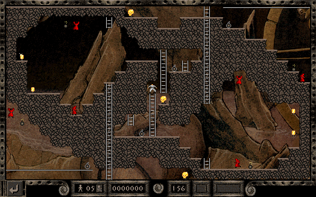

## Level 156
YING YANG 
- [Schematic](pngs_schema/156_s.png)
  

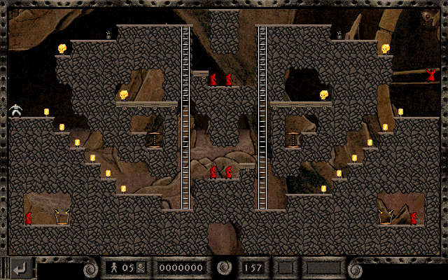

## Level 157
DOUBLE TROUBLE 
- [Schematic](pngs_schema/157_s.png)
  

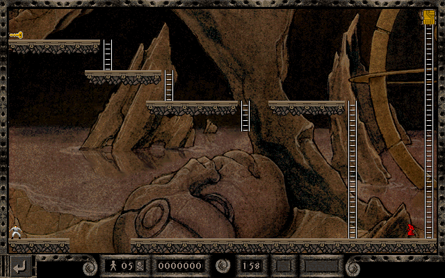

## Level 158
FALLING MONKS 
- [Schematic](pngs_schema/158_s.png)
  

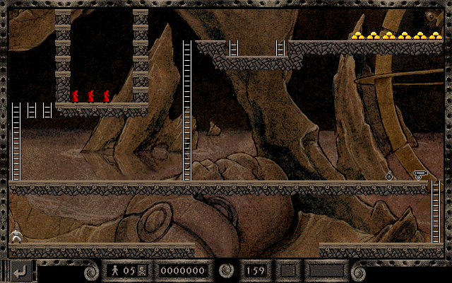

## Level 159
BEWARE THE MONK CHAMBER 
- [Schematic](pngs_schema/159_s.png)
  

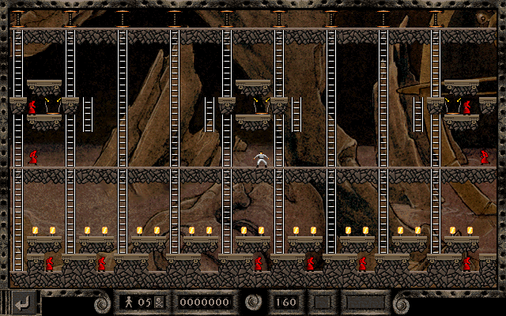

## Level 160
LADDER LAND 
- [Schematic](pngs_schema/160_s.png)
  

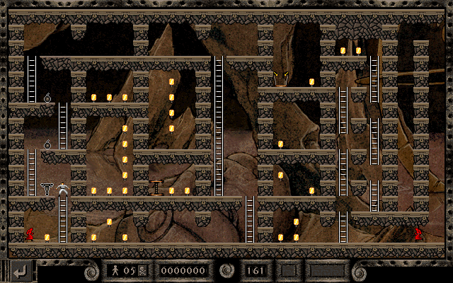

## Level 161
THE CHASE! 
- [Schematic](pngs_schema/161_s.png)
  

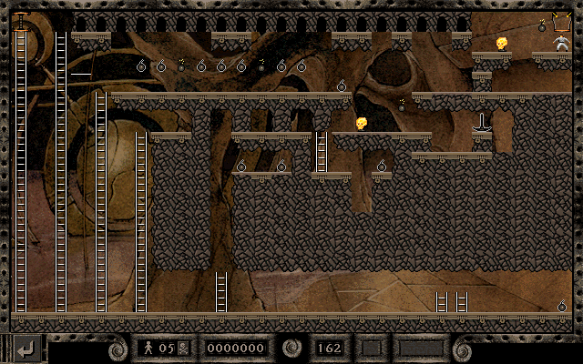

## Level 162
DEMOLITION BRIDGE 
- [Schematic](pngs_schema/162_s.png)
  

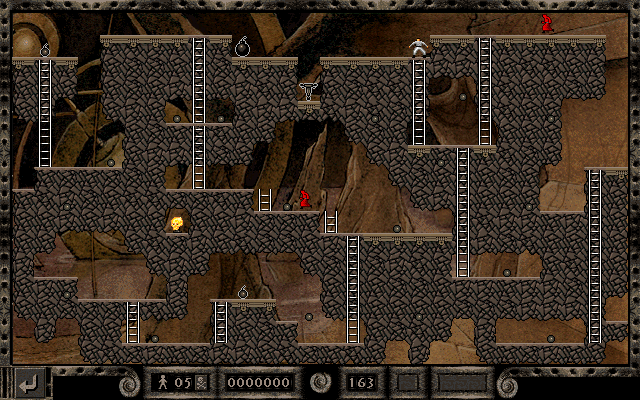

## Level 163
HIDE AND SEEK 
- [Schematic](pngs_schema/163_s.png)
  

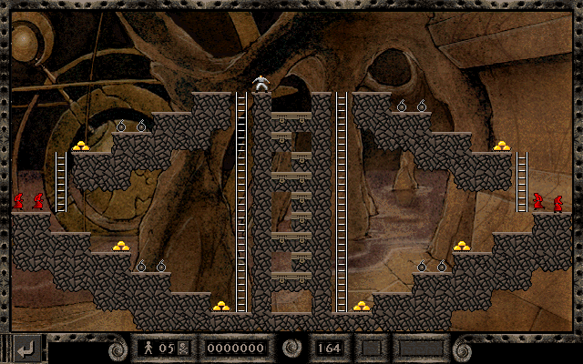

## Level 164
DEATH TRAP 2 
- [Schematic](pngs_schema/164_s.png)
  

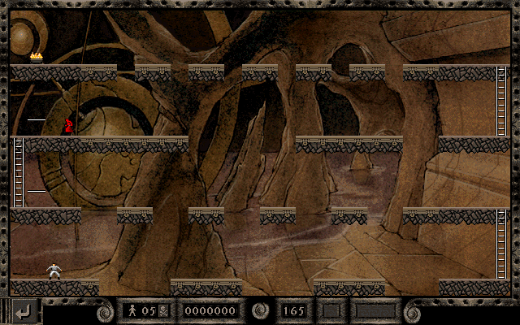

## Level 165
FIND THE PATTERN 
- [Schematic](pngs_schema/165_s.png)
  

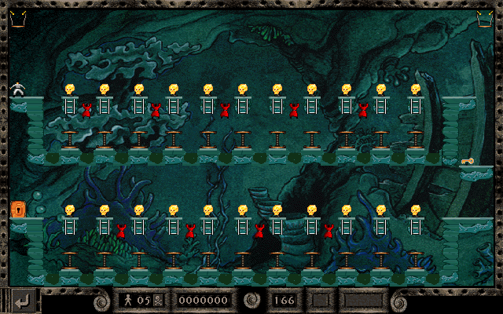

## Level 166
MONK RAIN 
- [Schematic](pngs_schema/166_s.png)
  

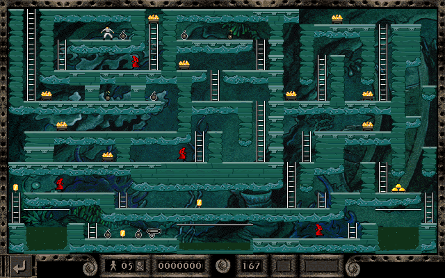

## Level 167
SEFL SON 
- [Schematic](pngs_schema/167_s.png)
  

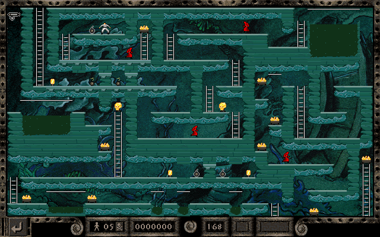

## Level 168
SEFL'S WAY 
- [Schematic](pngs_schema/168_s.png)
  

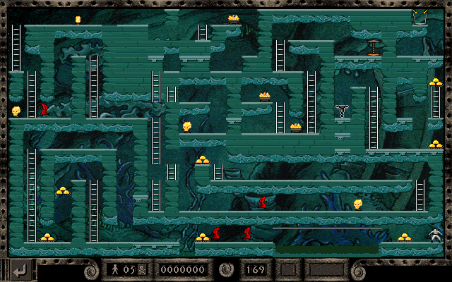

## Level 169
SEFL'S LAIR 
- [Schematic](pngs_schema/169_s.png)
  

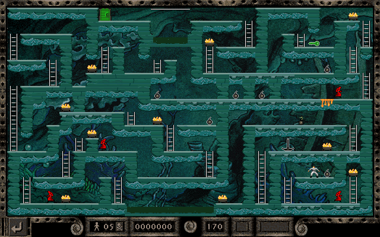

## Level 170
WATER WIND 
- [Schematic](pngs_schema/170_s.png)
  

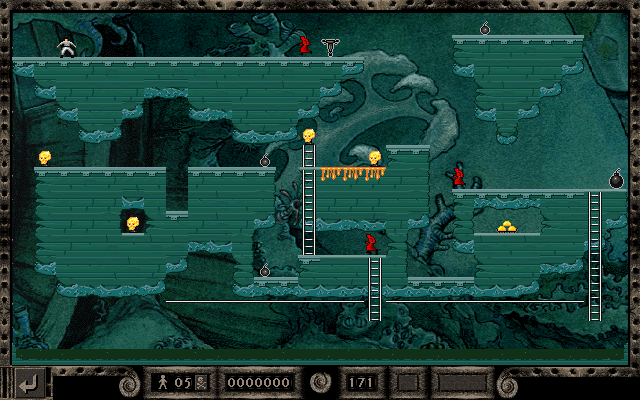

## Level 171
ESCAPE 
- [Schematic](pngs_schema/171_s.png)
  

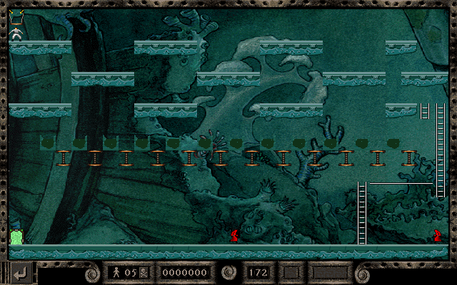

## Level 172
CAN YOU FIND A SHORTCUT? 
- [Schematic](pngs_schema/172_s.png)
  

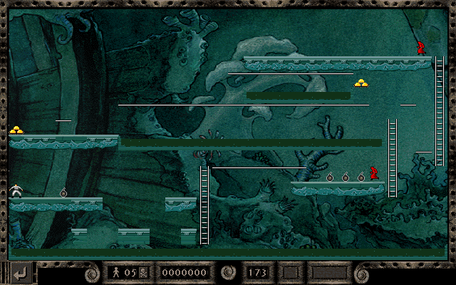

## Level 173
WATERWORLD 
- [Schematic](pngs_schema/173_s.png)
  

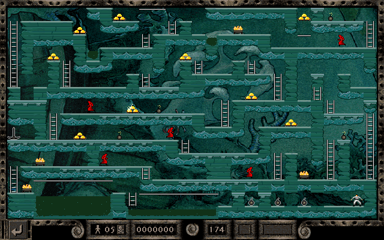

## Level 174
MONKS FROM MUNCHAUSEN 
- [Schematic](pngs_schema/174_s.png)
  

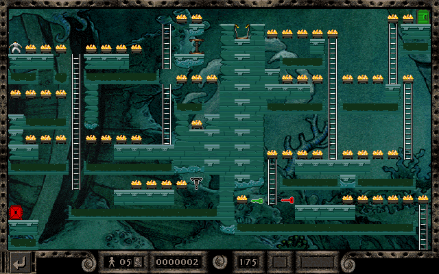

## Level 175
FOLLOW THE YELLOW BRICK ROAD 
- [Schematic](pngs_schema/175_s.png)
  

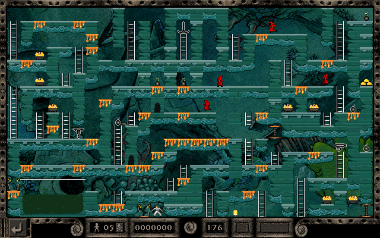

## Level 176
MUNCHAUSEN MADNESS 
- [Schematic](pngs_schema/176_s.png)
  

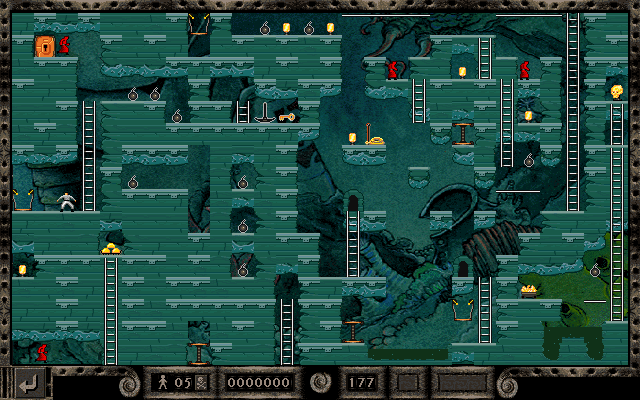

## Level 177
CASTLE CHRONOS 
- [Schematic](pngs_schema/177_s.png)
- Made by Todd Daggert.
  

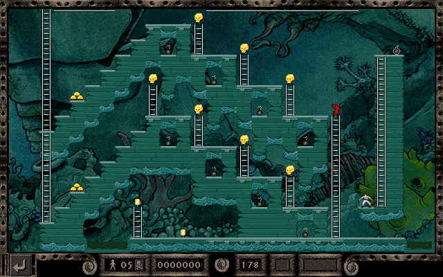

## Level 178
MINEFIELD 
- [Schematic](pngs_schema/178_s.png)
  

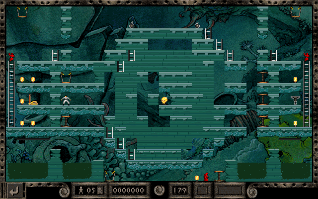

## Level 179
THE GRINDER 
- [Schematic](pngs_schema/179_s.png)
- Made by Todd Daggert.
  

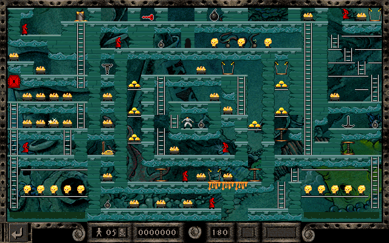

## Level 180
JAKE'S LABRYNTH 
- [Schematic](pngs_schema/180_s.png)
  

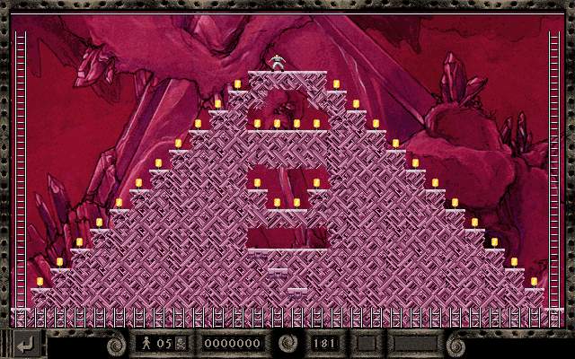

## Level 181
HEART OF THE PYRAMID 
- [Schematic](pngs_schema/181_s.png)
  

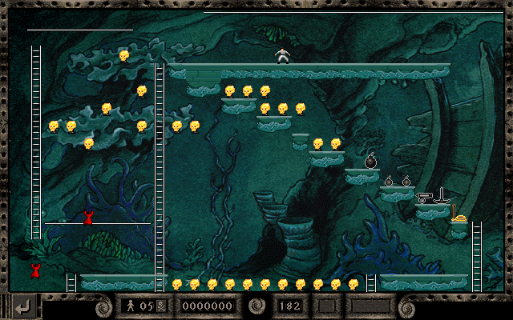

## Level 182
HEARTBEAT 
- [Schematic](pngs_schema/182_s.png)
  

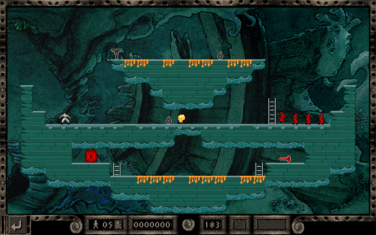

## Level 183
SINKING SHIP 
- [Schematic](pngs_schema/183_s.png)
  

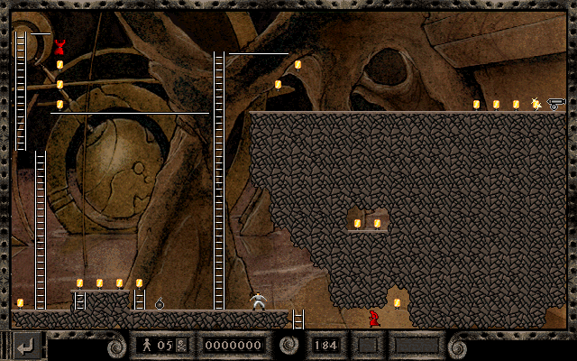

## Level 184
NOT SO FAST 
- [Schematic](pngs_schema/184_s.png)
  

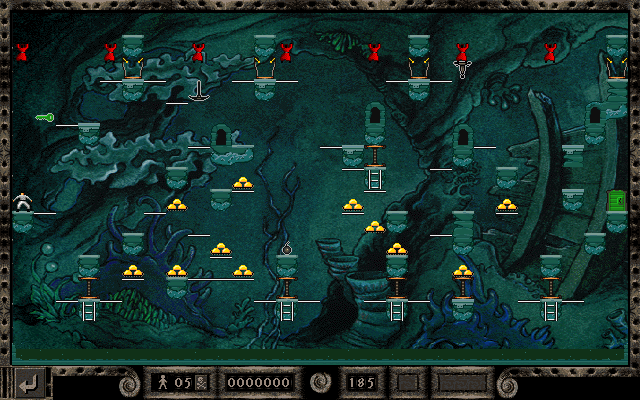

## Level 185
MORE MONK RAIN 
- [Schematic](pngs_schema/185_s.png)
  

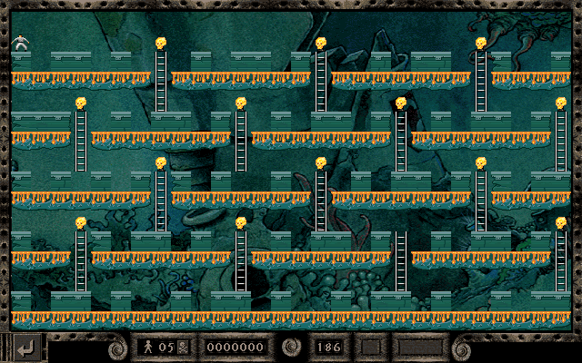

## Level 186
JUST WATCH 
- [Schematic](pngs_schema/186_s.png)
  

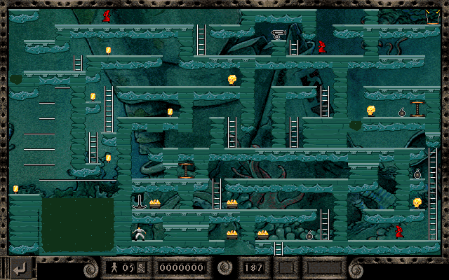

## Level 187
MUNCHAUSEN MANIA 
- [Schematic](pngs_schema/187_s.png)
  

