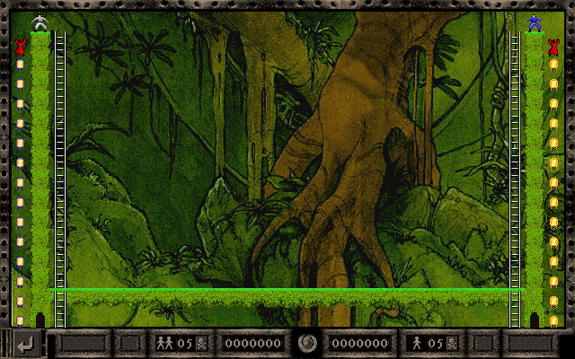

## Level 001
CRISS CROSS 
- [Schematic](pngs_schema/001_s.png)
- <a href="pngs_labeled/LRO_MMR_2P - 001 - MOSS - CRISS CROSS.png">Labeled image</a>
  

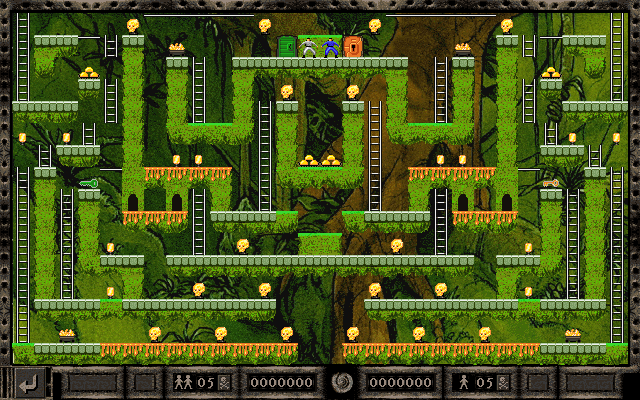

## Level 002
IT'S A RACE 
- [Schematic](pngs_schema/002_s.png)
- <a href="pngs_labeled/LRO_MMR_2P - 002 - MOSS - IT'S A RACE.png">Labeled image</a>
  

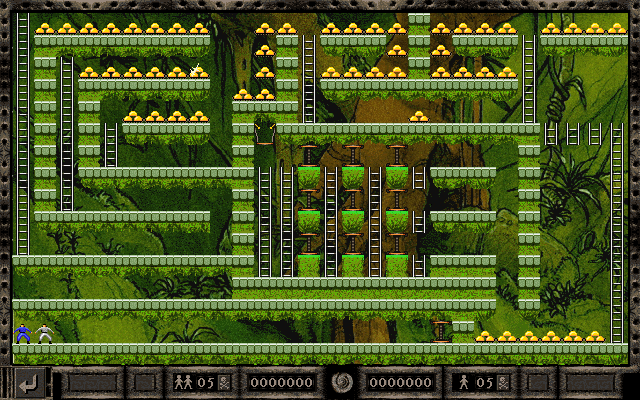

## Level 003
HAPPY HORDING 
- [Schematic](pngs_schema/003_s.png)
- <a href="pngs_labeled/LRO_MMR_2P - 003 - MOSS - HAPPY HORDING.png">Labeled image</a>
  

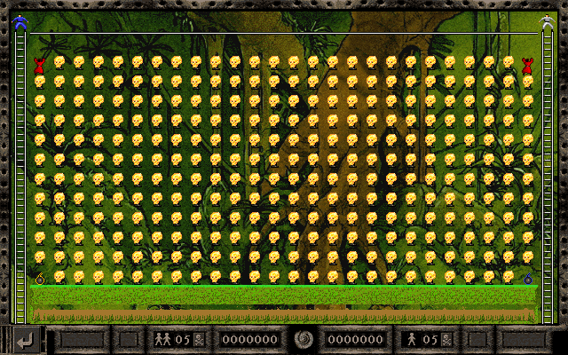

## Level 004
UNSTEADY PLATFORMZ 
- [Schematic](pngs_schema/004_s.png)
- <a href="pngs_labeled/LRO_MMR_2P - 004 - MOSS - UNSTEADY PLATFORMZ.png">Labeled image</a>
  

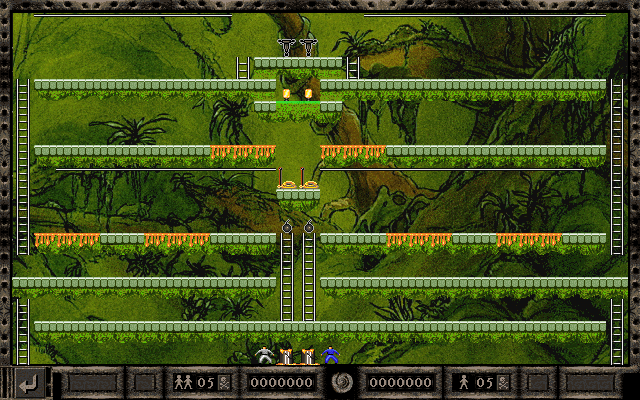

## Level 005
ONE ON ONE 
- [Schematic](pngs_schema/005_s.png)
- <a href="pngs_labeled/LRO_MMR_2P - 005 - MOSS - ONE ON ONE.png">Labeled image</a>
  

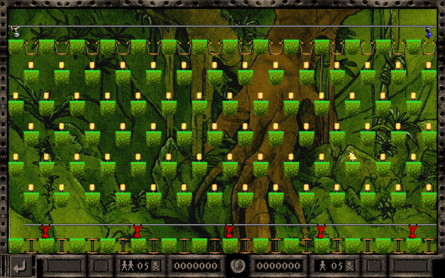

## Level 006
POWDER PUFF 
- [Schematic](pngs_schema/006_s.png)
- <a href="pngs_labeled/LRO_MMR_2P - 006 - MOSS - POWDER PUFF.png">Labeled image</a>
  

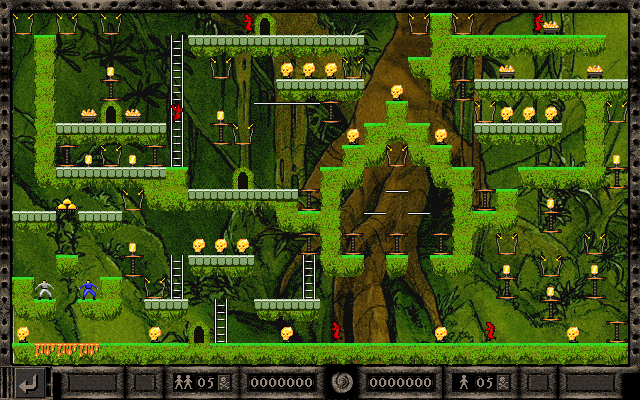

## Level 007
BEAM ME UP, SCOTTY 
- [Schematic](pngs_schema/007_s.png)
- <a href="pngs_labeled/LRO_MMR_2P - 007 - MOSS - BEAM ME UP, SCOTTY.png">Labeled image</a>
  

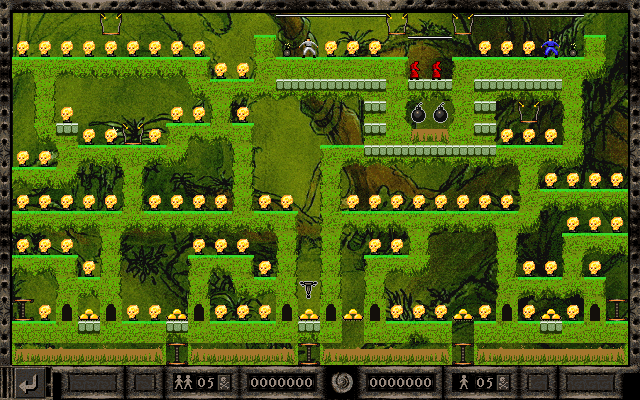

## Level 008
GOLD RUSH 
- [Schematic](pngs_schema/008_s.png)
- <a href="pngs_labeled/LRO_MMR_2P - 008 - MOSS - GOLD RUSH.png">Labeled image</a>
  

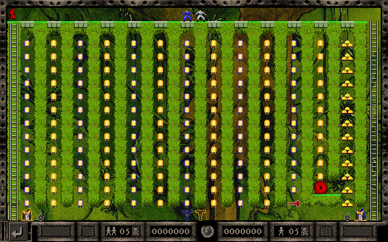

## Level 009
DROP RIGHT IN 
- [Schematic](pngs_schema/009_s.png)
- <a href="pngs_labeled/LRO_MMR_2P - 009 - MOSS - DROP RIGHT IN.png">Labeled image</a>
  

## Level 010
STICKY MAZE 
- [Schematic](pngs_schema/010_s.png)
- <a href="pngs_labeled/LRO_MMR_2P - 010 - MOSS - STICKY MAZE.png">Labeled image</a>
  

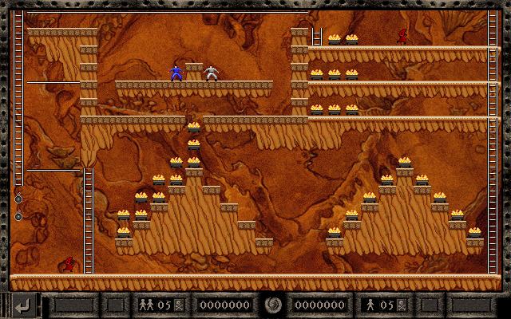

## Level 011
DANE ONE 
- [Schematic](pngs_schema/011_s.png)
- <a href="pngs_labeled/LRO_MMR_2P - 011 - FUNG - DANE ONE.png">Labeled image</a>
  

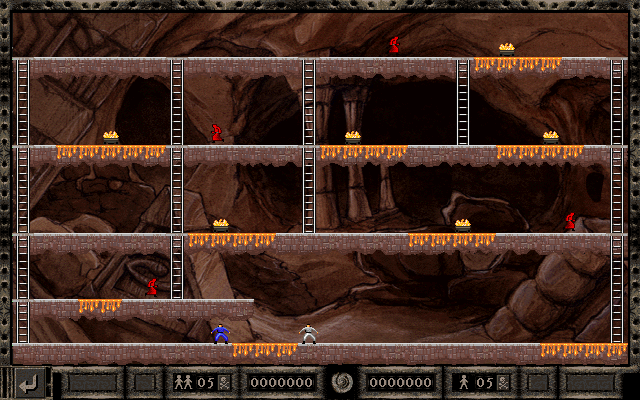

## Level 012
DANE TWO 
- [Schematic](pngs_schema/012_s.png)
- <a href="pngs_labeled/LRO_MMR_2P - 012 - ANCI - DANE TWO.png">Labeled image</a>
  

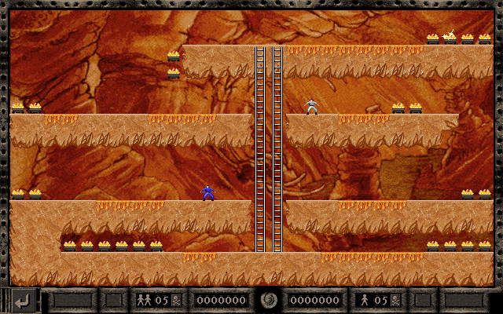

## Level 013
DANE THREE 
- [Schematic](pngs_schema/013_s.png)
- <a href="pngs_labeled/LRO_MMR_2P - 013 - FOSS - DANE THREE.png">Labeled image</a>
  

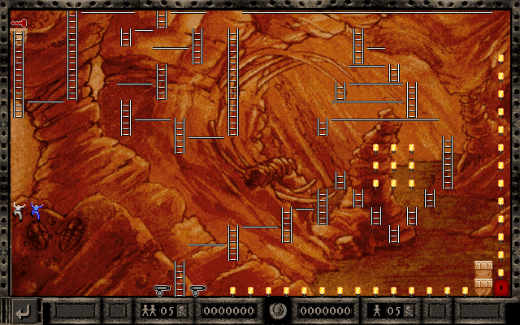

## Level 014
DON'T FALL 
- [Schematic](pngs_schema/014_s.png)
- <a href="pngs_labeled/LRO_MMR_2P - 014 - FOSS - DON'T FALL.png">Labeled image</a>
  

## Level 015
TRAP THROUGH 
- [Schematic](pngs_schema/015_s.png)
- <a href="pngs_labeled/LRO_MMR_2P - 015 - FUNG - TRAP THROUGH.png">Labeled image</a>
  

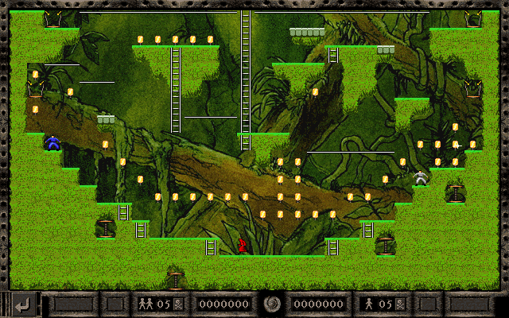

## Level 016
SUSPENDED TREASURE 
- [Schematic](pngs_schema/016_s.png)
- <a href="pngs_labeled/LRO_MMR_2P - 016 - MOSS - SUSPENDED TREASURE.png">Labeled image</a>
  

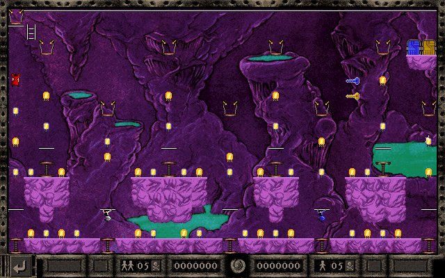

## Level 017
TELE FUN 
- [Schematic](pngs_schema/017_s.png)
- <a href="pngs_labeled/LRO_MMR_2P - 017 - PHOS - TELE FUN.png">Labeled image</a>
  

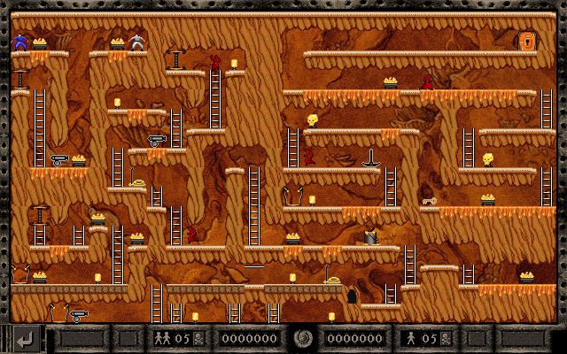

## Level 018
GOO RUN 
- [Schematic](pngs_schema/018_s.png)
- <a href="pngs_labeled/LRO_MMR_2P - 018 - FUNG - GOO RUN.png">Labeled image</a>
  

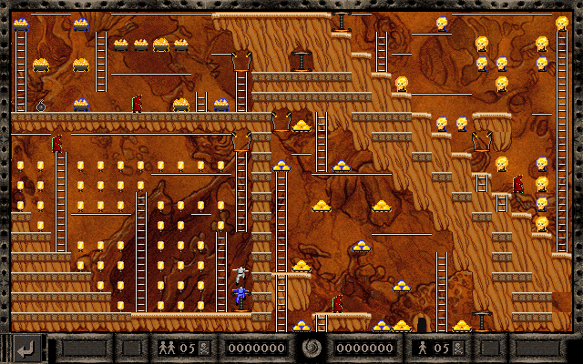

## Level 019
FOUR CORNERS 
- [Schematic](pngs_schema/019_s.png)
- <a href="pngs_labeled/LRO_MMR_2P - 019 - FUNG - FOUR CORNERS.png">Labeled image</a>
  

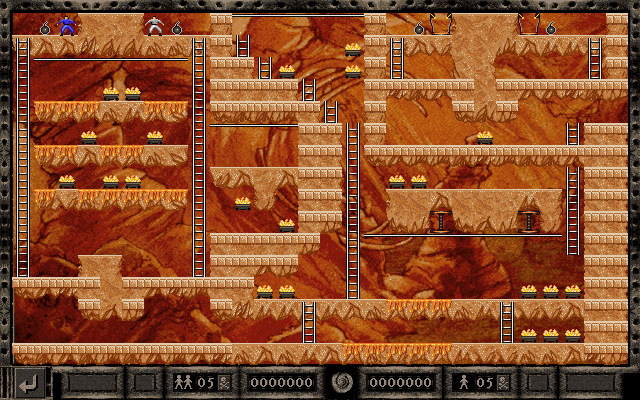

## Level 020
DANE FOUR 
- [Schematic](pngs_schema/020_s.png)
- <a href="pngs_labeled/LRO_MMR_2P - 020 - FOSS - DANE FOUR.png">Labeled image</a>
  

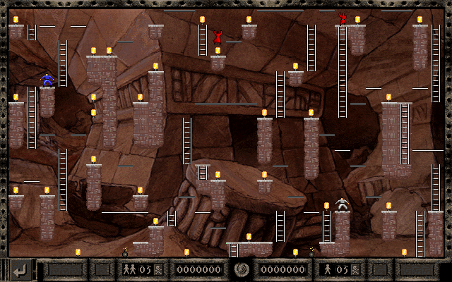

## Level 021
TRAP-EEZ 
- [Schematic](pngs_schema/021_s.png)
- <a href="pngs_labeled/LRO_MMR_2P - 021 - ANCI - TRAP-EEZ.png">Labeled image</a>
  

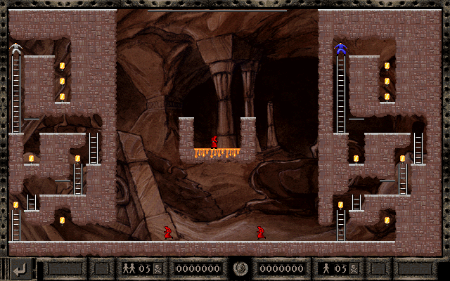

## Level 022
ANT FARM 
- [Schematic](pngs_schema/022_s.png)
- <a href="pngs_labeled/LRO_MMR_2P - 022 - ANCI - ANT FARM.png">Labeled image</a>
  

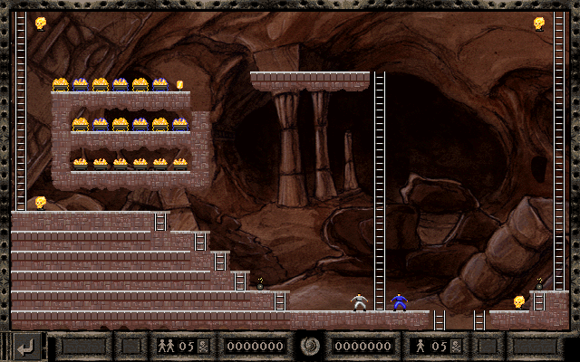

## Level 023
LEAP OF FAITH 
- [Schematic](pngs_schema/023_s.png)
- <a href="pngs_labeled/LRO_MMR_2P - 023 - ANCI - LEAP OF FAITH.png">Labeled image</a>
  

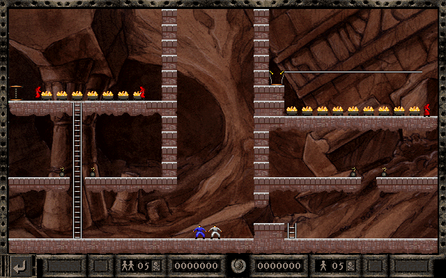

## Level 024
SQUEEZE 
- [Schematic](pngs_schema/024_s.png)
- <a href="pngs_labeled/LRO_MMR_2P - 024 - ANCI - SQUEEZE.png">Labeled image</a>
  

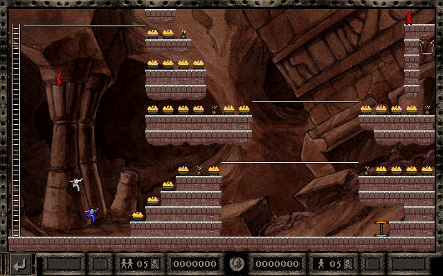

## Level 025
TIMEBOMB 
- [Schematic](pngs_schema/025_s.png)
- <a href="pngs_labeled/LRO_MMR_2P - 025 - ANCI - TIMEBOMB.png">Labeled image</a>
  

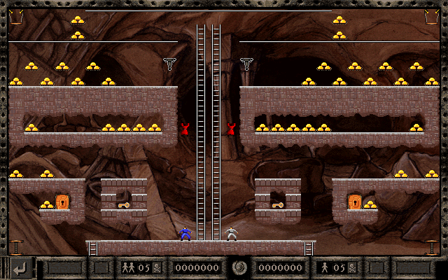

## Level 026
ASYMETRY 
- [Schematic](pngs_schema/026_s.png)
- <a href="pngs_labeled/LRO_MMR_2P - 026 - ANCI - ASYMETRY.png">Labeled image</a>
  

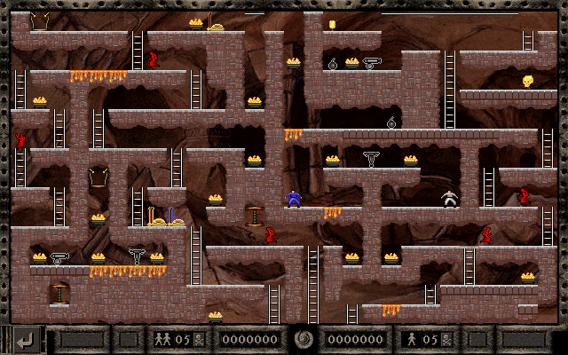

## Level 027
ANCIENT ENIGMA 
- [Schematic](pngs_schema/027_s.png)
- <a href="pngs_labeled/LRO_MMR_2P - 027 - ANCI - ANCIENT ENIGMA.png">Labeled image</a>
  

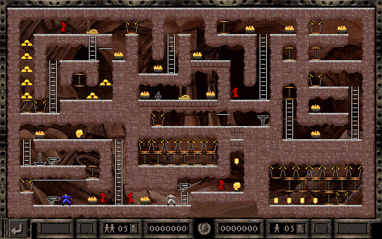

## Level 028
MUNK PERIL 
- [Schematic](pngs_schema/028_s.png)
- <a href="pngs_labeled/LRO_MMR_2P - 028 - ANCI - MUNK PERIL.png">Labeled image</a>
  

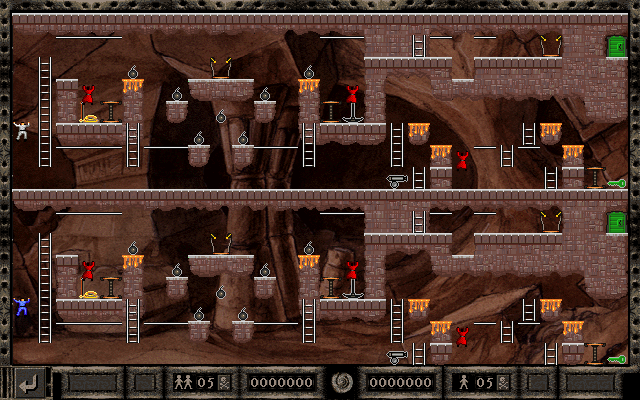

## Level 029
REMOVE THE GUARD 
- [Schematic](pngs_schema/029_s.png)
- <a href="pngs_labeled/LRO_MMR_2P - 029 - ANCI - REMOVE THE GUARD.png">Labeled image</a>
  

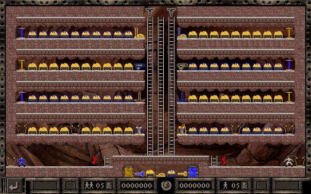

## Level 030
TRADING PLACES 
- [Schematic](pngs_schema/030_s.png)
- <a href="pngs_labeled/LRO_MMR_2P - 030 - ANCI - TRADING PLACES.png">Labeled image</a>
  

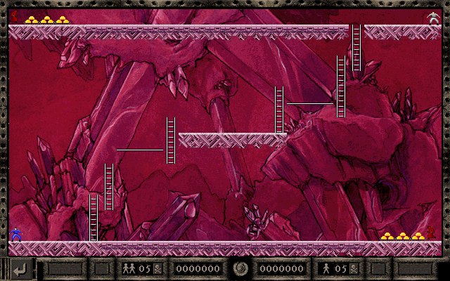

## Level 031
HANGING BY A THREAD 
- [Schematic](pngs_schema/031_s.png)
- <a href="pngs_labeled/LRO_MMR_2P - 031 - CRYS - HANGING BY A THREAD.png">Labeled image</a>
  

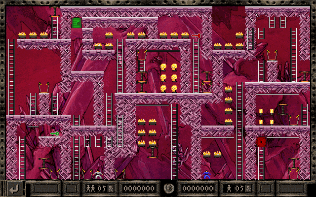

## Level 032
ZOPPING 
- [Schematic](pngs_schema/032_s.png)
- <a href="pngs_labeled/LRO_MMR_2P - 032 - CRYS - ZOPPING.png">Labeled image</a>
  

## Level 033
DEEP IN THE JUNGLE 
- [Schematic](pngs_schema/033_s.png)
- <a href="pngs_labeled/LRO_MMR_2P - 033 - MOSS - DEEP IN THE JUNGLE.png">Labeled image</a>
  

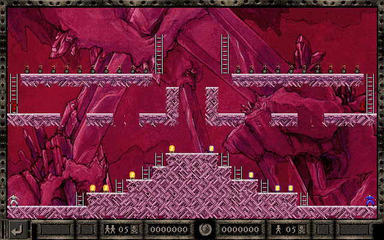

## Level 034
BEAT THE BOMBS 
- [Schematic](pngs_schema/034_s.png)
- <a href="pngs_labeled/LRO_MMR_2P - 034 - CRYS - BEAT THE BOMBS.png">Labeled image</a>
  

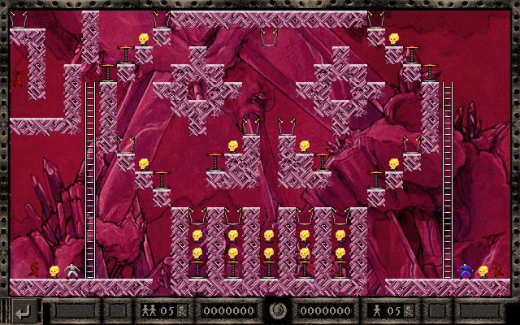

## Level 035
SKULLTOWN 
- [Schematic](pngs_schema/035_s.png)
- <a href="pngs_labeled/LRO_MMR_2P - 035 - CRYS - SKULLTOWN.png">Labeled image</a>
  

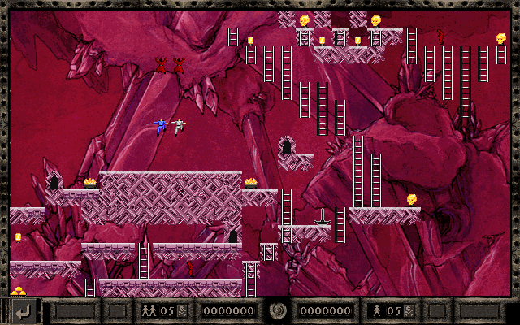

## Level 036
SLIPPERY WHEN WET 
- [Schematic](pngs_schema/036_s.png)
- <a href="pngs_labeled/LRO_MMR_2P - 036 - CRYS - SLIPPERY WHEN WET.png">Labeled image</a>
  

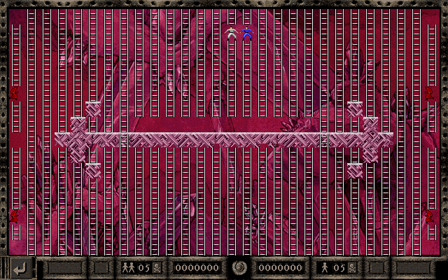

## Level 037
DOUBLE ARROWHEAD 
- [Schematic](pngs_schema/037_s.png)
- <a href="pngs_labeled/LRO_MMR_2P - 037 - CRYS - DOUBLE ARROWHEAD.png">Labeled image</a>
  

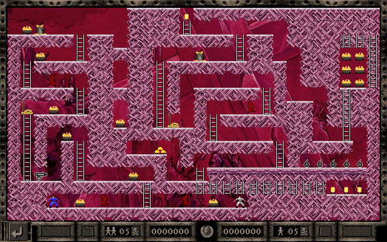

## Level 038
CRYSTAL GARDEN 
- [Schematic](pngs_schema/038_s.png)
- <a href="pngs_labeled/LRO_MMR_2P - 038 - CRYS - CRYSTAL GARDEN.png">Labeled image</a>
  

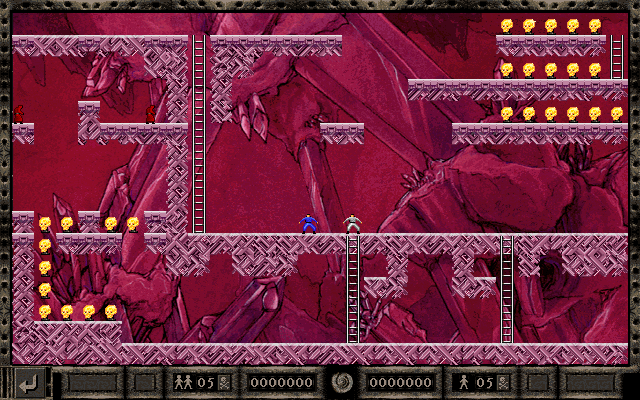

## Level 039
BRIDGE WORK 
- [Schematic](pngs_schema/039_s.png)
- <a href="pngs_labeled/LRO_MMR_2P - 039 - CRYS - BRIDGE WORK.png">Labeled image</a>
  

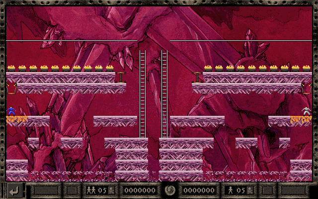

## Level 040
BRIDGE WAY 
- [Schematic](pngs_schema/040_s.png)
- <a href="pngs_labeled/LRO_MMR_2P - 040 - CRYS - BRIDGE WAY.png">Labeled image</a>
  

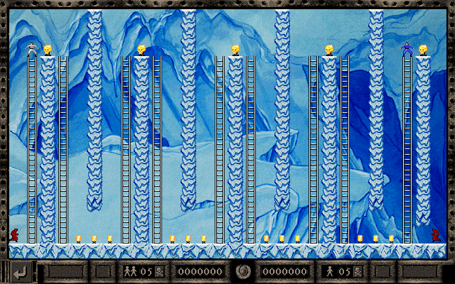

## Level 041
ICE SPIKES 
- [Schematic](pngs_schema/041_s.png)
- <a href="pngs_labeled/LRO_MMR_2P - 041 - ICEW - ICE SPIKES.png">Labeled image</a>
  

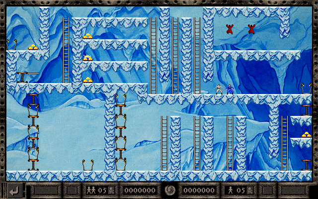

## Level 042
ICECASCADE 
- [Schematic](pngs_schema/042_s.png)
- <a href="pngs_labeled/LRO_MMR_2P - 042 - ICEW - ICECASCADE.png">Labeled image</a>
  

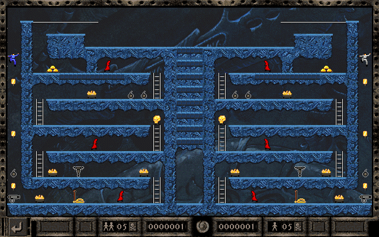

## Level 043
SEFLIZED 
- [Schematic](pngs_schema/043_s.png)
- <a href="pngs_labeled/LRO_MMR_2P - 043 - DARK - SEFLIZED.png">Labeled image</a>
  

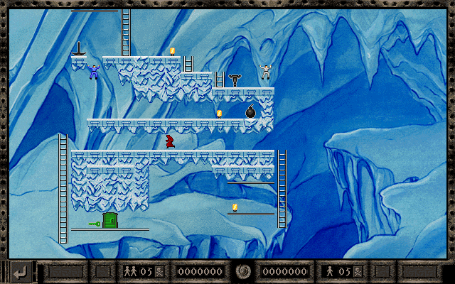

## Level 044
ROLE PLAYING 
- [Schematic](pngs_schema/044_s.png)
- <a href="pngs_labeled/LRO_MMR_2P - 044 - ICEW - ROLE PLAYING.png">Labeled image</a>
  

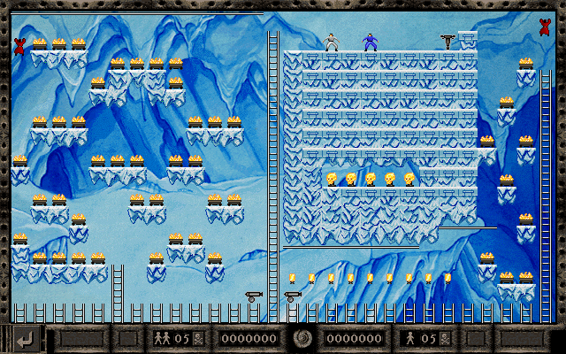

## Level 045
FRIENDS, OR ENEMIES? 
- [Schematic](pngs_schema/045_s.png)
- <a href="pngs_labeled/LRO_MMR_2P - 045 - ICEW - FRIENDS, OR ENEMIES.png">Labeled image</a>
  

## Level 046
ICICLES II 
- [Schematic](pngs_schema/046_s.png)
- <a href="pngs_labeled/LRO_MMR_2P - 046 - ICEW - ICICLES II.png">Labeled image</a>
  

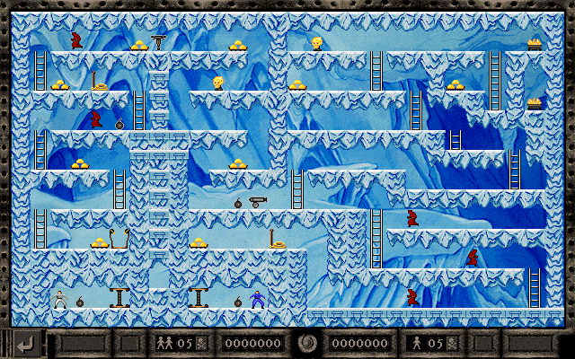

## Level 047
HAMMERING ICE 
- [Schematic](pngs_schema/047_s.png)
- <a href="pngs_labeled/LRO_MMR_2P - 047 - ICEW - HAMMERING ICE.png">Labeled image</a>
  

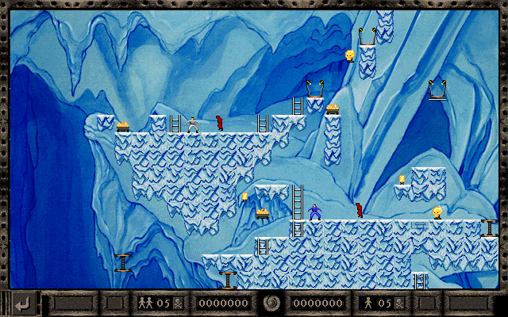

## Level 048
ICEBOX 
- [Schematic](pngs_schema/048_s.png)
- <a href="pngs_labeled/LRO_MMR_2P - 048 - ICEW - ICEBOX.png">Labeled image</a>
  

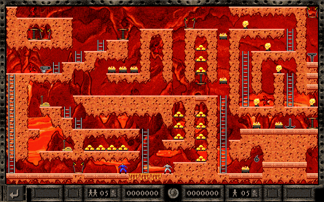

## Level 049
SEFF-EFF 
- [Schematic](pngs_schema/049_s.png)
- <a href="pngs_labeled/LRO_MMR_2P - 049 - LAVA - SEFF-EFF.png">Labeled image</a>
  

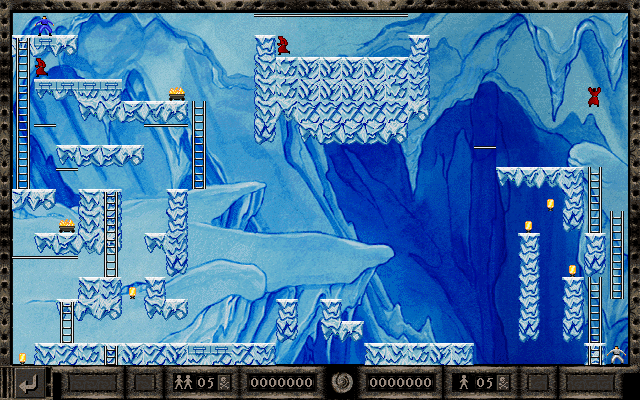

## Level 050
HELP ME! 
- [Schematic](pngs_schema/050_s.png)
- <a href="pngs_labeled/LRO_MMR_2P - 050 - ICEW - HELP ME.png">Labeled image</a>
  

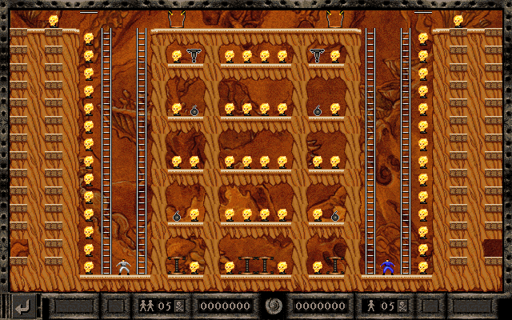

## Level 051
GOLDEN ROOMS 
- [Schematic](pngs_schema/051_s.png)
- <a href="pngs_labeled/LRO_MMR_2P - 051 - FUNG - GOLDEN ROOMS.png">Labeled image</a>
  

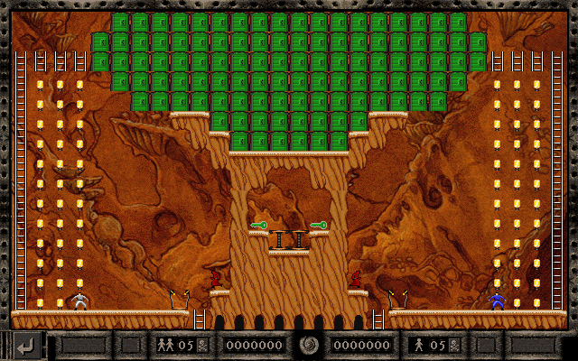

## Level 052
MONEY TREE 
- [Schematic](pngs_schema/052_s.png)
- <a href="pngs_labeled/LRO_MMR_2P - 052 - FUNG - MONEY TREE.png">Labeled image</a>
  

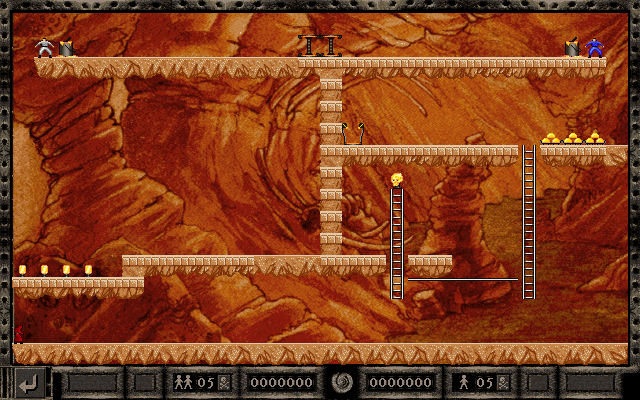

## Level 053
WORK'N TOGETHER 
- [Schematic](pngs_schema/053_s.png)
- <a href="pngs_labeled/LRO_MMR_2P - 053 - FOSS - WORK'N TOGETHER.png">Labeled image</a>
  

## Level 054
STEPH-FA 
- [Schematic](pngs_schema/054_s.png)
- <a href="pngs_labeled/LRO_MMR_2P - 054 - FOSS - STEPH-FA.png">Labeled image</a>
  

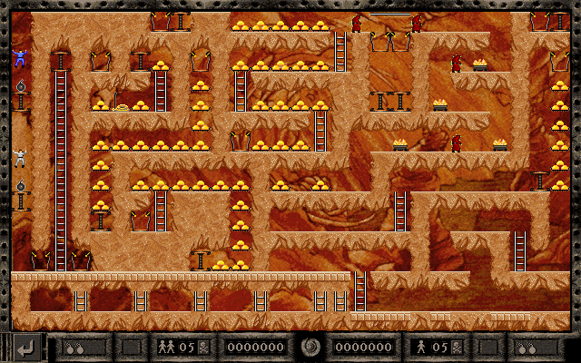

## Level 055
STEPH-LA 
- [Schematic](pngs_schema/055_s.png)
- <a href="pngs_labeled/LRO_MMR_2P - 055 - FOSS - STEPH-LA.png">Labeled image</a>
  

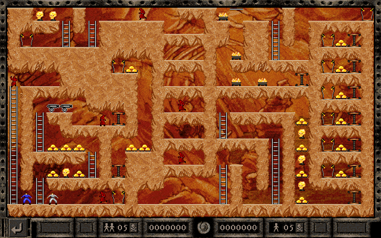

## Level 056
STEPH-SO 
- [Schematic](pngs_schema/056_s.png)
- <a href="pngs_labeled/LRO_MMR_2P - 056 - FOSS - STEPH-SO.png">Labeled image</a>
  

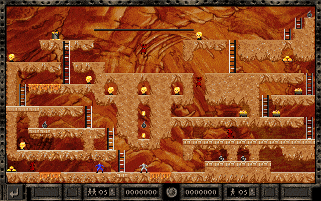

## Level 057
STEPH-FUN 
- [Schematic](pngs_schema/057_s.png)
- <a href="pngs_labeled/LRO_MMR_2P - 057 - FOSS - STEPH-FUN.png">Labeled image</a>
  

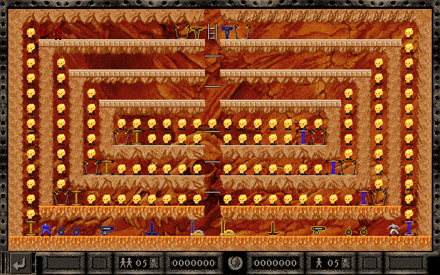

## Level 058
PURGATORY 
- [Schematic](pngs_schema/058_s.png)
- <a href="pngs_labeled/LRO_MMR_2P - 058 - FOSS - PURGATORY.png">Labeled image</a>
  

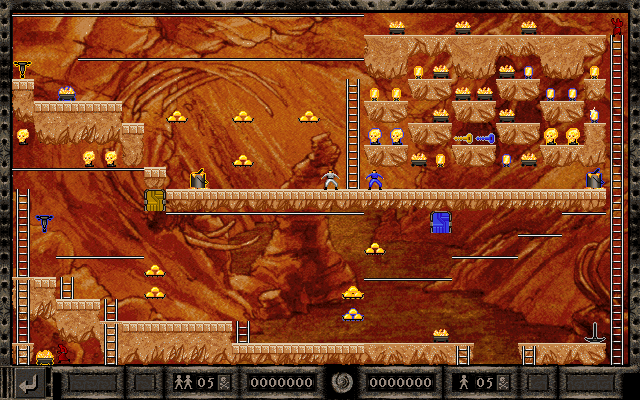

## Level 059
PERTURBATION 
- [Schematic](pngs_schema/059_s.png)
- <a href="pngs_labeled/LRO_MMR_2P - 059 - FOSS - PERTURBATION.png">Labeled image</a>
  

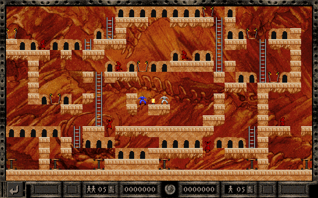

## Level 060
PHAZE HIDEAWAY 
- [Schematic](pngs_schema/060_s.png)
- <a href="pngs_labeled/LRO_MMR_2P - 060 - FOSS - PHAZE HIDEAWAY.png">Labeled image</a>
  

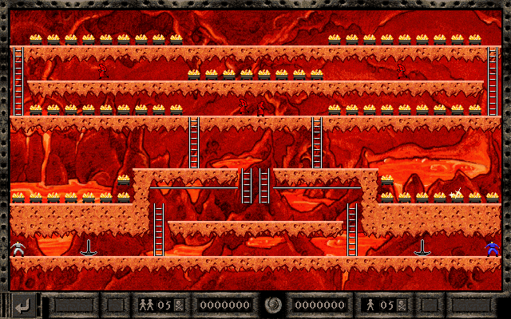

## Level 061
IS IT HOT IN HERE, OR IS IT JUST ME? 
- [Schematic](pngs_schema/061_s.png)
- <a href="pngs_labeled/LRO_MMR_2P - 061 - LAVA - IS IT HOT IN HERE, OR IS IT JUST ME.png">Labeled image</a>
  

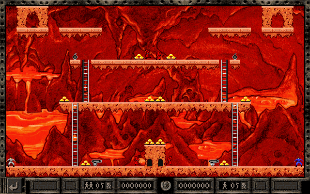

## Level 062
DARBATT 
- [Schematic](pngs_schema/062_s.png)
- <a href="pngs_labeled/LRO_MMR_2P - 062 - LAVA - DARBATT.png">Labeled image</a>
  

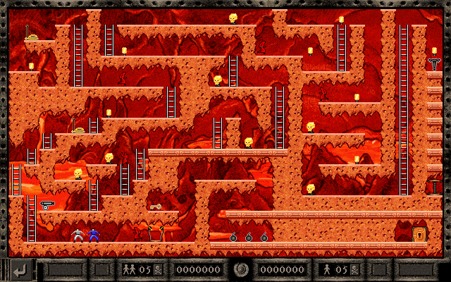

## Level 063
BOMB BLASTER 
- [Schematic](pngs_schema/063_s.png)
- <a href="pngs_labeled/LRO_MMR_2P - 063 - LAVA - BOMB BLASTER.png">Labeled image</a>
  

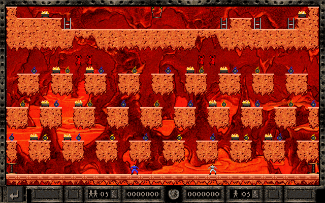

## Level 064
STAGGERED STUFF 
- [Schematic](pngs_schema/064_s.png)
- <a href="pngs_labeled/LRO_MMR_2P - 064 - LAVA - STAGGERED STUFF.png">Labeled image</a>
  

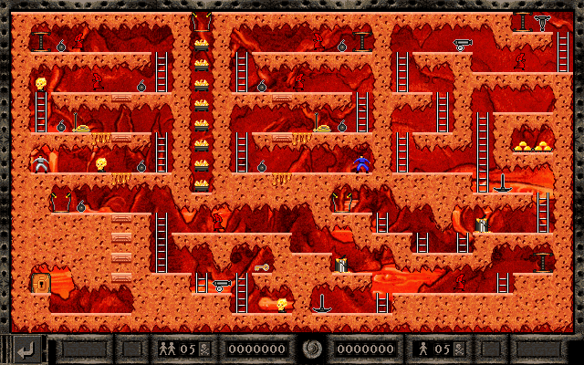

## Level 065
HEAT OF THE SPRINT 
- [Schematic](pngs_schema/065_s.png)
- <a href="pngs_labeled/LRO_MMR_2P - 065 - LAVA - HEAT OF THE SPRINT.png">Labeled image</a>
  

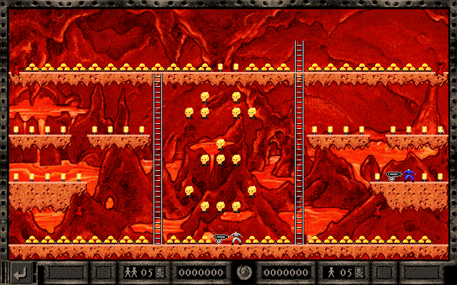

## Level 066
WATCH WHERE YOU POINT THAT THING 
- [Schematic](pngs_schema/066_s.png)
- <a href="pngs_labeled/LRO_MMR_2P - 066 - LAVA - WATCH WHERE YOU POINT THAT THING.png">Labeled image</a>
  

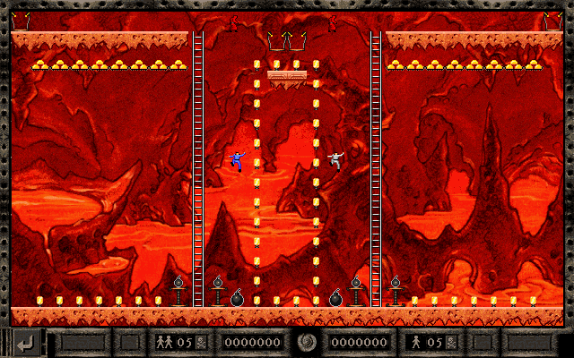

## Level 067
BIG SKY BOMB 
- [Schematic](pngs_schema/067_s.png)
- <a href="pngs_labeled/LRO_MMR_2P - 067 - LAVA - BIG SKY BOMB.png">Labeled image</a>
  

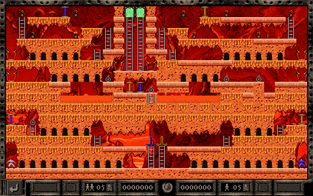

## Level 068
HELL 
- [Schematic](pngs_schema/068_s.png)
- <a href="pngs_labeled/LRO_MMR_2P - 068 - LAVA - HELL.png">Labeled image</a>
  

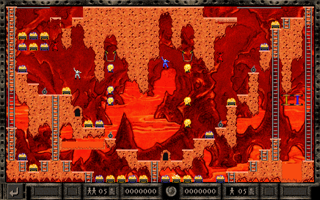

## Level 069
CAVERNOUS TERRATORY 
- [Schematic](pngs_schema/069_s.png)
- <a href="pngs_labeled/LRO_MMR_2P - 069 - LAVA - CAVERNOUS TERRATORY.png">Labeled image</a>
  

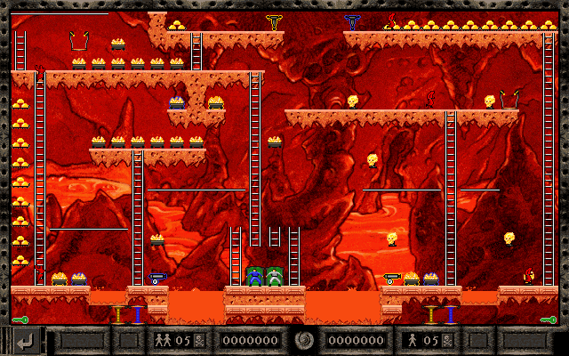

## Level 070
TOOL TRICKS 
- [Schematic](pngs_schema/070_s.png)
- <a href="pngs_labeled/LRO_MMR_2P - 070 - LAVA - TOOL TRICKS.png">Labeled image</a>
  

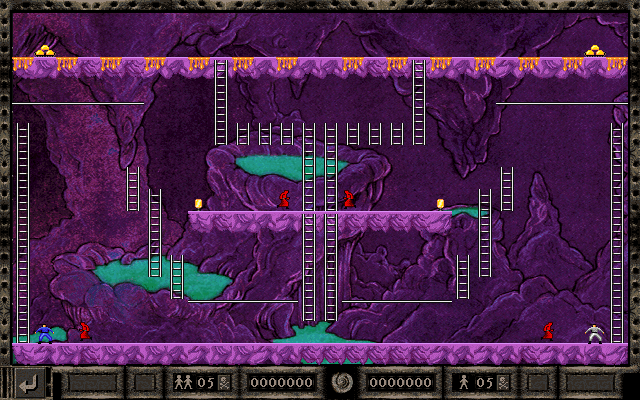

## Level 071
TOP SHELF 
- [Schematic](pngs_schema/071_s.png)
- <a href="pngs_labeled/LRO_MMR_2P - 071 - PHOS - TOP SHELF.png">Labeled image</a>
  

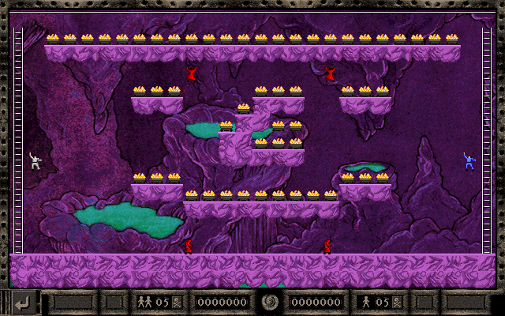

## Level 072
ARE YOU ANNOYED YET 
- [Schematic](pngs_schema/072_s.png)
- <a href="pngs_labeled/LRO_MMR_2P - 072 - PHOS - ARE YOU ANNOYED YET.png">Labeled image</a>
  

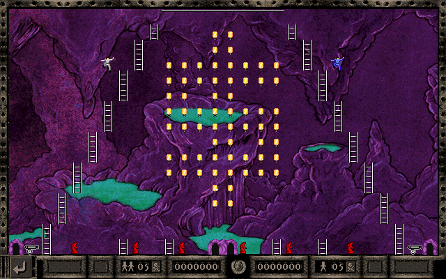

## Level 073
MONEY, MONEY 
- [Schematic](pngs_schema/073_s.png)
- <a href="pngs_labeled/LRO_MMR_2P - 073 - PHOS - MONEY, MONEY.png">Labeled image</a>
  

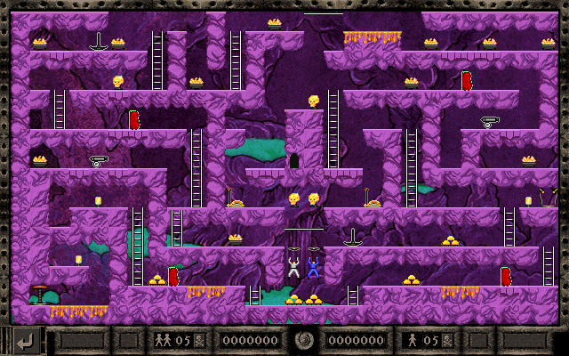

## Level 074
PHOSPHEROUS FINDINGS 
- [Schematic](pngs_schema/074_s.png)
- <a href="pngs_labeled/LRO_MMR_2P - 074 - PHOS - PHOSPHEROUS FINDINGS.png">Labeled image</a>
  

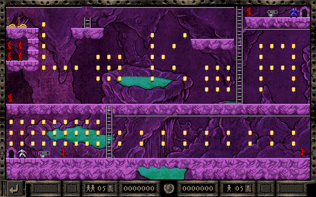

## Level 075
DON'T BE GREEDY 
- [Schematic](pngs_schema/075_s.png)
- <a href="pngs_labeled/LRO_MMR_2P - 075 - PHOS - DON'T BE GREEDY.png">Labeled image</a>
  

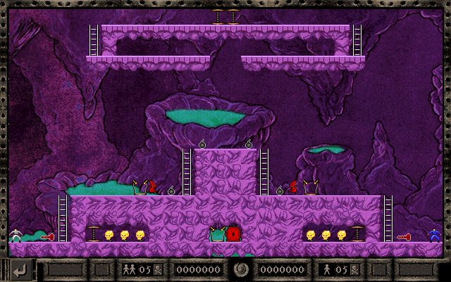

## Level 076
DARN RACE 
- [Schematic](pngs_schema/076_s.png)
- <a href="pngs_labeled/LRO_MMR_2P - 076 - PHOS - DARN RACE.png">Labeled image</a>
  

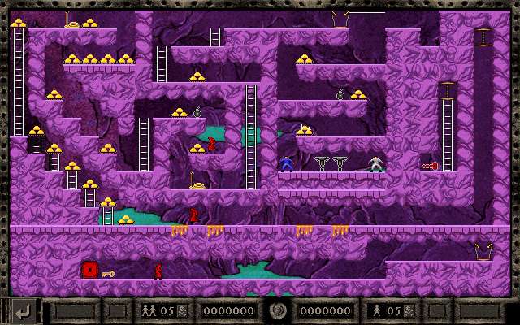

## Level 077
STEPH-TI 
- [Schematic](pngs_schema/077_s.png)
- <a href="pngs_labeled/LRO_MMR_2P - 077 - PHOS - STEPH-TI.png">Labeled image</a>
  

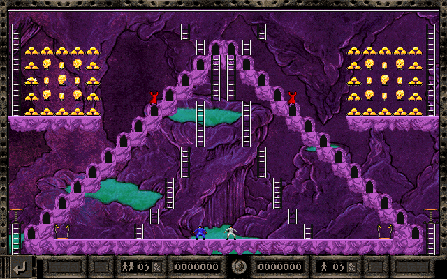

## Level 078
PURPLE HAZE 
- [Schematic](pngs_schema/078_s.png)
- <a href="pngs_labeled/LRO_MMR_2P - 078 - PHOS - PURPLE HAZE.png">Labeled image</a>
  

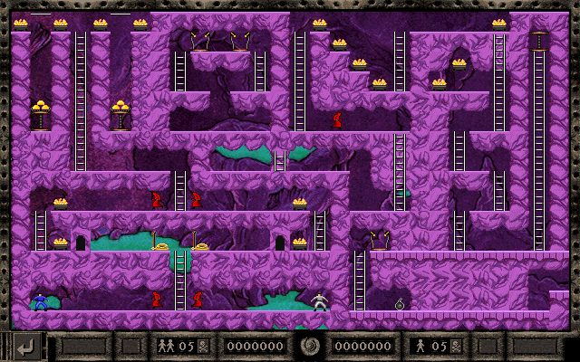

## Level 079
STEPH STEP 
- [Schematic](pngs_schema/079_s.png)
- <a href="pngs_labeled/LRO_MMR_2P - 079 - PHOS - STEPH STEP.png">Labeled image</a>
  

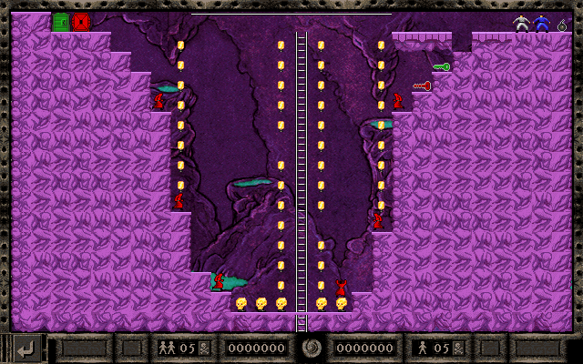

## Level 080
KENNY'S PIT 
- [Schematic](pngs_schema/080_s.png)
- <a href="pngs_labeled/LRO_MMR_2P - 080 - PHOS - KENNY'S PIT.png">Labeled image</a>
  

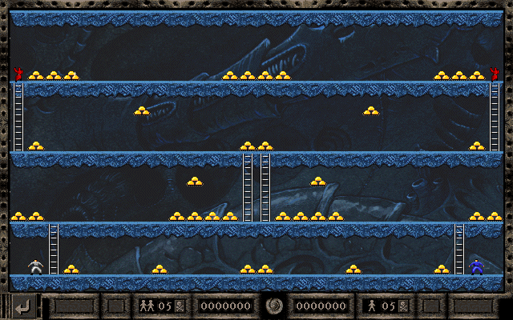

## Level 081
BLUE BATTLE 
- [Schematic](pngs_schema/081_s.png)
- <a href="pngs_labeled/LRO_MMR_2P - 081 - DARK - BLUE BATTLE.png">Labeled image</a>
  

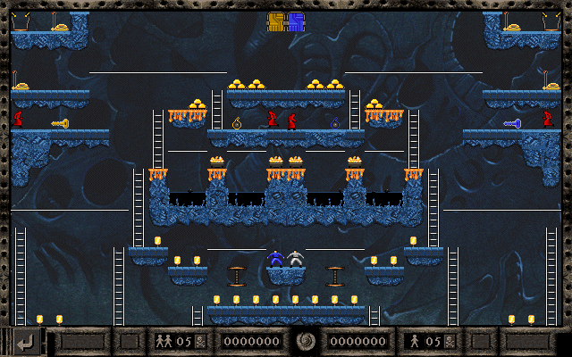

## Level 082
ICKY CAKE WALK 
- [Schematic](pngs_schema/082_s.png)
- <a href="pngs_labeled/LRO_MMR_2P - 082 - DARK - ICKY CAKE WALK.png">Labeled image</a>
  

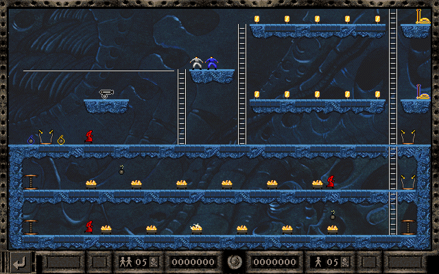

## Level 083
NARROW 
- [Schematic](pngs_schema/083_s.png)
- <a href="pngs_labeled/LRO_MMR_2P - 083 - DARK - NARROW.png">Labeled image</a>
  

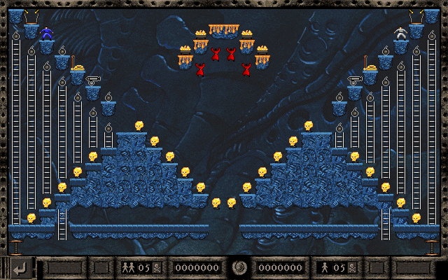

## Level 084
SKULLBOY WITH WINGS 
- [Schematic](pngs_schema/084_s.png)
- <a href="pngs_labeled/LRO_MMR_2P - 084 - DARK - SKULLBOY WITH WINGS.png">Labeled image</a>
  

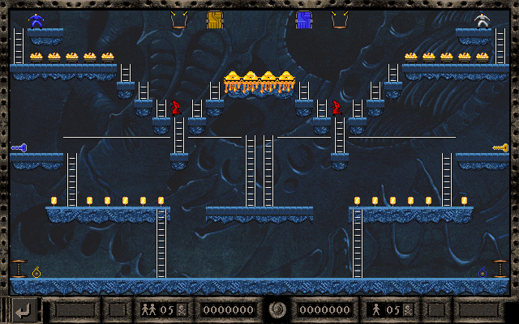

## Level 085
KEASY 
- [Schematic](pngs_schema/085_s.png)
- <a href="pngs_labeled/LRO_MMR_2P - 085 - DARK - KEASY.png">Labeled image</a>
  

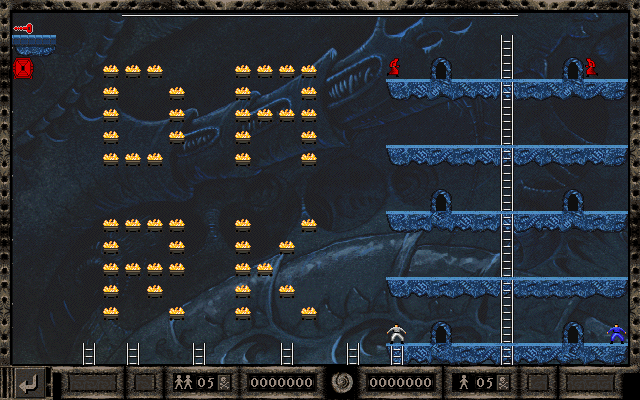

## Level 086
ARE YOU AFRAID OF THE DARK? 
- [Schematic](pngs_schema/086_s.png)
- <a href="pngs_labeled/LRO_MMR_2P - 086 - DARK - ARE YOU AFRAID OF THE DARK.png">Labeled image</a>
  

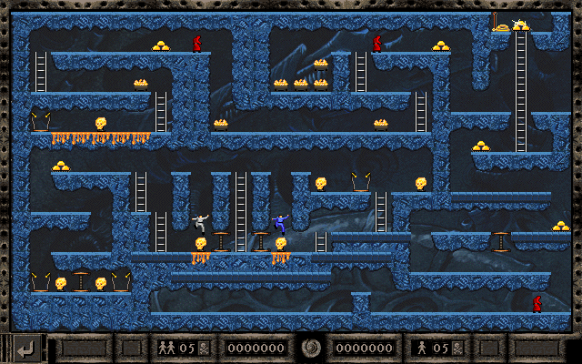

## Level 087
SERVENTS OF DARKNESS 
- [Schematic](pngs_schema/087_s.png)
- <a href="pngs_labeled/LRO_MMR_2P - 087 - DARK - SERVENTS OF DARKNESS.png">Labeled image</a>
  

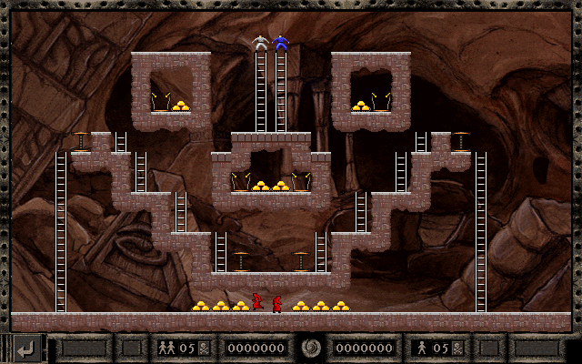

## Level 088
FACIAL 
- [Schematic](pngs_schema/088_s.png)
- <a href="pngs_labeled/LRO_MMR_2P - 088 - ANCI - FACIAL.png">Labeled image</a>
  

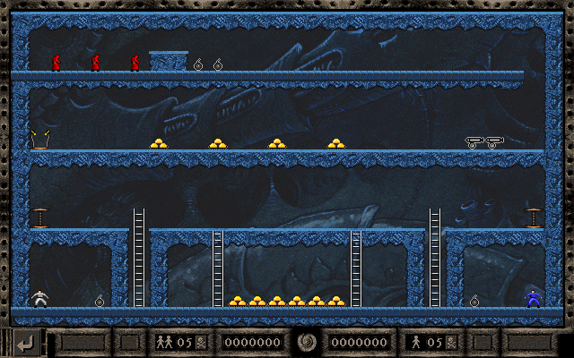

## Level 089
SMOKE BOMB 
- [Schematic](pngs_schema/089_s.png)
- <a href="pngs_labeled/LRO_MMR_2P - 089 - DARK - SMOKE BOMB.png">Labeled image</a>
  

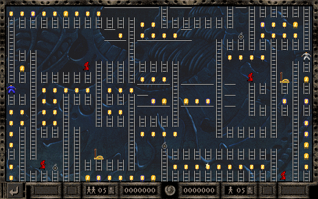

## Level 090
BOUNTIFUL BOXES 
- [Schematic](pngs_schema/090_s.png)
- <a href="pngs_labeled/LRO_MMR_2P - 090 - DARK - BOUNTIFUL BOXES.png">Labeled image</a>
  

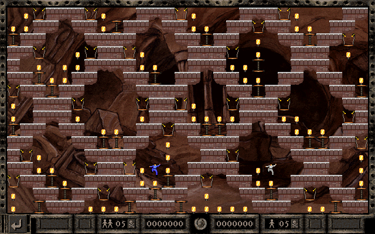

## Level 091
WHERE YOU END UP, NOBODY KNOWS 
- [Schematic](pngs_schema/091_s.png)
- <a href="pngs_labeled/LRO_MMR_2P - 091 - ANCI - WHERE YOU END UP, NOBODY KNOWS.png">Labeled image</a>
  

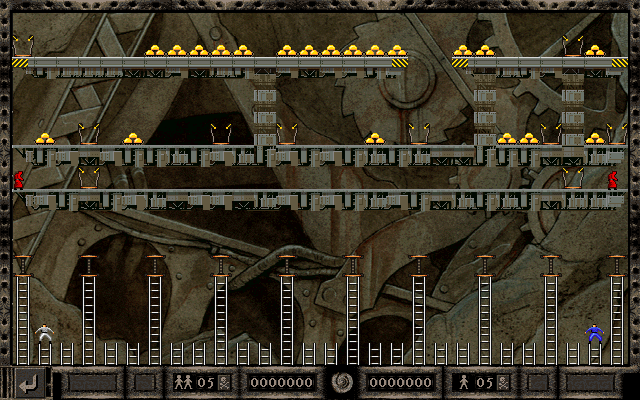

## Level 092
TELEHUNT 
- [Schematic](pngs_schema/092_s.png)
- <a href="pngs_labeled/LRO_MMR_2P - 092 - INDU - TELEHUNT.png">Labeled image</a>
  

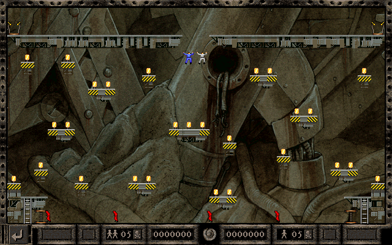

## Level 093
DROP 'EM 
- [Schematic](pngs_schema/093_s.png)
- <a href="pngs_labeled/LRO_MMR_2P - 093 - INDU - DROP 'EM.png">Labeled image</a>
  

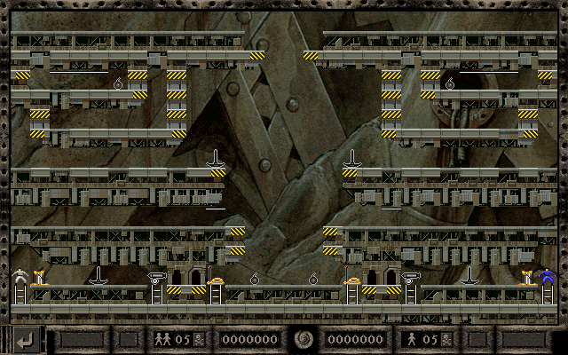

## Level 094
THE SEARCH 
- [Schematic](pngs_schema/094_s.png)
- <a href="pngs_labeled/LRO_MMR_2P - 094 - INDU - THE SEARCH.png">Labeled image</a>
  

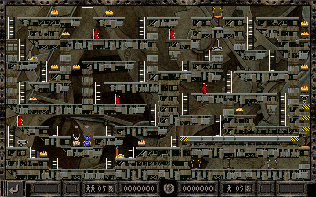

## Level 095
INDUSTRIAL ESPIONAGE 
- [Schematic](pngs_schema/095_s.png)
- <a href="pngs_labeled/LRO_MMR_2P - 095 - INDU - INDUSTRIAL ESPIONAGE.png">Labeled image</a>
  

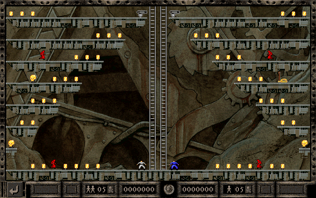

## Level 096
GHOST IN THE MACHINE 
- [Schematic](pngs_schema/096_s.png)
- <a href="pngs_labeled/LRO_MMR_2P - 096 - INDU - GHOST IN THE MACHINE.png">Labeled image</a>
  

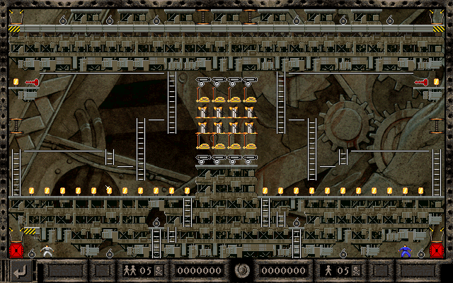

## Level 097
BAMMO 
- [Schematic](pngs_schema/097_s.png)
- <a href="pngs_labeled/LRO_MMR_2P - 097 - INDU - BAMMO.png">Labeled image</a>
  

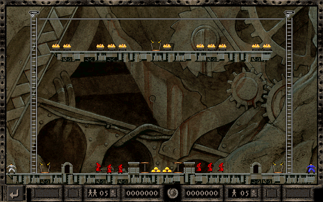

## Level 098
CENTER-OUT 
- [Schematic](pngs_schema/098_s.png)
- <a href="pngs_labeled/LRO_MMR_2P - 098 - INDU - CENTER-OUT.png">Labeled image</a>
  

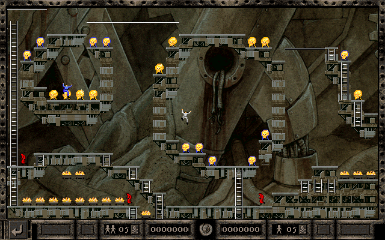

## Level 099
COGS 
- [Schematic](pngs_schema/099_s.png)
- <a href="pngs_labeled/LRO_MMR_2P - 099 - INDU - COGS.png">Labeled image</a>
  

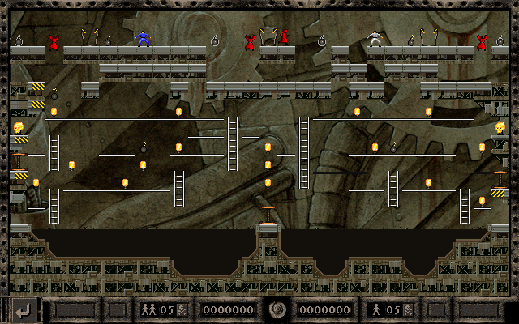

## Level 100
HIGHWIRE 
- [Schematic](pngs_schema/100_s.png)
- <a href="pngs_labeled/LRO_MMR_2P - 100 - INDU - HIGHWIRE.png">Labeled image</a>
  

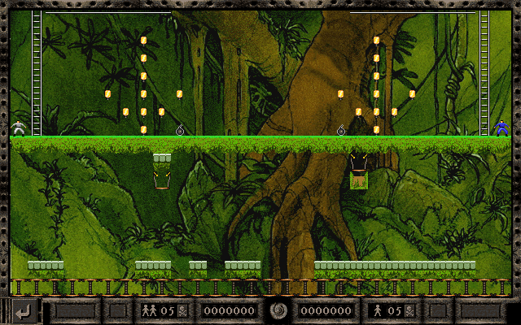

## Level 101
FOLLOW THE ARROWS 
- [Schematic](pngs_schema/101_s.png)
- <a href="pngs_labeled/LRO_MMR_2P - 101 - MOSS - FOLLOW THE ARROWS.png">Labeled image</a>
  

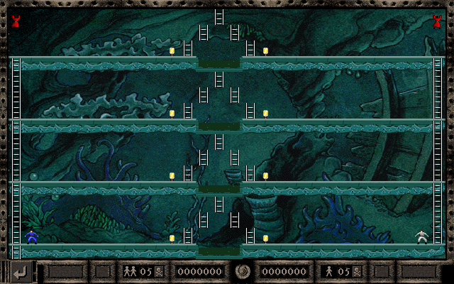

## Level 102
UP N' OVER 
- [Schematic](pngs_schema/102_s.png)
- <a href="pngs_labeled/LRO_MMR_2P - 102 - REEF - UP N' OVER.png">Labeled image</a>
  

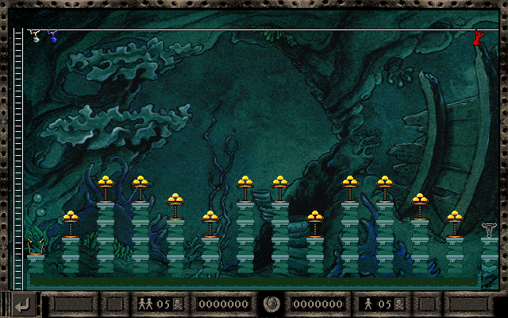

## Level 103
DROP ON IN 
- [Schematic](pngs_schema/103_s.png)
- <a href="pngs_labeled/LRO_MMR_2P - 103 - REEF - DROP ON IN.png">Labeled image</a>
  

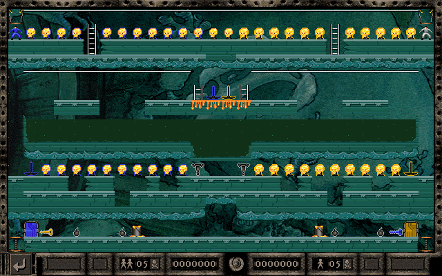

## Level 104
PHAZED WATERWAY 
- [Schematic](pngs_schema/104_s.png)
- <a href="pngs_labeled/LRO_MMR_2P - 104 - REEF - PHAZED WATERWAY.png">Labeled image</a>
  

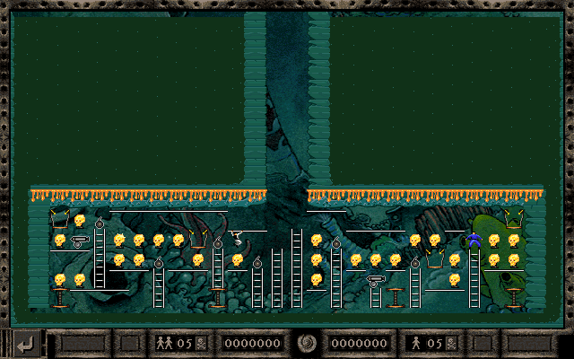

## Level 105
ARENA ATLANTIS 
- [Schematic](pngs_schema/105_s.png)
- <a href="pngs_labeled/LRO_MMR_2P - 105 - REEF - ARENA ATLANTIS.png">Labeled image</a>
  

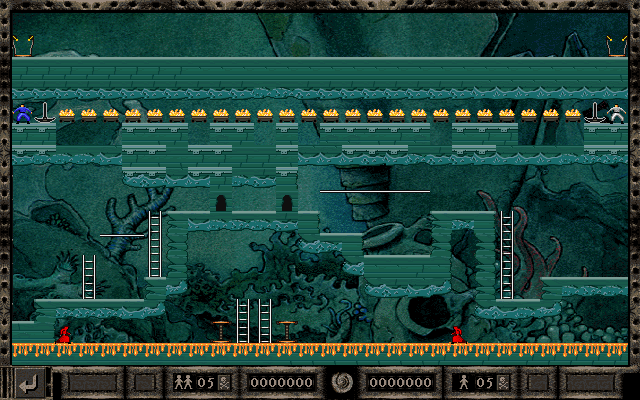

## Level 106
PICKAXE PHAZE 
- [Schematic](pngs_schema/106_s.png)
- <a href="pngs_labeled/LRO_MMR_2P - 106 - REEF - PICKAXE PHAZE.png">Labeled image</a>
  

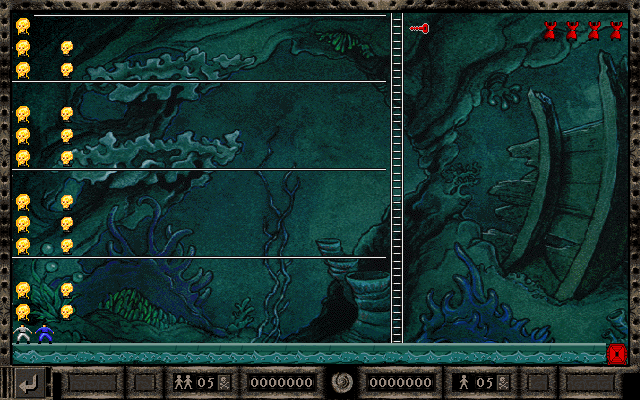

## Level 107
VAULTIN' 
- [Schematic](pngs_schema/107_s.png)
- <a href="pngs_labeled/LRO_MMR_2P - 107 - REEF - VAULTIN'.png">Labeled image</a>
  

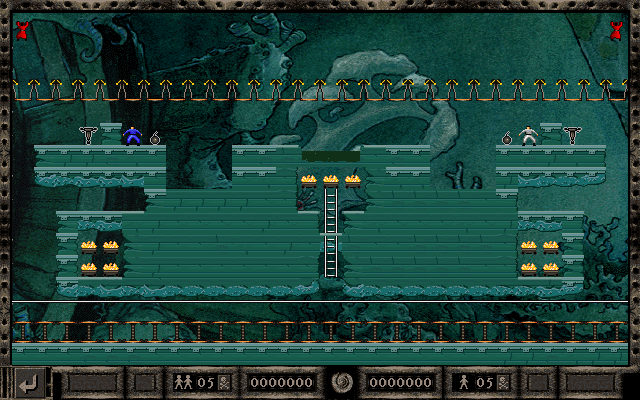

## Level 108
TELEPORTER MADNESS 
- [Schematic](pngs_schema/108_s.png)
- <a href="pngs_labeled/LRO_MMR_2P - 108 - REEF - TELEPORTER MADNESS.png">Labeled image</a>
  

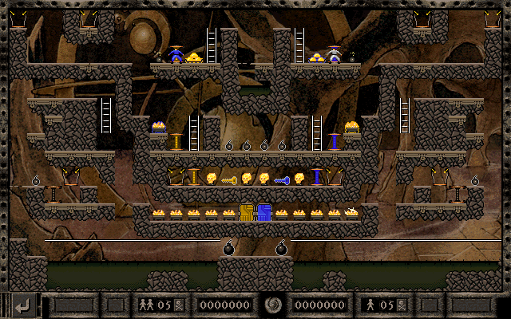

## Level 109
UNDERWATER NIGHTMARE 
- [Schematic](pngs_schema/109_s.png)
- <a href="pngs_labeled/LRO_MMR_2P - 109 - ASTR - UNDERWATER NIGHTMARE.png">Labeled image</a>
  

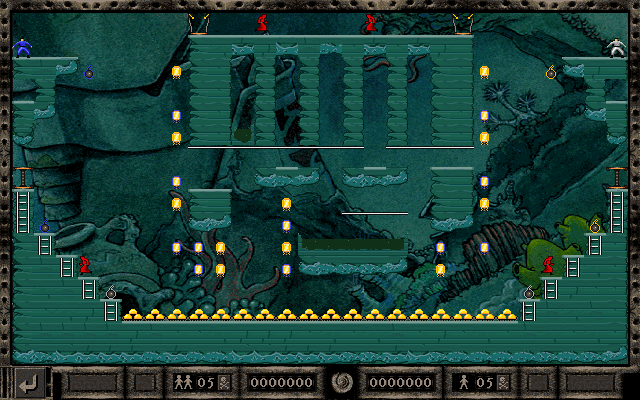

## Level 110
BOMB TEAMWORK 
- [Schematic](pngs_schema/110_s.png)
- <a href="pngs_labeled/LRO_MMR_2P - 110 - REEF - BOMB TEAMWORK.png">Labeled image</a>
  

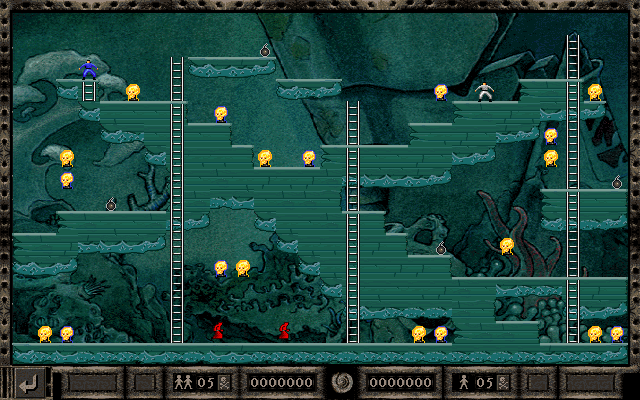

## Level 111
RUMMAGE SALE 
- [Schematic](pngs_schema/111_s.png)
- <a href="pngs_labeled/LRO_MMR_2P - 111 - REEF - RUMMAGE SALE.png">Labeled image</a>
  

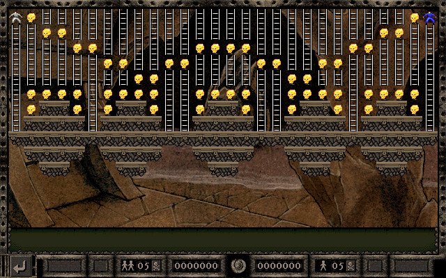

## Level 112
CLIMBURSTER 
- [Schematic](pngs_schema/112_s.png)
- <a href="pngs_labeled/LRO_MMR_2P - 112 - ASTR - CLIMBURSTER.png">Labeled image</a>
  

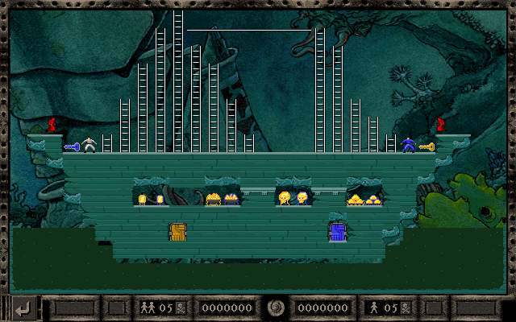

## Level 113
ARK 
- [Schematic](pngs_schema/113_s.png)
- <a href="pngs_labeled/LRO_MMR_2P - 113 - REEF - ARK.png">Labeled image</a>
  

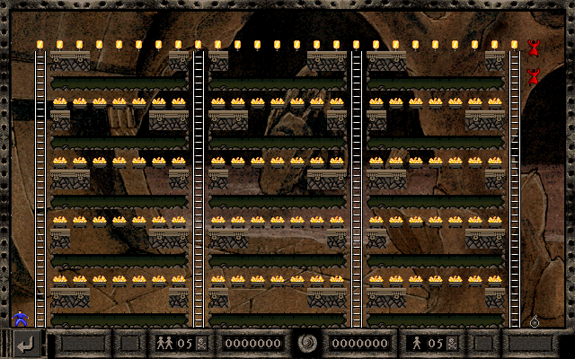

## Level 114
PLATFORMZ 
- [Schematic](pngs_schema/114_s.png)
- <a href="pngs_labeled/LRO_MMR_2P - 114 - ASTR - PLATFORMZ.png">Labeled image</a>
  

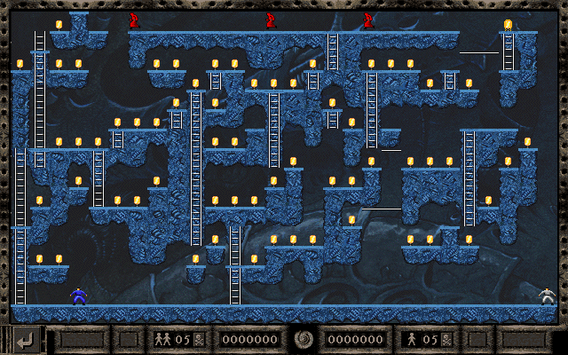

## Level 115
READE'S RALLY 
- [Schematic](pngs_schema/115_s.png)
- <a href="pngs_labeled/LRO_MMR_2P - 115 - DARK - READE'S RALLY.png">Labeled image</a>
  

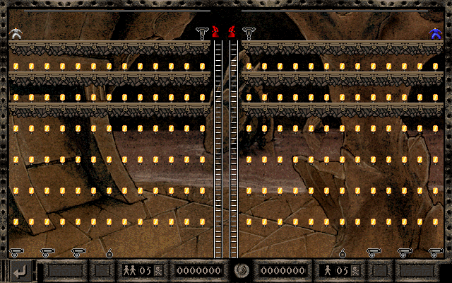

## Level 116
THE WORLD CRUMBLETH 
- [Schematic](pngs_schema/116_s.png)
- <a href="pngs_labeled/LRO_MMR_2P - 116 - ASTR - THE WORLD CRUMBLETH.png">Labeled image</a>
  

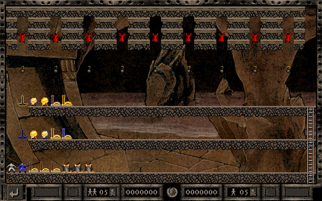

## Level 117
WHAT'S BEHIND DOOR #0? 
- [Schematic](pngs_schema/117_s.png)
- <a href="pngs_labeled/LRO_MMR_2P - 117 - ASTR - WHAT'S BEHIND DOOR #0.png">Labeled image</a>
  

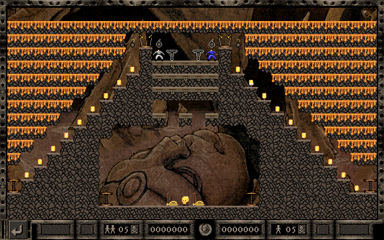

## Level 118
PHARAOH'S TOMB 
- [Schematic](pngs_schema/118_s.png)
- <a href="pngs_labeled/LRO_MMR_2P - 118 - ASTR - PHARAOH'S TOMB.png">Labeled image</a>
  

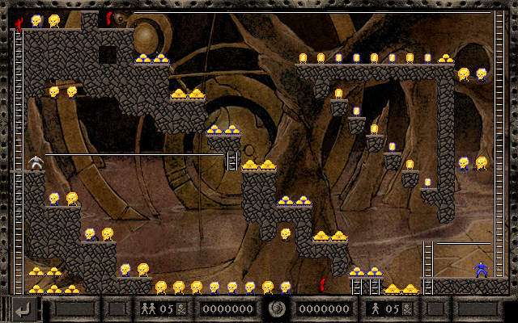

## Level 119
NEW SLANT 
- [Schematic](pngs_schema/119_s.png)
- <a href="pngs_labeled/LRO_MMR_2P - 119 - ASTR - NEW SLANT.png">Labeled image</a>
  

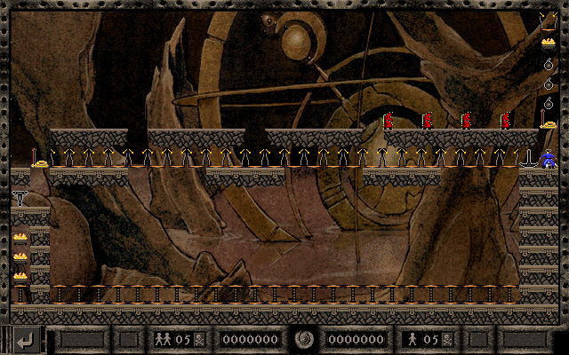

## Level 120
MOVING BRIDGE 
- [Schematic](pngs_schema/120_s.png)
- <a href="pngs_labeled/LRO_MMR_2P - 120 - ASTR - MOVING BRIDGE.png">Labeled image</a>
  

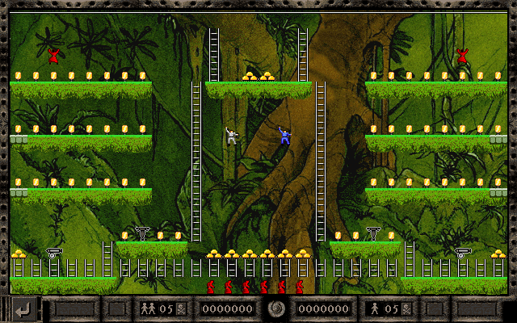

## Level 121
DON'T DIE 
- [Schematic](pngs_schema/121_s.png)
- <a href="pngs_labeled/LRO_MMR_2P - 121 - MOSS - DON'T DIE.png">Labeled image</a>
  

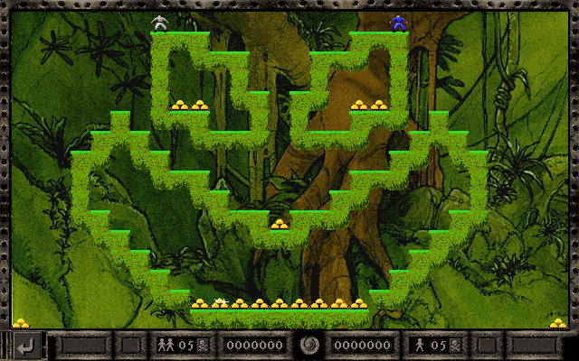

## Level 122
FACE 
- [Schematic](pngs_schema/122_s.png)
- <a href="pngs_labeled/LRO_MMR_2P - 122 - MOSS - FACE.png">Labeled image</a>
  

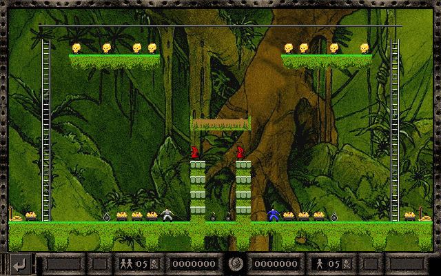

## Level 123
BOMBS ARE OUR FRIENDS 
- [Schematic](pngs_schema/123_s.png)
- <a href="pngs_labeled/LRO_MMR_2P - 123 - MOSS - BOMBS ARE OUR FRIENDS.png">Labeled image</a>
  

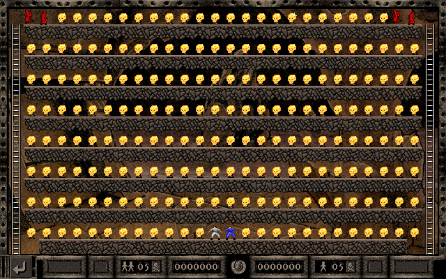

## Level 124
GOLD RUSH 
- [Schematic](pngs_schema/124_s.png)
- <a href="pngs_labeled/LRO_MMR_2P - 124 - ASTR - GOLD RUSH.png">Labeled image</a>
  

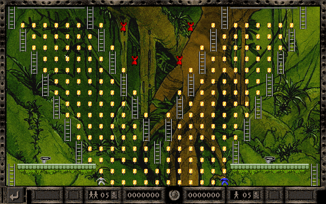

## Level 125
V IS FOR VICTORY 
- [Schematic](pngs_schema/125_s.png)
- <a href="pngs_labeled/LRO_MMR_2P - 125 - MOSS - V IS FOR VICTORY.png">Labeled image</a>
  

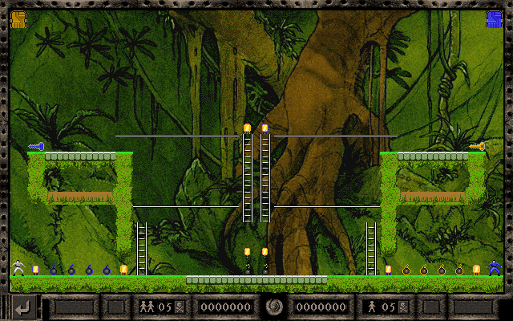

## Level 126
SWITCH SIDES 
- [Schematic](pngs_schema/126_s.png)
- <a href="pngs_labeled/LRO_MMR_2P - 126 - MOSS - SWITCH SIDES.png">Labeled image</a>
  

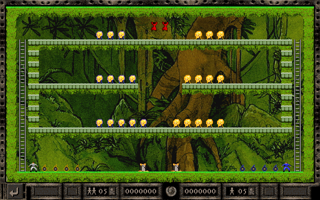

## Level 127
DON'T WASTE BOMBS 
- [Schematic](pngs_schema/127_s.png)
- <a href="pngs_labeled/LRO_MMR_2P - 127 - MOSS - DON'T WASTE BOMBS.png">Labeled image</a>
  

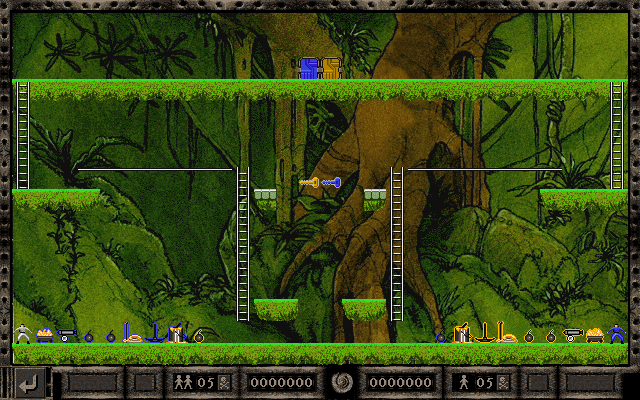

## Level 128
THE DUEL 
- [Schematic](pngs_schema/128_s.png)
- <a href="pngs_labeled/LRO_MMR_2P - 128 - MOSS - THE DUEL.png">Labeled image</a>
  

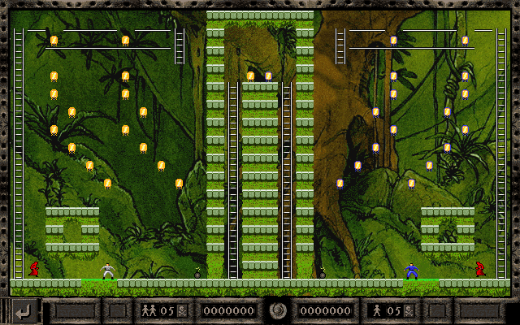

## Level 129
BOX A MONK 
- [Schematic](pngs_schema/129_s.png)
- <a href="pngs_labeled/LRO_MMR_2P - 129 - MOSS - BOX A MONK.png">Labeled image</a>
  

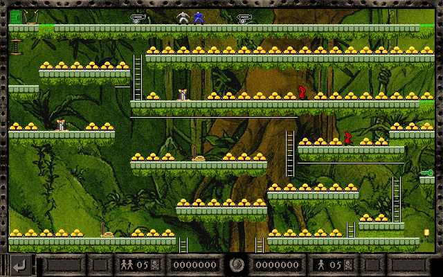

## Level 130
YOU'VE STRUCK IT RICH 
- [Schematic](pngs_schema/130_s.png)
- <a href="pngs_labeled/LRO_MMR_2P - 130 - MOSS - YOU'VE STRUCK IT RICH.png">Labeled image</a>
  

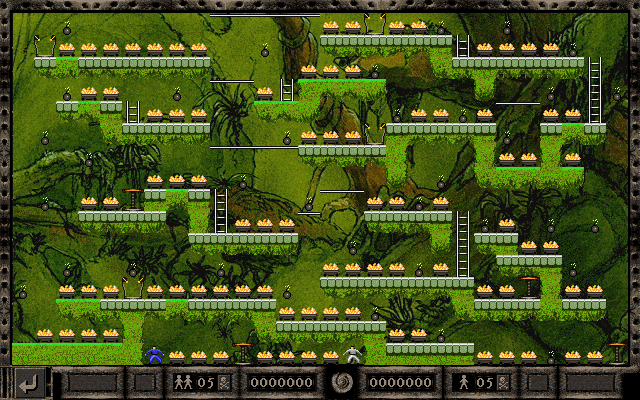

## Level 131
DODGE BOMB 
- [Schematic](pngs_schema/131_s.png)
- <a href="pngs_labeled/LRO_MMR_2P - 131 - MOSS - DODGE BOMB.png">Labeled image</a>
  

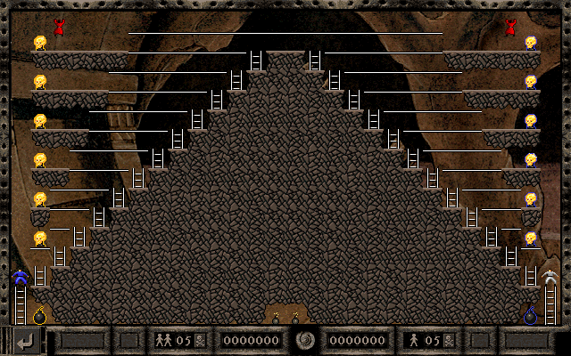

## Level 132
PYRAMID OF DOOM 
- [Schematic](pngs_schema/132_s.png)
- <a href="pngs_labeled/LRO_MMR_2P - 132 - ASTR - PYRAMID OF DOOM.png">Labeled image</a>
  

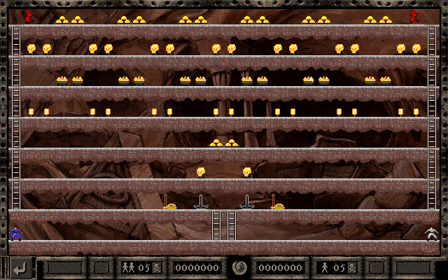

## Level 133
VARIETY 
- [Schematic](pngs_schema/133_s.png)
- <a href="pngs_labeled/LRO_MMR_2P - 133 - ASTR - VARIETY.png">Labeled image</a>
  

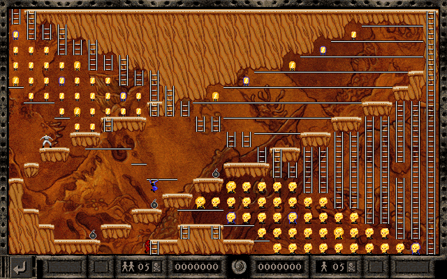

## Level 134
X MARKS THE SPOT 
- [Schematic](pngs_schema/134_s.png)
- <a href="pngs_labeled/LRO_MMR_2P - 134 - FUNG - X MARKS THE SPOT.png">Labeled image</a>
  

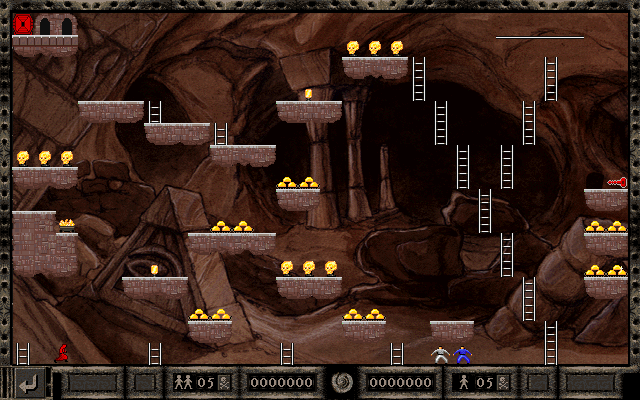

## Level 135
DON'T JUDGE A BOOK BY ITS COVER 
- [Schematic](pngs_schema/135_s.png)
- <a href="pngs_labeled/LRO_MMR_2P - 135 - ANCI - DON'T JUDGE A BOOK BY ITS COVER.png">Labeled image</a>
  

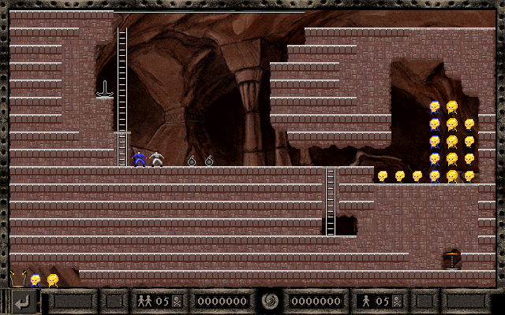

## Level 136
FILL THE BLOWHOLE 
- [Schematic](pngs_schema/136_s.png)
- <a href="pngs_labeled/LRO_MMR_2P - 136 - ANCI - FILL THE BLOWHOLE.png">Labeled image</a>
  

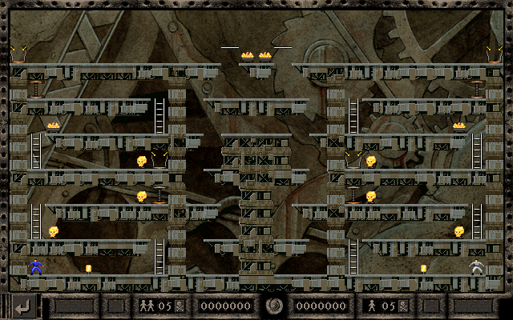

## Level 137
STEPPING STEPH 
- [Schematic](pngs_schema/137_s.png)
- <a href="pngs_labeled/LRO_MMR_2P - 137 - INDU - STEPPING STEPH.png">Labeled image</a>
  

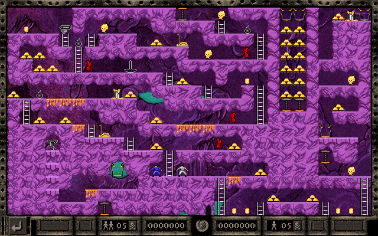

## Level 138
STEPHEN'S STEP 
- [Schematic](pngs_schema/138_s.png)
- <a href="pngs_labeled/LRO_MMR_2P - 138 - PHOS - STEPHEN'S STEP.png">Labeled image</a>
  

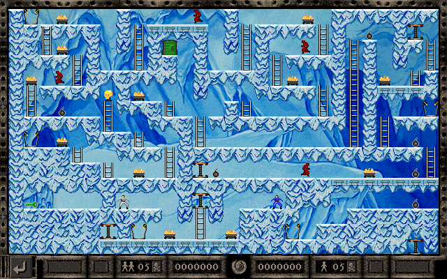

## Level 139
ICE INSANITY 
- [Schematic](pngs_schema/139_s.png)
- <a href="pngs_labeled/LRO_MMR_2P - 139 - ICEW - ICE INSANITY.png">Labeled image</a>
  

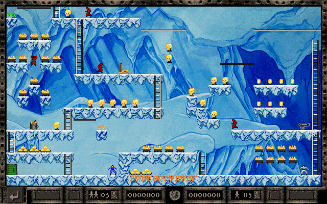

## Level 140
SLIP AND STICK 
- [Schematic](pngs_schema/140_s.png)
- <a href="pngs_labeled/LRO_MMR_2P - 140 - ICEW - SLIP AND STICK.png">Labeled image</a>
  

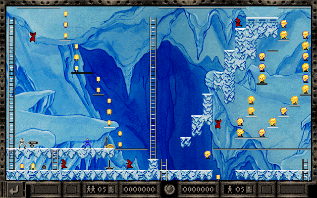

## Level 141
PENNIES FROM HEAVEN 
- [Schematic](pngs_schema/141_s.png)
- <a href="pngs_labeled/LRO_MMR_2P - 141 - ICEW - PENNIES FROM HEAVEN.png">Labeled image</a>
  

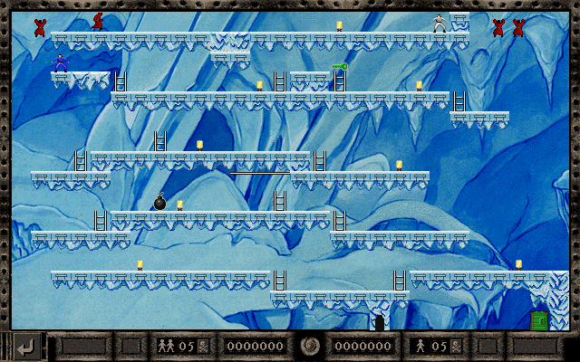

## Level 142
PACK ICE 
- [Schematic](pngs_schema/142_s.png)
- <a href="pngs_labeled/LRO_MMR_2P - 142 - ICEW - PACK ICE.png">Labeled image</a>
  

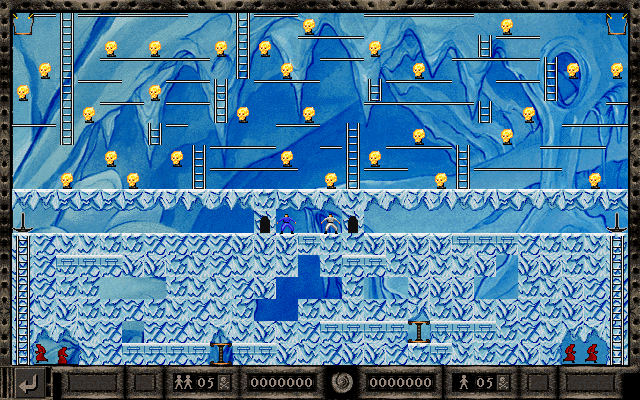

## Level 143
HEAVEN AND EARTH 
- [Schematic](pngs_schema/143_s.png)
- <a href="pngs_labeled/LRO_MMR_2P - 143 - ICEW - HEAVEN AND EARTH.png">Labeled image</a>
  

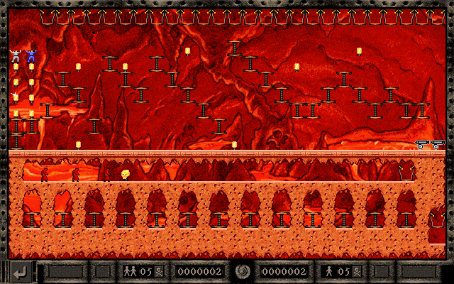

## Level 144
TRANSPORTER MAYHAM 
- [Schematic](pngs_schema/144_s.png)
- <a href="pngs_labeled/LRO_MMR_2P - 144 - LAVA - TRANSPORTER MAYHAM.png">Labeled image</a>
  

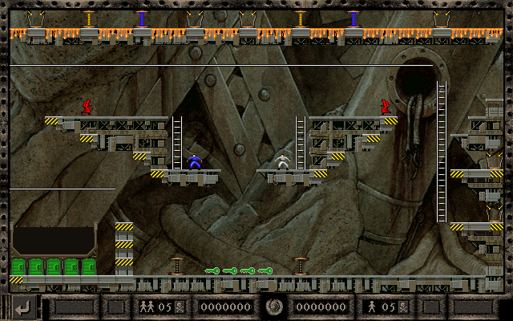

## Level 145
BROKEN GUTS 
- [Schematic](pngs_schema/145_s.png)
- <a href="pngs_labeled/LRO_MMR_2P - 145 - INDU - BROKEN GUTS.png">Labeled image</a>
  

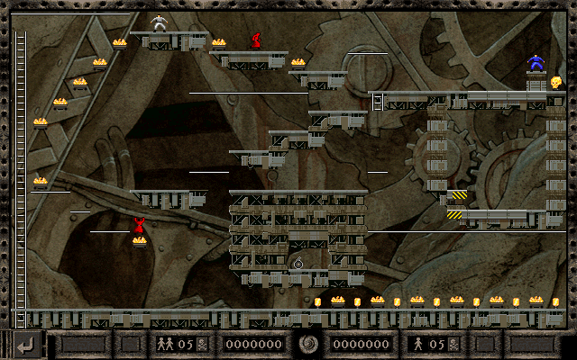

## Level 146
MACHINE HEAD 
- [Schematic](pngs_schema/146_s.png)
- <a href="pngs_labeled/LRO_MMR_2P - 146 - INDU - MACHINE HEAD.png">Labeled image</a>
  

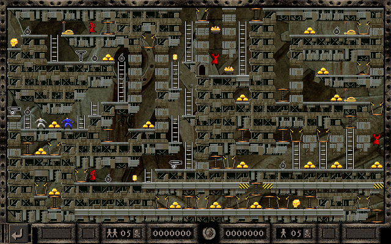

## Level 147
INDUSTRIAL EXPLOSION 
- [Schematic](pngs_schema/147_s.png)
- <a href="pngs_labeled/LRO_MMR_2P - 147 - INDU - INDUSTRIAL EXPLOSION.png">Labeled image</a>
  

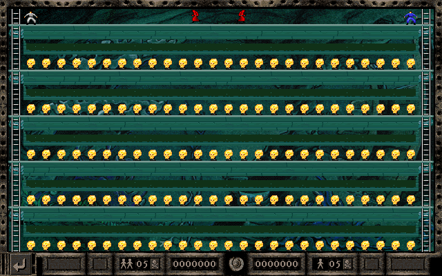

## Level 148
BRUN YER BUDDY 
- [Schematic](pngs_schema/148_s.png)
- <a href="pngs_labeled/LRO_MMR_2P - 148 - REEF - BRUN YER BUDDY.png">Labeled image</a>
  

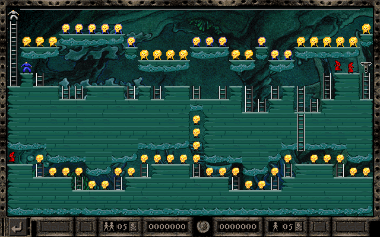

## Level 149
GOLD IN VEIN 
- [Schematic](pngs_schema/149_s.png)
- <a href="pngs_labeled/LRO_MMR_2P - 149 - REEF - GOLD IN VEIN.png">Labeled image</a>
  

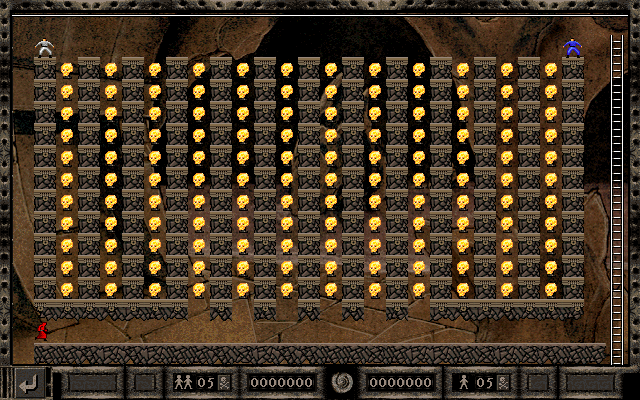

## Level 150
GOIN' IN 
- [Schematic](pngs_schema/150_s.png)
- <a href="pngs_labeled/LRO_MMR_2P - 150 - ASTR - GOIN' IN.png">Labeled image</a>
  

