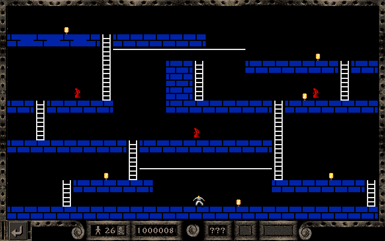
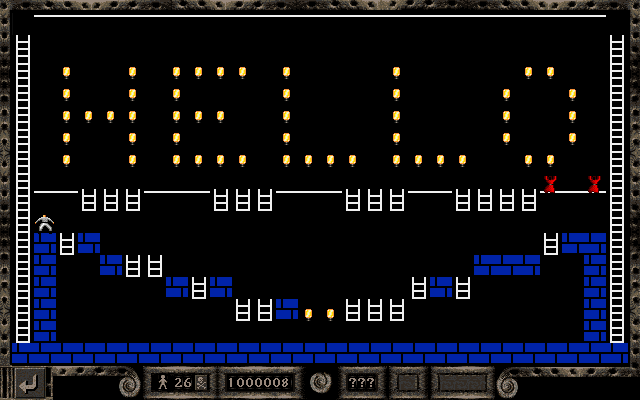
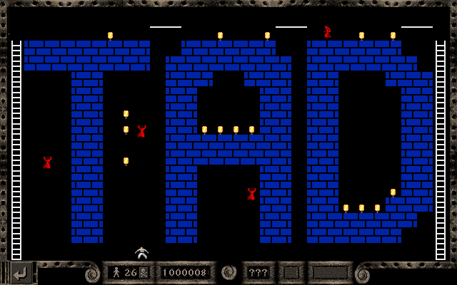
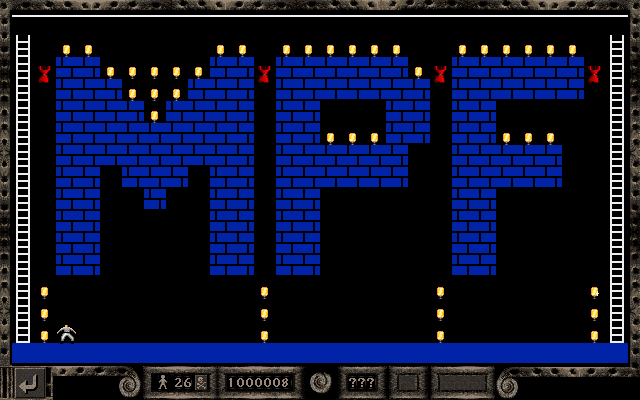
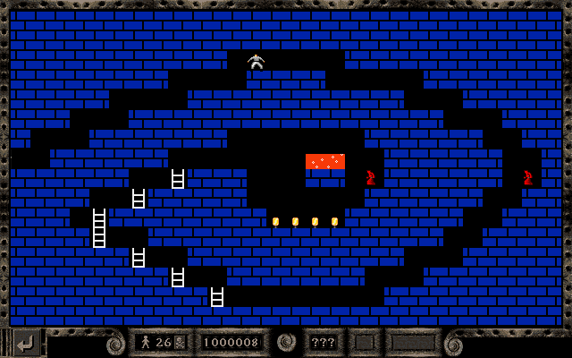

## Level 001
- <a href="pngs_labeled/LRO_MMR_EE1P - 001 - CLSC - untitled.png">Labeled image</a>
- First puzzle from the original release (1983), reproduced by lead programmer Todd Daggert.
  

## Level 002
- <a href="pngs_labeled/LRO_MMR_EE1P - 002 - CLSC - untitled.png">Labeled image</a>
- Famous first puzzle from the Championship series (1984), reproduced by Todd Daggert.
  

## Level 003
- <a href="pngs_labeled/LRO_MMR_EE1P - 003 - CLSC - untitled.png">Labeled image</a>
- Made by Todd Daggert, "TAD" is his initial. 
  

## Level 004
- <a href="pngs_labeled/LRO_MMR_EE1P - 004 - CLSC - untitled.png">Labeled image</a>
- Made by Todd Daggert, "MPF" likely refers to Mick Foley, who was a designer/programmer.
  

## Level 005
- <a href="pngs_labeled/LRO_MMR_EE1P - 005 - CLSC - untitled.png">Labeled image</a>
- Presage "eye" logo! Made by Todd Daggert.
  

