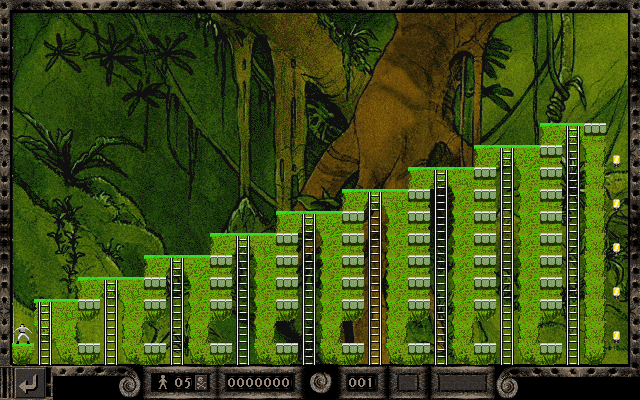

## Level 001
STEPS 
- [Schematic](pngs_schema/001_s.png)
- <a href="pngs_labeled/LR_EXTRA_1P - 001 - MOSS - STEPS.png">Labeled image</a>
  

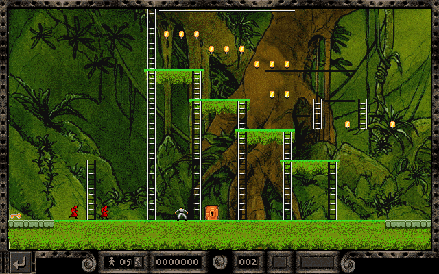

## Level 002
STONE FLOOR 
- [Schematic](pngs_schema/002_s.png)
- <a href="pngs_labeled/LR_EXTRA_1P - 002 - MOSS - STONE FLOOR.png">Labeled image</a>
  

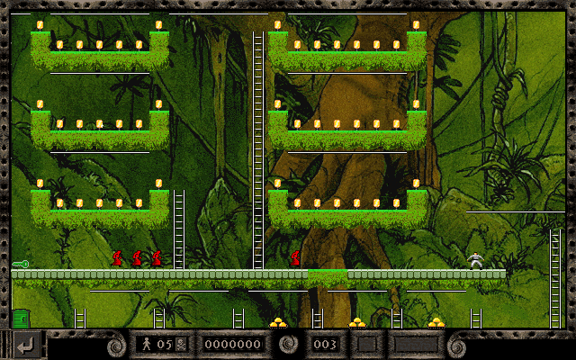

## Level 003
WHICH MONK DO YOU LIKE BEST? 
- [Schematic](pngs_schema/003_s.png)
- <a href="pngs_labeled/LR_EXTRA_1P - 003 - MOSS - WHICH MONK DO YOU LIKE BEST.png">Labeled image</a>
  

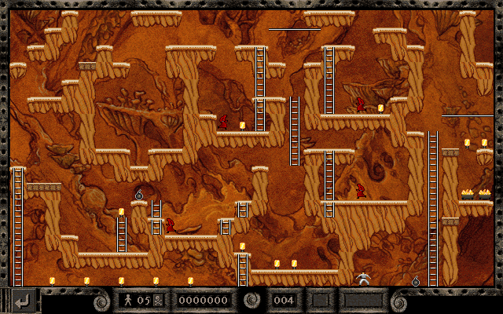

## Level 004
BOMBS OR SKILL? 
- [Schematic](pngs_schema/004_s.png)
- <a href="pngs_labeled/LR_EXTRA_1P - 004 - FUNG - BOMBS OR SKILL.png">Labeled image</a>
  

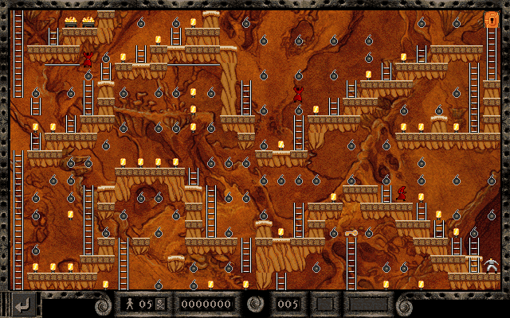

## Level 005
BIG BURN 
- [Schematic](pngs_schema/005_s.png)
- <a href="pngs_labeled/LR_EXTRA_1P - 005 - FUNG - BIG BURN.png">Labeled image</a>
  

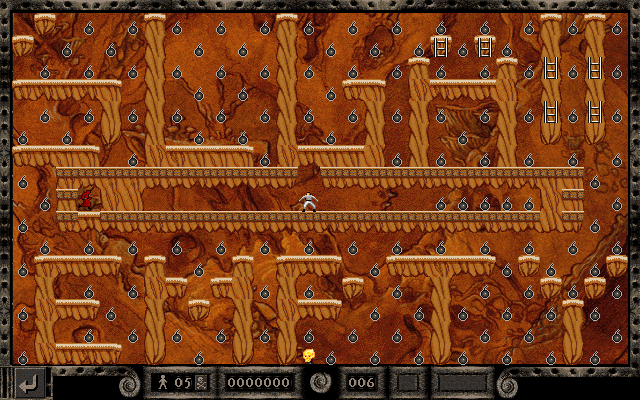

## Level 006
\<BOMB^3 NO.8> 
- [Schematic](pngs_schema/006_s.png)
- <a href="pngs_labeled/LR_EXTRA_1P - 006 - FUNG - BOMB^3 NO.8.png">Labeled image</a>
  

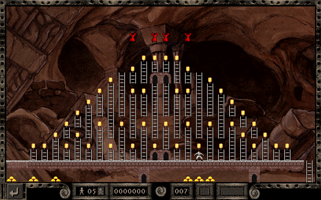

## Level 007
TREASURE MOUNTAIN 
- [Schematic](pngs_schema/007_s.png)
- <a href="pngs_labeled/LR_EXTRA_1P - 007 - ANCI - TREASURE MOUNTAIN.png">Labeled image</a>
  

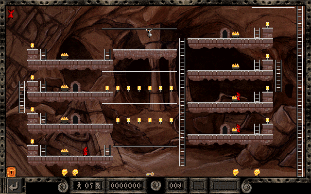

## Level 008
CLIMB AND FALL 
- [Schematic](pngs_schema/008_s.png)
- <a href="pngs_labeled/LR_EXTRA_1P - 008 - ANCI - CLIMB AND FALL.png">Labeled image</a>
  

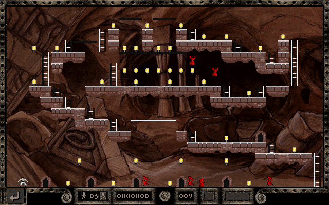

## Level 009
HIDE OUT 
- [Schematic](pngs_schema/009_s.png)
- <a href="pngs_labeled/LR_EXTRA_1P - 009 - ANCI - HIDE OUT.png">Labeled image</a>
  

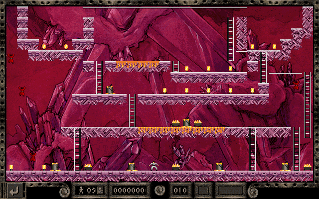

## Level 010
FEEL EASY 
- [Schematic](pngs_schema/010_s.png)
- <a href="pngs_labeled/LR_EXTRA_1P - 010 - CRYS - FEEL EASY.png">Labeled image</a>
  

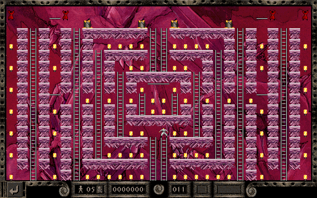

## Level 011
HARD FLOOR.... 
- [Schematic](pngs_schema/011_s.png)
- <a href="pngs_labeled/LR_EXTRA_1P - 011 - CRYS - HARD FLOOR.png">Labeled image</a>
  

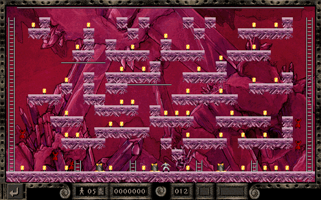

## Level 012
DO YOU LIKE NEVA NEVA TRAP? 
- [Schematic](pngs_schema/012_s.png)
- <a href="pngs_labeled/LR_EXTRA_1P - 012 - CRYS - DO YOU LIKE NEVA NEVA TRAP.png">Labeled image</a>
  

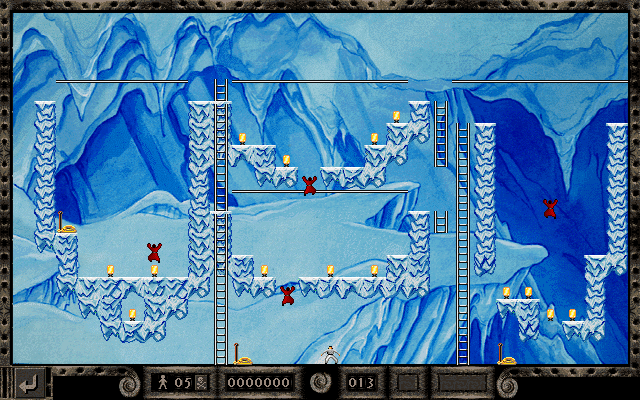

## Level 013
I'M SHORT OF CASH ! 
- [Schematic](pngs_schema/013_s.png)
- <a href="pngs_labeled/LR_EXTRA_1P - 013 - ICEW - I'M SHORT OF CASH.png">Labeled image</a>
  

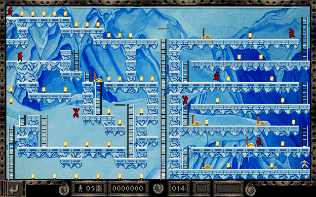

## Level 014
RUN, TRAP, RUN, TRAP ..... 
- [Schematic](pngs_schema/014_s.png)
- <a href="pngs_labeled/LR_EXTRA_1P - 014 - ICEW - RUN, TRAP, RUN, TRAP.png">Labeled image</a>
  

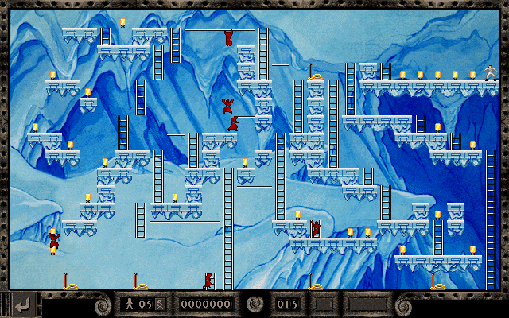

## Level 015
SET A TRAP! HURRY UP! 
- [Schematic](pngs_schema/015_s.png)
- <a href="pngs_labeled/LR_EXTRA_1P - 015 - ICEW - SET A TRAP HURRY UP.png">Labeled image</a>
  

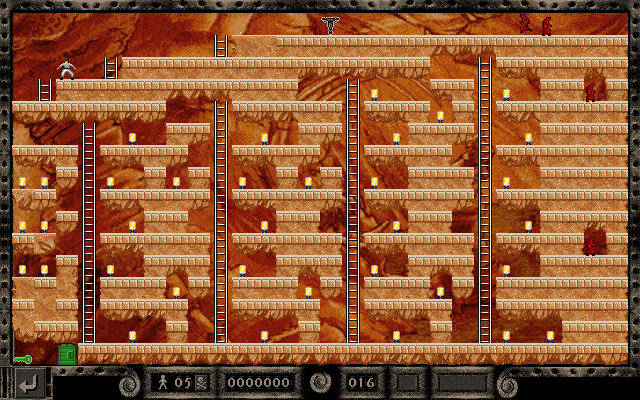

## Level 016
DIG DIG DIG..... 
- [Schematic](pngs_schema/016_s.png)
- <a href="pngs_labeled/LR_EXTRA_1P - 016 - FOSS - DIG DIG DIG.png">Labeled image</a>
  

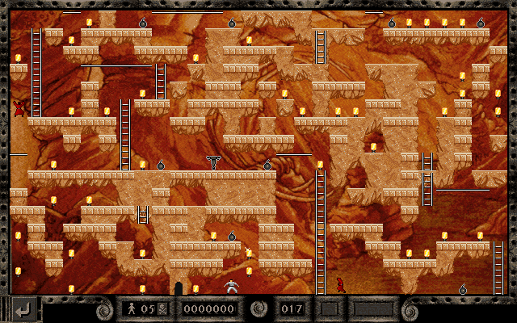

## Level 017
DON'T FORGET TO GET... 
- [Schematic](pngs_schema/017_s.png)
- <a href="pngs_labeled/LR_EXTRA_1P - 017 - FOSS - DON'T FORGET TO GET.png">Labeled image</a>
  

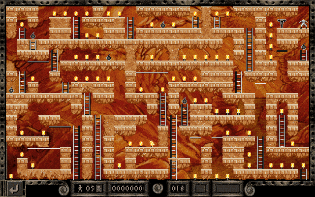

## Level 018
THIS ROPE LEADS TO EXIT. WHERE ? 
- [Schematic](pngs_schema/018_s.png)
- <a href="pngs_labeled/LR_EXTRA_1P - 018 - FOSS - THIS ROPE LEADS TO EXIT. WHERE.png">Labeled image</a>
  

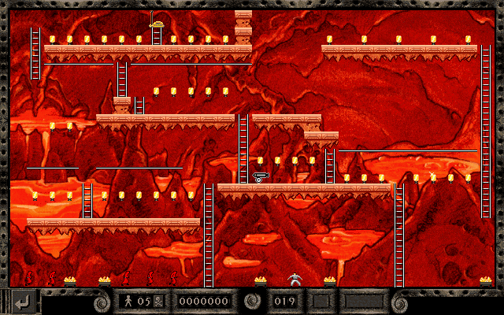

## Level 019
WHICH DO YOU LIKE ROPE OR SPRAY. 
- [Schematic](pngs_schema/019_s.png)
- <a href="pngs_labeled/LR_EXTRA_1P - 019 - LAVA - WHICH DO YOU LIKE ROPE OR SPRAY.png">Labeled image</a>
  

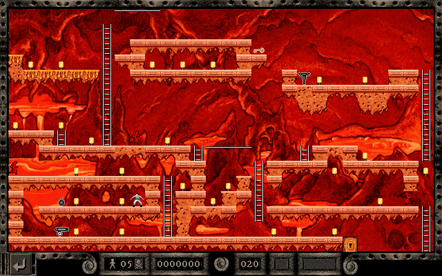

## Level 020
HERE AND THERE 
- [Schematic](pngs_schema/020_s.png)
- <a href="pngs_labeled/LR_EXTRA_1P - 020 - LAVA - HERE AND THERE.png">Labeled image</a>
  

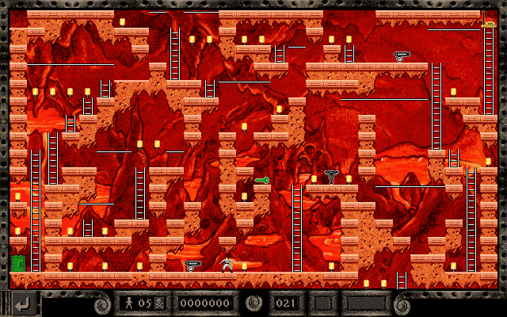

## Level 021
ROUND AND ROUND 
- [Schematic](pngs_schema/021_s.png)
- <a href="pngs_labeled/LR_EXTRA_1P - 021 - LAVA - ROUND AND ROUND.png">Labeled image</a>
  

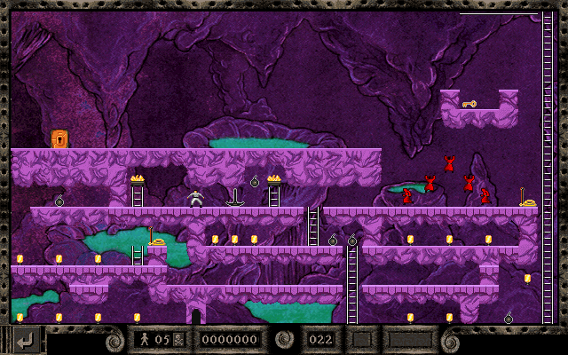

## Level 022
TIMING AND LUCK! 
- [Schematic](pngs_schema/022_s.png)
- <a href="pngs_labeled/LR_EXTRA_1P - 022 - PHOS - TIMING AND LUCK.png">Labeled image</a>
  

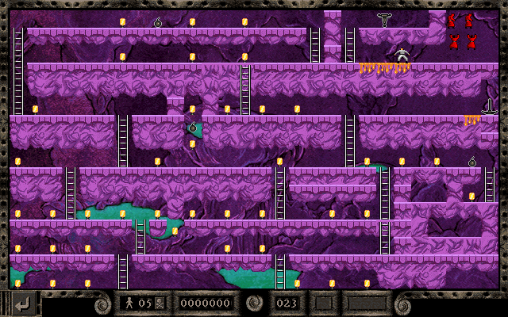

## Level 023
HOW TO USE BOMBS... 
- [Schematic](pngs_schema/023_s.png)
- <a href="pngs_labeled/LR_EXTRA_1P - 023 - PHOS - HOW TO USE BOMBS.png">Labeled image</a>
  

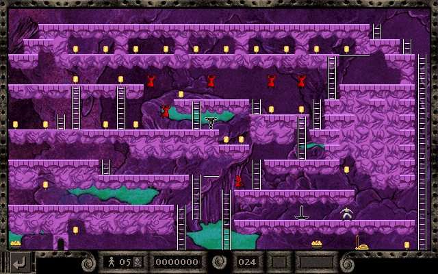

## Level 024
PITFALL 
- [Schematic](pngs_schema/024_s.png)
- <a href="pngs_labeled/LR_EXTRA_1P - 024 - PHOS - PITFALL.png">Labeled image</a>
  

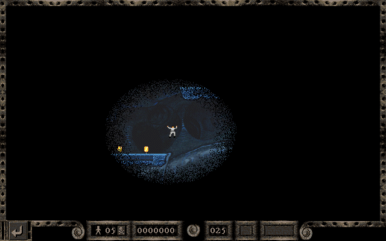

## Level 025
DARK PUZZLE NO.1 
- [Schematic](pngs_schema/025_s.png)
- <a href="pngs_labeled/LR_EXTRA_1P - 025 - DARK - DARK PUZZLE NO.1.png">Labeled image</a>
  

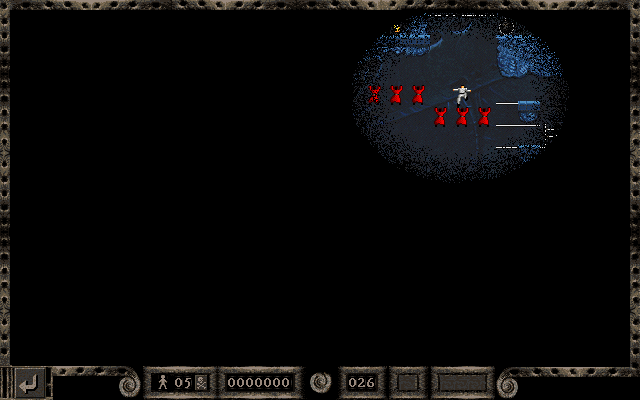

## Level 026
CAN YOU GET ALL COINS? 
- [Schematic](pngs_schema/026_s.png)
- <a href="pngs_labeled/LR_EXTRA_1P - 026 - DARK - CAN YOU GET ALL COINS.png">Labeled image</a>
  

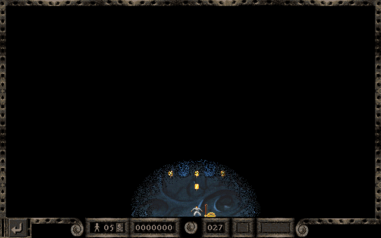

## Level 027
MONK IN A CAGE... 
- [Schematic](pngs_schema/027_s.png)
- <a href="pngs_labeled/LR_EXTRA_1P - 027 - DARK - MONK IN A CAGE.png">Labeled image</a>
  

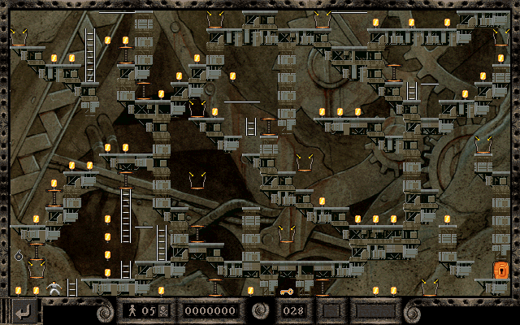

## Level 028
TROUBLESOME 
- [Schematic](pngs_schema/028_s.png)
- <a href="pngs_labeled/LR_EXTRA_1P - 028 - INDU - TROUBLESOME.png">Labeled image</a>
  

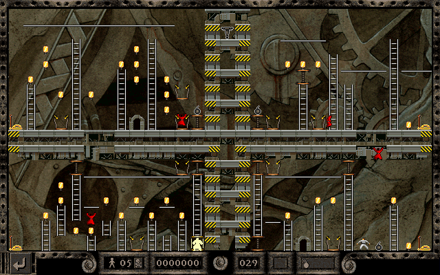

## Level 029
DEBT COLLECTOR 
- [Schematic](pngs_schema/029_s.png)
- <a href="pngs_labeled/LR_EXTRA_1P - 029 - INDU - DEBT COLLECTOR.png">Labeled image</a>
  

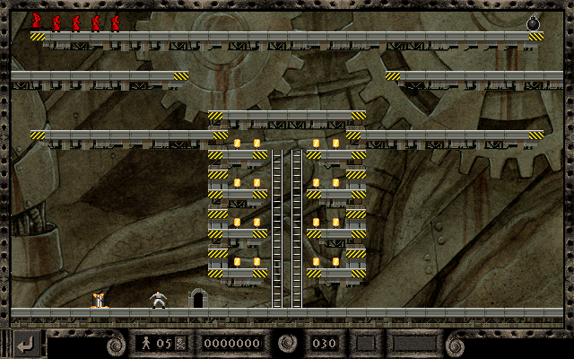

## Level 030
SUMMON MONSTER! 
- [Schematic](pngs_schema/030_s.png)
- <a href="pngs_labeled/LR_EXTRA_1P - 030 - INDU - SUMMON MONSTER.png">Labeled image</a>
  

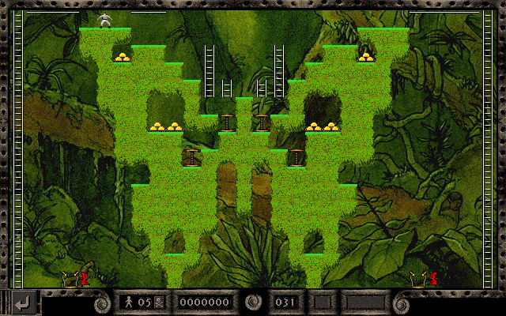

## Level 031
PATRA 
- [Schematic](pngs_schema/031_s.png)
- <a href="pngs_labeled/LR_EXTRA_1P - 031 - MOSS - PATRA.png">Labeled image</a>
- Patra was the PlayStation publisher of this game, with butterfly as their company logo. 
  

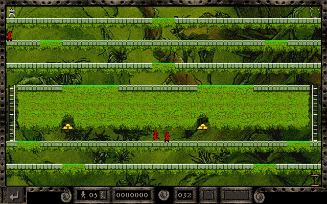

## Level 032
DOWN & WARP 
- [Schematic](pngs_schema/032_s.png)
- <a href="pngs_labeled/LR_EXTRA_1P - 032 - MOSS - DOWN & WARP.png">Labeled image</a>
  

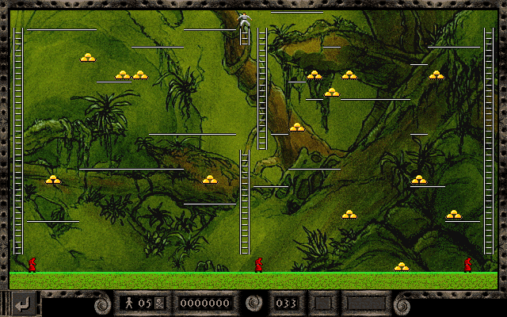

## Level 033
LAST LANDING 
- [Schematic](pngs_schema/033_s.png)
- <a href="pngs_labeled/LR_EXTRA_1P - 033 - MOSS - LAST LANDING.png">Labeled image</a>
  

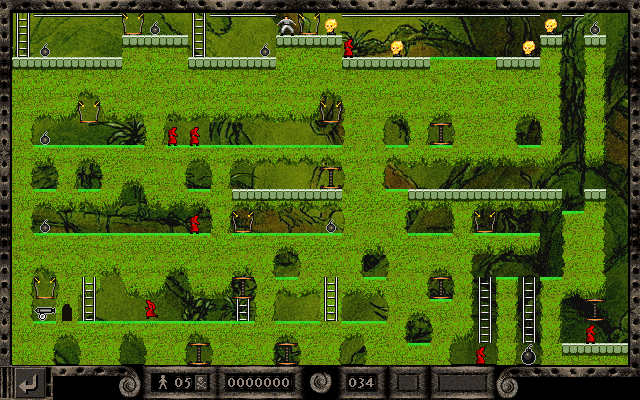

## Level 034
HOLE 
- [Schematic](pngs_schema/034_s.png)
- <a href="pngs_labeled/LR_EXTRA_1P - 034 - MOSS - HOLE.png">Labeled image</a>
  

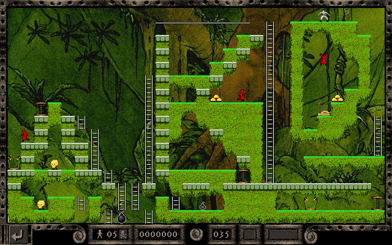

## Level 035
A K D 
- [Schematic](pngs_schema/035_s.png)
- <a href="pngs_labeled/LR_EXTRA_1P - 035 - MOSS - A K D.png">Labeled image</a>
  

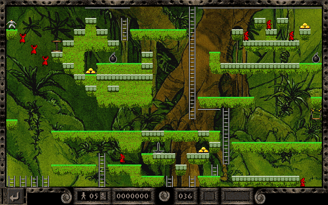

## Level 036
STEPPING MONKS 
- [Schematic](pngs_schema/036_s.png)
- <a href="pngs_labeled/LR_EXTRA_1P - 036 - MOSS - STEPPING MONKS.png">Labeled image</a>
  

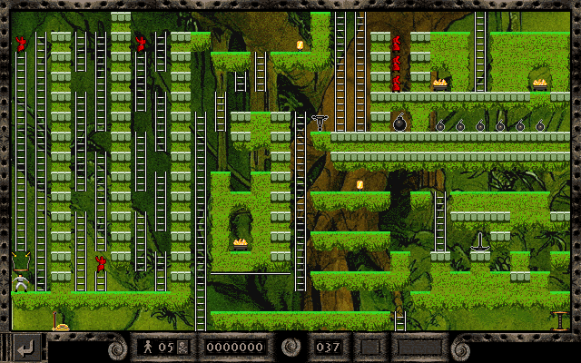

## Level 037
SLIP THROUGH 
- [Schematic](pngs_schema/037_s.png)
- <a href="pngs_labeled/LR_EXTRA_1P - 037 - MOSS - SLIP THROUGH.png">Labeled image</a>
  

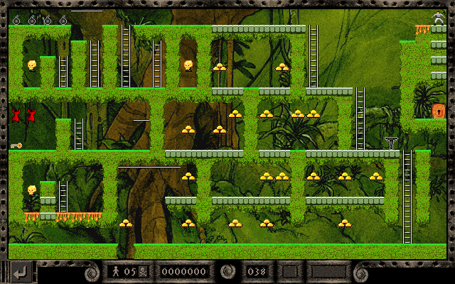

## Level 038
DRILL 
- [Schematic](pngs_schema/038_s.png)
- <a href="pngs_labeled/LR_EXTRA_1P - 038 - MOSS - DRILL.png">Labeled image</a>
  

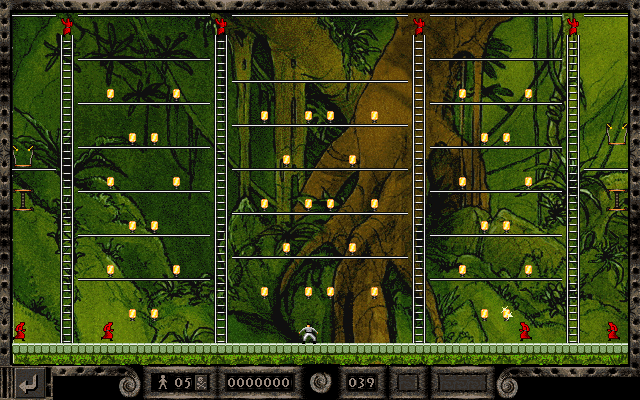

## Level 039
"AMIDA" ACTION 
- [Schematic](pngs_schema/039_s.png)
- <a href="pngs_labeled/LR_EXTRA_1P - 039 - MOSS - AMIDA ACTION.png">Labeled image</a>
  

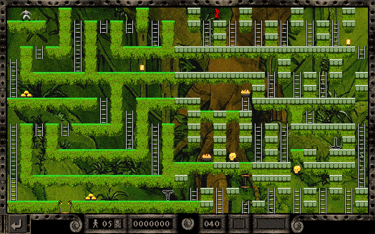

## Level 040
TIME 
- [Schematic](pngs_schema/040_s.png)
- <a href="pngs_labeled/LR_EXTRA_1P - 040 - MOSS - TIME.png">Labeled image</a>
  

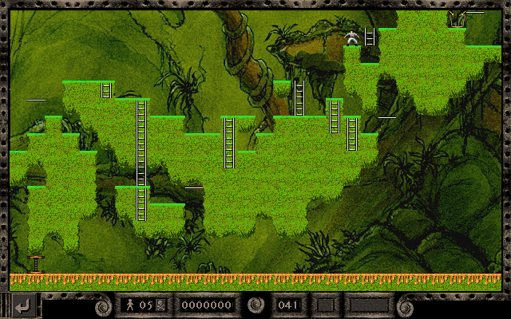

## Level 041
AROUND JAPAN 
- [Schematic](pngs_schema/041_s.png)
- <a href="pngs_labeled/LR_EXTRA_1P - 041 - MOSS - AROUND JAPAN.png">Labeled image</a>
- Map of Japan.
  

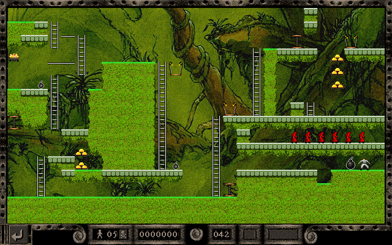

## Level 042
WARPMAN 
- [Schematic](pngs_schema/042_s.png)
- <a href="pngs_labeled/LR_EXTRA_1P - 042 - MOSS - WARPMAN.png">Labeled image</a>
  

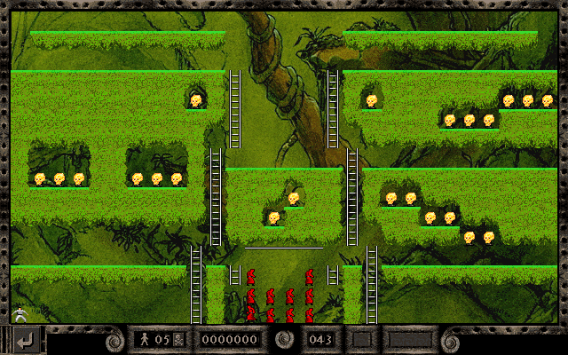

## Level 043
ROPE WALKER 
- [Schematic](pngs_schema/043_s.png)
- <a href="pngs_labeled/LR_EXTRA_1P - 043 - MOSS - ROPE WALKER.png">Labeled image</a>
  

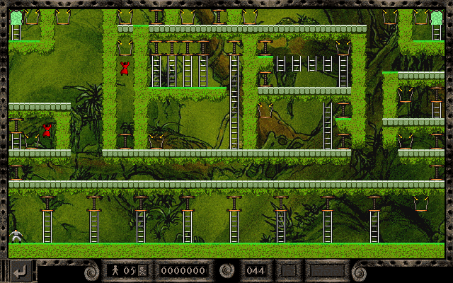

## Level 044
SELECTION 
- [Schematic](pngs_schema/044_s.png)
- <a href="pngs_labeled/LR_EXTRA_1P - 044 - MOSS - SELECTION.png">Labeled image</a>
  

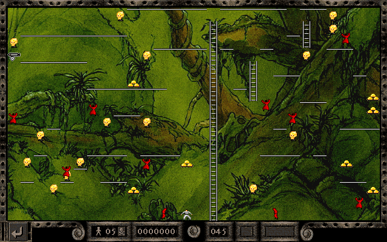

## Level 045
HERO TARZAN 
- [Schematic](pngs_schema/045_s.png)
- <a href="pngs_labeled/LR_EXTRA_1P - 045 - MOSS - HERO TARZAN.png">Labeled image</a>
  

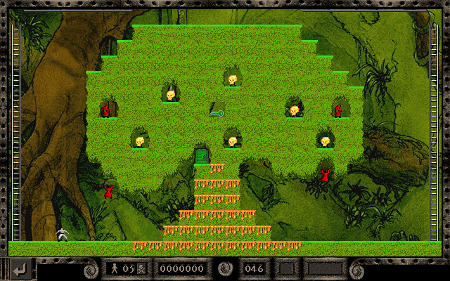

## Level 046
GOLD TREE 
- [Schematic](pngs_schema/046_s.png)
- <a href="pngs_labeled/LR_EXTRA_1P - 046 - MOSS - GOLD TREE.png">Labeled image</a>
  

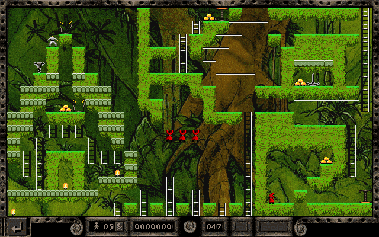

## Level 047
A K D 2 
- [Schematic](pngs_schema/047_s.png)
- <a href="pngs_labeled/LR_EXTRA_1P - 047 - MOSS - A K D 2.png">Labeled image</a>
  

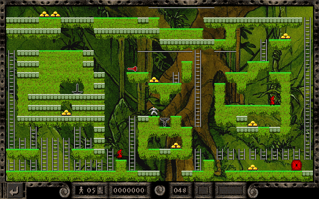

## Level 048
3 ISLAND 
- [Schematic](pngs_schema/048_s.png)
- <a href="pngs_labeled/LR_EXTRA_1P - 048 - MOSS - 3 ISLAND.png">Labeled image</a>
  

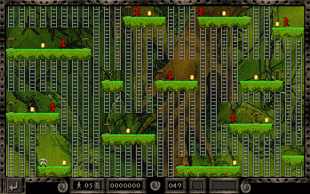

## Level 049
EXIT 
- [Schematic](pngs_schema/049_s.png)
- <a href="pngs_labeled/LR_EXTRA_1P - 049 - MOSS - EXIT.png">Labeled image</a>
  

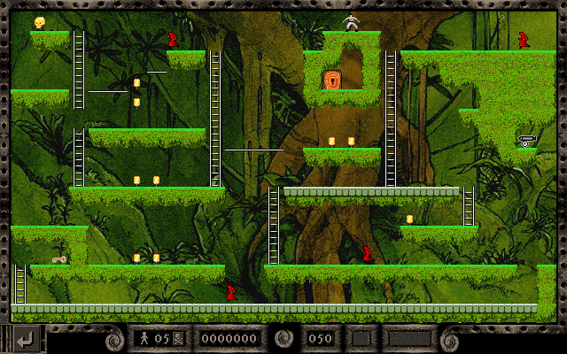

## Level 050
CONTROL MONSTERS 
- [Schematic](pngs_schema/050_s.png)
- <a href="pngs_labeled/LR_EXTRA_1P - 050 - MOSS - CONTROL MONSTERS.png">Labeled image</a>
  

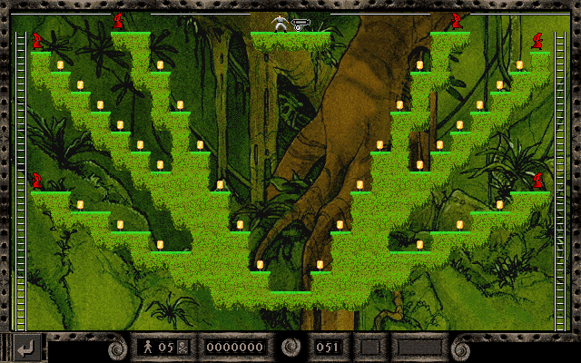

## Level 051
SPLAY FLOWER 
- [Schematic](pngs_schema/051_s.png)
- <a href="pngs_labeled/LR_EXTRA_1P - 051 - MOSS - SPLAY FLOWER.png">Labeled image</a>
  

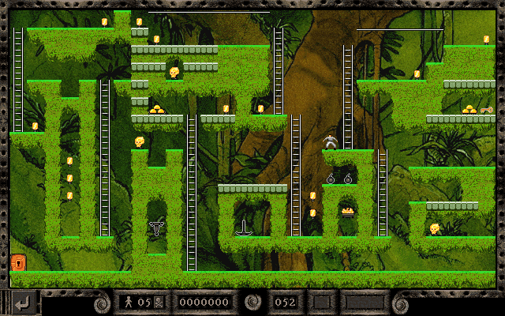

## Level 052
PUT THE KEY 
- [Schematic](pngs_schema/052_s.png)
- <a href="pngs_labeled/LR_EXTRA_1P - 052 - MOSS - PUT THE KEY.png">Labeled image</a>
  

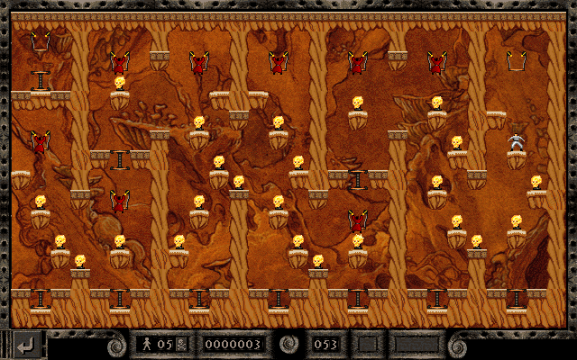

## Level 053
\<MAPPIE-MPTY> 
- [Schematic](pngs_schema/053_s.png)
- <a href="pngs_labeled/LR_EXTRA_1P - 053 - FUNG - MAPPIE-MPTY.png">Labeled image</a>
  

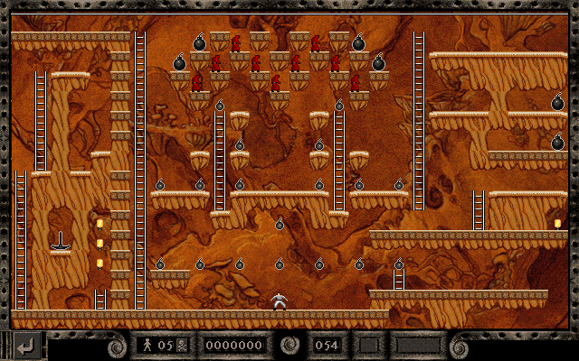

## Level 054
BOMB SETTING 
- [Schematic](pngs_schema/054_s.png)
- <a href="pngs_labeled/LR_EXTRA_1P - 054 - FUNG - BOMB SETTING.png">Labeled image</a>
  

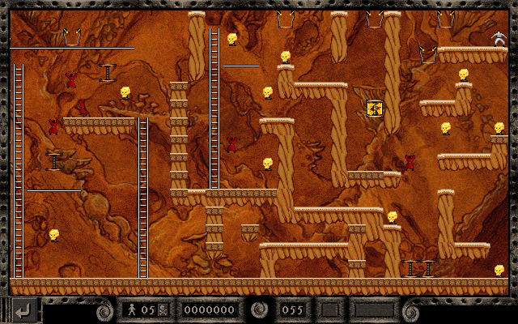

## Level 055
\<IYAGARASE> 
- [Schematic](pngs_schema/055_s.png)
- <a href="pngs_labeled/LR_EXTRA_1P - 055 - FUNG - IYAGARASE.png">Labeled image</a>
- Means "harassment" in Japanese. 
  

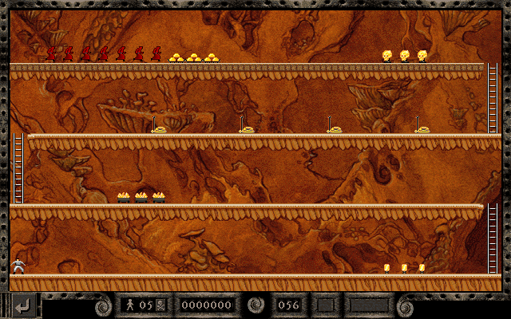

## Level 056
USE MONSTER TRAP! 
- [Schematic](pngs_schema/056_s.png)
- <a href="pngs_labeled/LR_EXTRA_1P - 056 - FUNG - USE MONSTER TRAP.png">Labeled image</a>
  

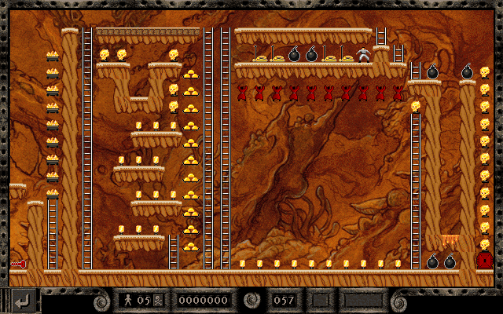

## Level 057
STOREHOUSE 
- [Schematic](pngs_schema/057_s.png)
- <a href="pngs_labeled/LR_EXTRA_1P - 057 - FUNG - STOREHOUSE.png">Labeled image</a>
  

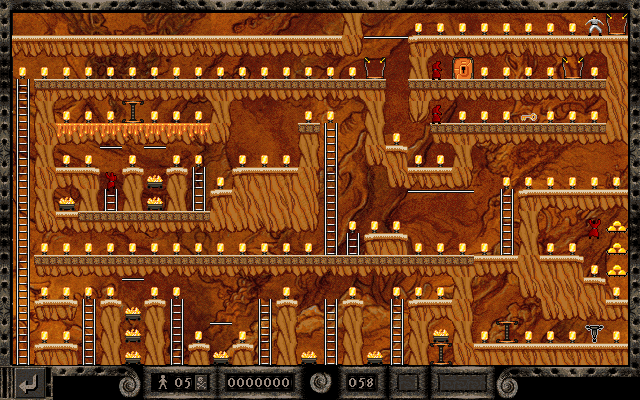

## Level 058
GOLD GOLD 
- [Schematic](pngs_schema/058_s.png)
- <a href="pngs_labeled/LR_EXTRA_1P - 058 - FUNG - GOLD GOLD.png">Labeled image</a>
  

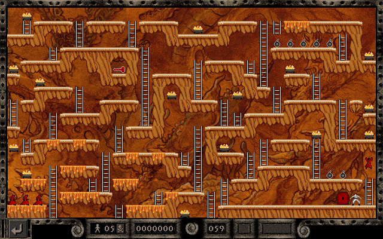

## Level 059
HIDDEN B 
- [Schematic](pngs_schema/059_s.png)
- <a href="pngs_labeled/LR_EXTRA_1P - 059 - FUNG - HIDDEN B.png">Labeled image</a>
  

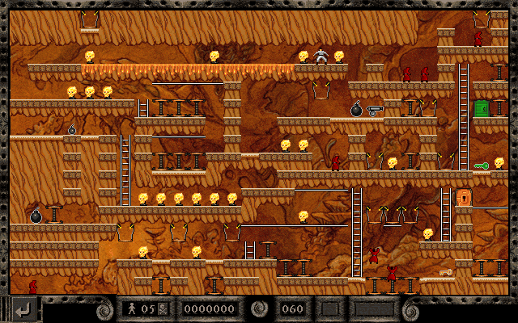

## Level 060
@MARU 
- [Schematic](pngs_schema/060_s.png)
- <a href="pngs_labeled/LR_EXTRA_1P - 060 - FUNG - @MARU.png">Labeled image</a>
  

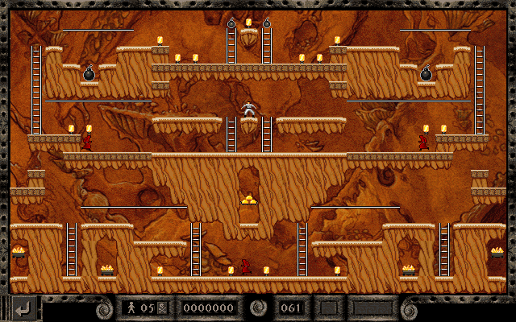

## Level 061
BANISHING 
- [Schematic](pngs_schema/061_s.png)
- <a href="pngs_labeled/LR_EXTRA_1P - 061 - FUNG - BANISHING.png">Labeled image</a>
  

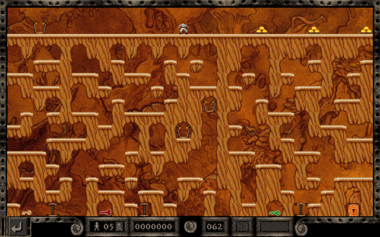

## Level 062
L-PORT 
- [Schematic](pngs_schema/062_s.png)
- <a href="pngs_labeled/LR_EXTRA_1P - 062 - FUNG - L-PORT.png">Labeled image</a>
  

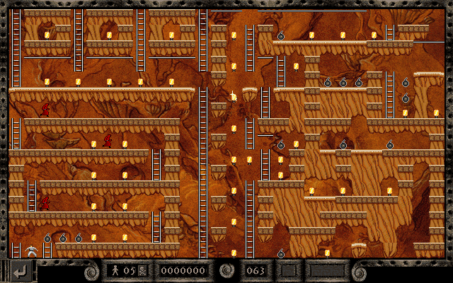

## Level 063
BOMB AND RUN 
- [Schematic](pngs_schema/063_s.png)
- <a href="pngs_labeled/LR_EXTRA_1P - 063 - FUNG - BOMB AND RUN.png">Labeled image</a>
  

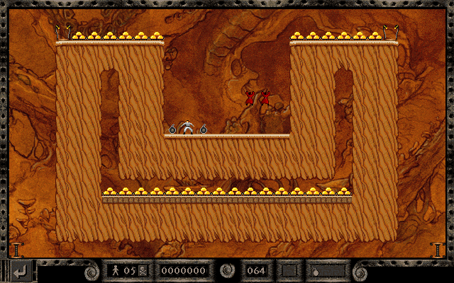

## Level 064
HIDDEN BOMB 
- [Schematic](pngs_schema/064_s.png)
- <a href="pngs_labeled/LR_EXTRA_1P - 064 - FUNG - HIDDEN BOMB.png">Labeled image</a>
  

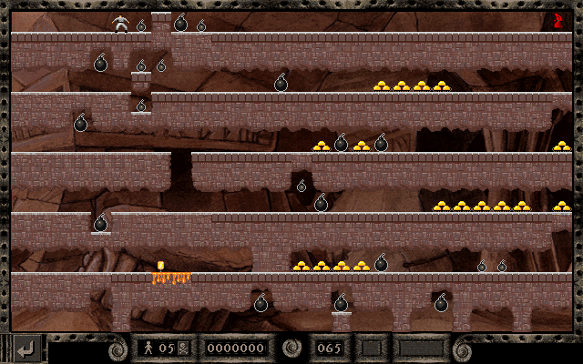

## Level 065
RUN&RUN! 
- [Schematic](pngs_schema/065_s.png)
- <a href="pngs_labeled/LR_EXTRA_1P - 065 - ANCI - RUN&RUN.png">Labeled image</a>
  

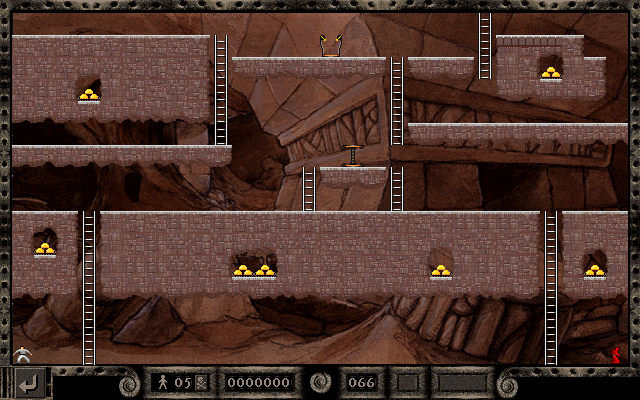

## Level 066
A STOPGAP 
- [Schematic](pngs_schema/066_s.png)
- <a href="pngs_labeled/LR_EXTRA_1P - 066 - ANCI - A STOPGAP.png">Labeled image</a>
  

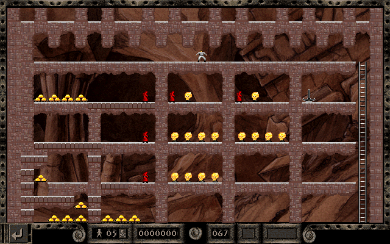

## Level 067
BOMBER MANSION 
- [Schematic](pngs_schema/067_s.png)
- <a href="pngs_labeled/LR_EXTRA_1P - 067 - ANCI - BOMBER MANSION.png">Labeled image</a>
  

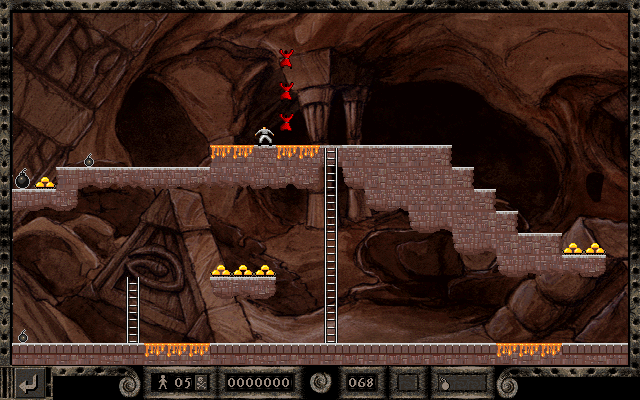

## Level 068
SIMPLICITY 
- [Schematic](pngs_schema/068_s.png)
- <a href="pngs_labeled/LR_EXTRA_1P - 068 - ANCI - SIMPLICITY.png">Labeled image</a>
  

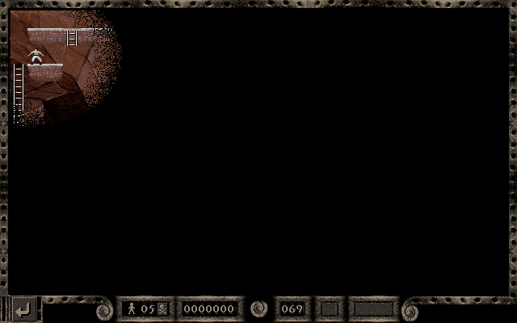

## Level 069
YAJI 
- [Schematic](pngs_schema/069_s.png)
- <a href="pngs_labeled/LR_EXTRA_1P - 069 - ANCI - YAJI.png">Labeled image</a>
  

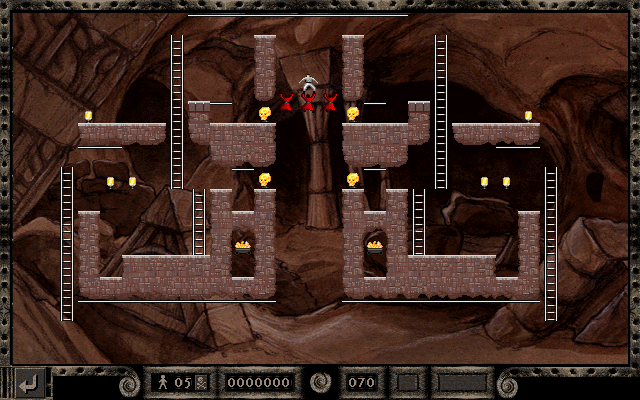

## Level 070
FREE FALL 1 
- [Schematic](pngs_schema/070_s.png)
- <a href="pngs_labeled/LR_EXTRA_1P - 070 - ANCI - FREE FALL 1.png">Labeled image</a>
  

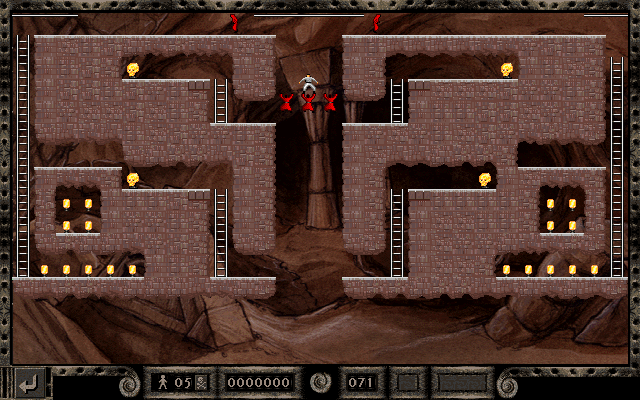

## Level 071
FREE FALL 2 
- [Schematic](pngs_schema/071_s.png)
- <a href="pngs_labeled/LR_EXTRA_1P - 071 - ANCI - FREE FALL 2.png">Labeled image</a>
  

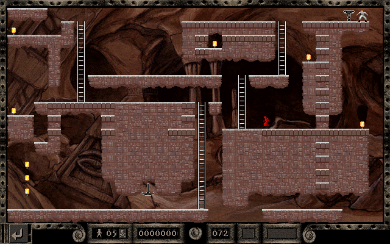

## Level 072
SIMPLE RIDDLE 
- [Schematic](pngs_schema/072_s.png)
- <a href="pngs_labeled/LR_EXTRA_1P - 072 - ANCI - SIMPLE RIDDLE.png">Labeled image</a>
  

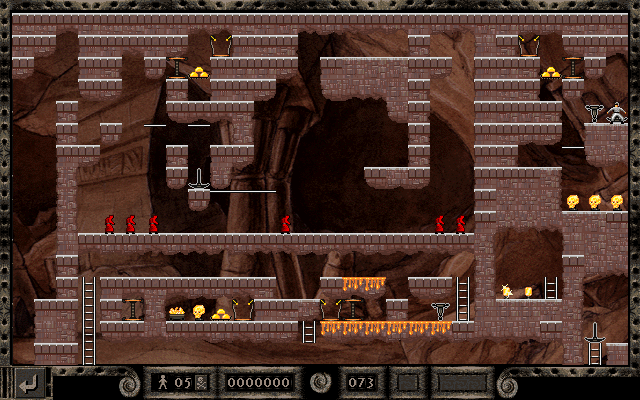

## Level 073
VALUABLE ITEM 
- [Schematic](pngs_schema/073_s.png)
- <a href="pngs_labeled/LR_EXTRA_1P - 073 - ANCI - VALUABLE ITEM.png">Labeled image</a>
  

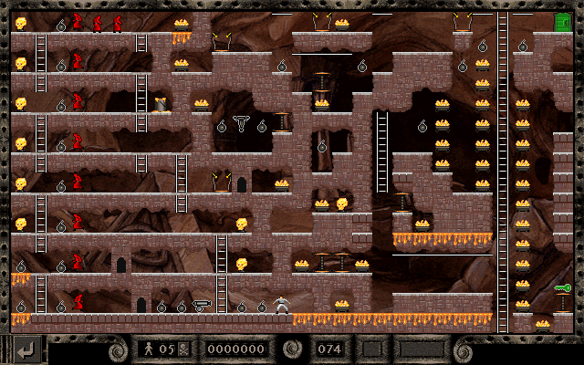

## Level 074
1 OR 8 
- [Schematic](pngs_schema/074_s.png)
- <a href="pngs_labeled/LR_EXTRA_1P - 074 - ANCI - 1 OR 8.png">Labeled image</a>
  

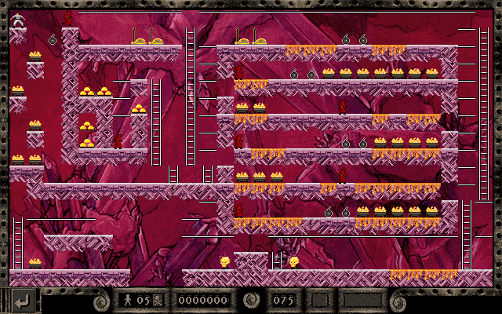

## Level 075
DUMPING GROUND 
- [Schematic](pngs_schema/075_s.png)
- <a href="pngs_labeled/LR_EXTRA_1P - 075 - CRYS - DUMPING GROUND.png">Labeled image</a>
  

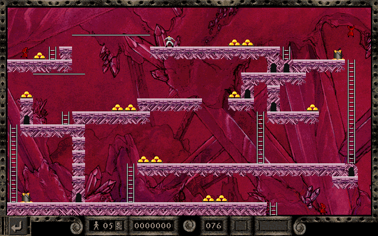

## Level 076
ESCAPE&JAM 
- [Schematic](pngs_schema/076_s.png)
- <a href="pngs_labeled/LR_EXTRA_1P - 076 - CRYS - ESCAPE&JAM.png">Labeled image</a>
  

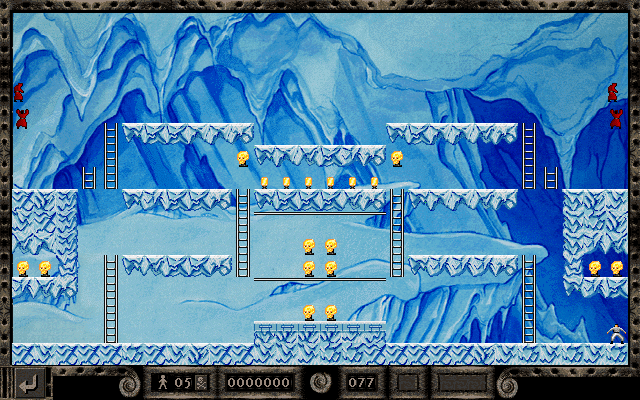

## Level 077
FROM END TO END 
- [Schematic](pngs_schema/077_s.png)
- <a href="pngs_labeled/LR_EXTRA_1P - 077 - ICEW - FROM END TO END.png">Labeled image</a>
  

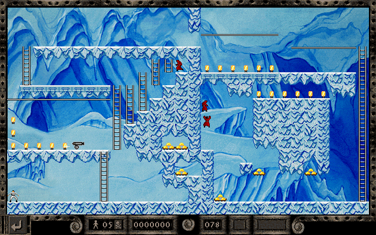

## Level 078
LEFT & RIGHT 
- [Schematic](pngs_schema/078_s.png)
- <a href="pngs_labeled/LR_EXTRA_1P - 078 - ICEW - LEFT & RIGHT.png">Labeled image</a>
  

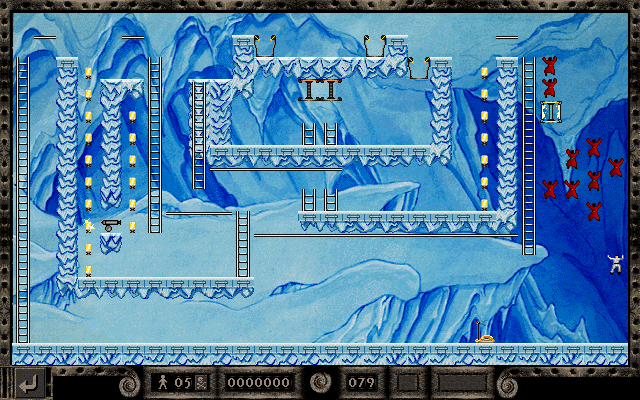

## Level 079
MONKS FALL 
- [Schematic](pngs_schema/079_s.png)
- <a href="pngs_labeled/LR_EXTRA_1P - 079 - ICEW - MONKS FALL.png">Labeled image</a>
  

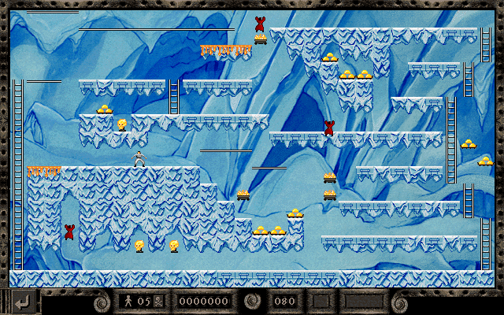

## Level 080
KEEP AN EYE 
- [Schematic](pngs_schema/080_s.png)
- <a href="pngs_labeled/LR_EXTRA_1P - 080 - ICEW - KEEP AN EYE.png">Labeled image</a>
  

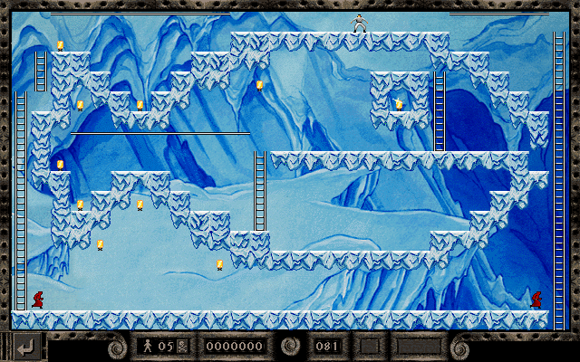

## Level 081
FREEZED FISH 
- [Schematic](pngs_schema/081_s.png)
- <a href="pngs_labeled/LR_EXTRA_1P - 081 - ICEW - FREEZED FISH.png">Labeled image</a>
- Probably meant 'frozen'. 
  

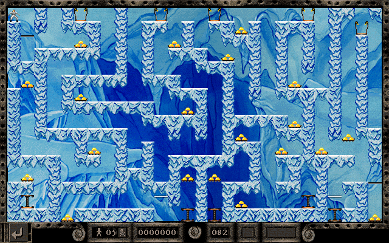

## Level 082
MAZE 
- [Schematic](pngs_schema/082_s.png)
- <a href="pngs_labeled/LR_EXTRA_1P - 082 - ICEW - MAZE.png">Labeled image</a>
  

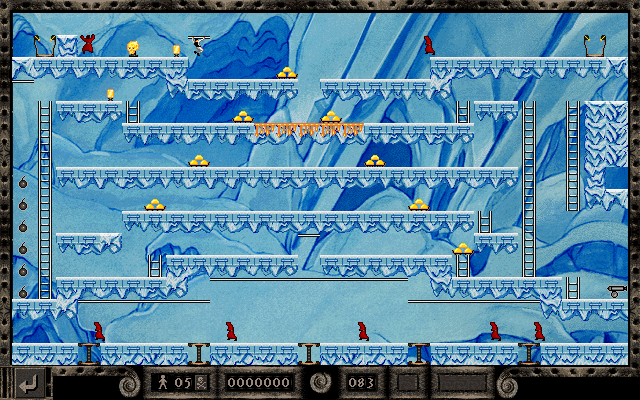

## Level 083
Y'S SPECIAL 
- [Schematic](pngs_schema/083_s.png)
- <a href="pngs_labeled/LR_EXTRA_1P - 083 - ICEW - Y'S SPECIAL.png">Labeled image</a>
  

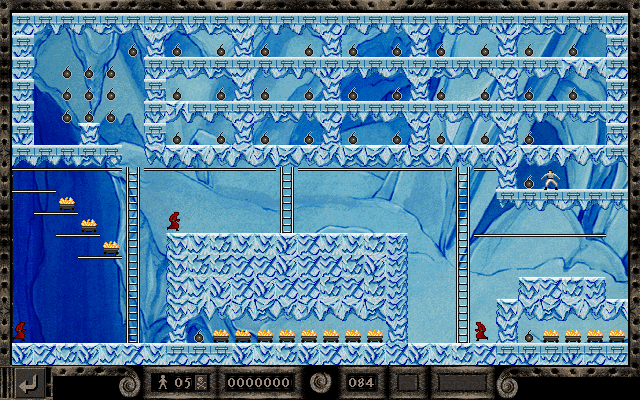

## Level 084
BLIZZARD!! 
- [Schematic](pngs_schema/084_s.png)
- <a href="pngs_labeled/LR_EXTRA_1P - 084 - ICEW - BLIZZARD.png">Labeled image</a>
  

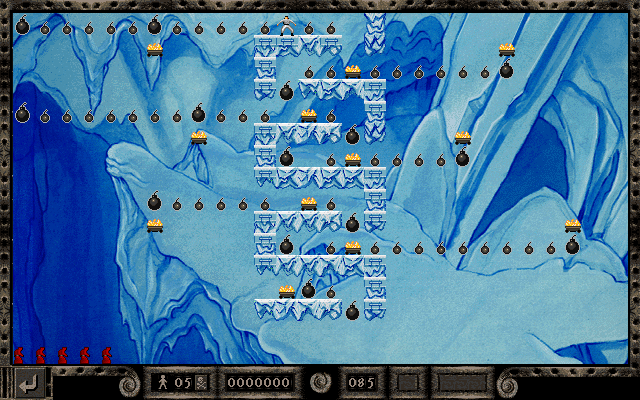

## Level 085
BOMBER!! 
- [Schematic](pngs_schema/085_s.png)
- <a href="pngs_labeled/LR_EXTRA_1P - 085 - ICEW - BOMBER.png">Labeled image</a>
  

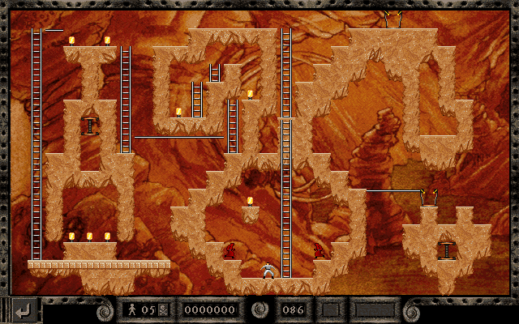

## Level 086
BUNNY'S PUZZLE 
- [Schematic](pngs_schema/086_s.png)
- <a href="pngs_labeled/LR_EXTRA_1P - 086 - FOSS - BUNNY'S PUZZLE.png">Labeled image</a>
  

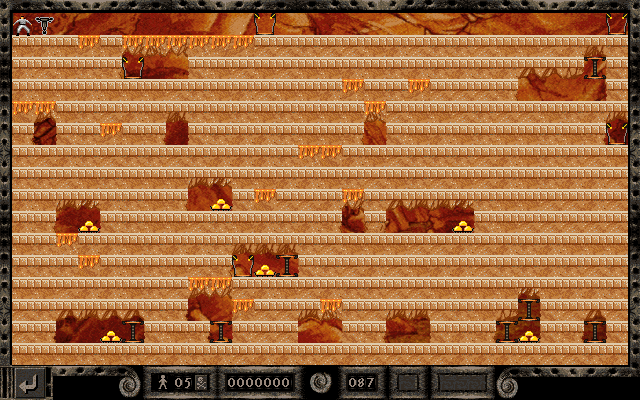

## Level 087
DIG 
- [Schematic](pngs_schema/087_s.png)
- <a href="pngs_labeled/LR_EXTRA_1P - 087 - FOSS - DIG.png">Labeled image</a>
  

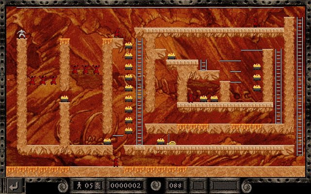

## Level 088
ON HEAD 
- [Schematic](pngs_schema/088_s.png)
- <a href="pngs_labeled/LR_EXTRA_1P - 088 - FOSS - ON HEAD.png">Labeled image</a>
  

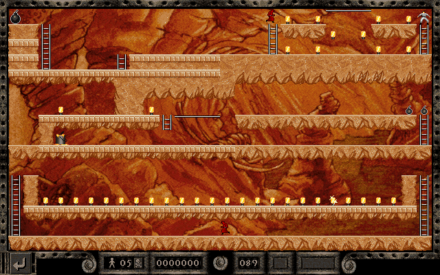

## Level 089
TAR TRAP 
- [Schematic](pngs_schema/089_s.png)
- <a href="pngs_labeled/LR_EXTRA_1P - 089 - FOSS - TAR TRAP.png">Labeled image</a>
  

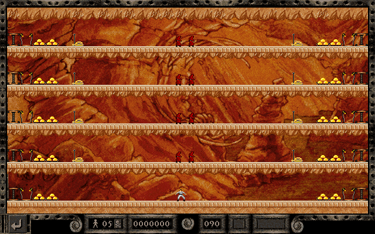

## Level 090
TRAP&TRAP 
- [Schematic](pngs_schema/090_s.png)
- <a href="pngs_labeled/LR_EXTRA_1P - 090 - FOSS - TRAP&TRAP.png">Labeled image</a>
  

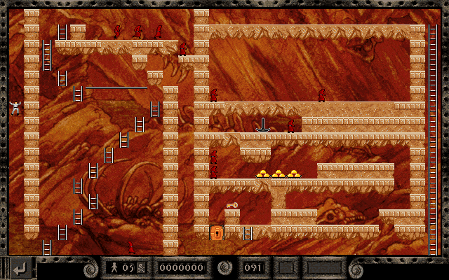

## Level 091
RUN A WAY! 
- [Schematic](pngs_schema/091_s.png)
- <a href="pngs_labeled/LR_EXTRA_1P - 091 - FOSS - RUN A WAY.png">Labeled image</a>
  

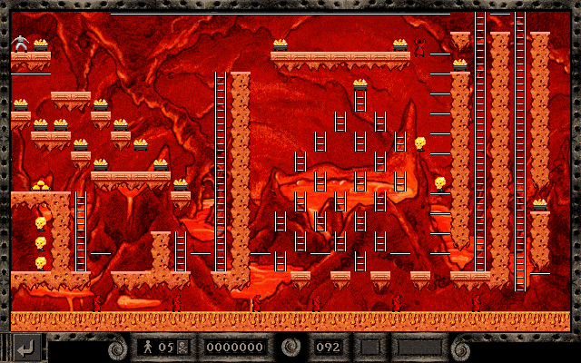

## Level 092
UNDERGROUND 
- [Schematic](pngs_schema/092_s.png)
- <a href="pngs_labeled/LR_EXTRA_1P - 092 - LAVA - UNDERGROUND.png">Labeled image</a>
  

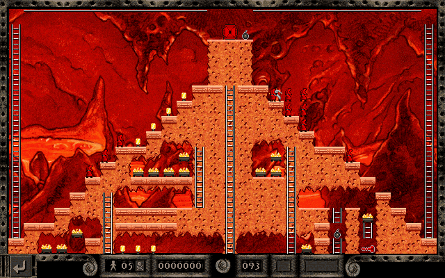

## Level 093
VOLCANIC ERUPTION 
- [Schematic](pngs_schema/093_s.png)
- <a href="pngs_labeled/LR_EXTRA_1P - 093 - LAVA - VOLCANIC ERUPTION.png">Labeled image</a>
  

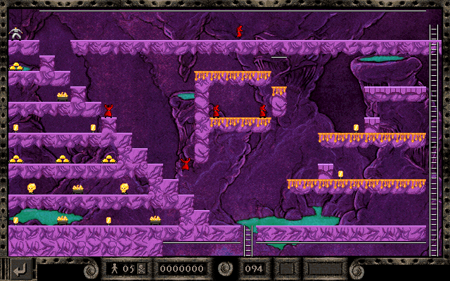

## Level 094
NORI 
- [Schematic](pngs_schema/094_s.png)
- <a href="pngs_labeled/LR_EXTRA_1P - 094 - PHOS - NORI.png">Labeled image</a>
  

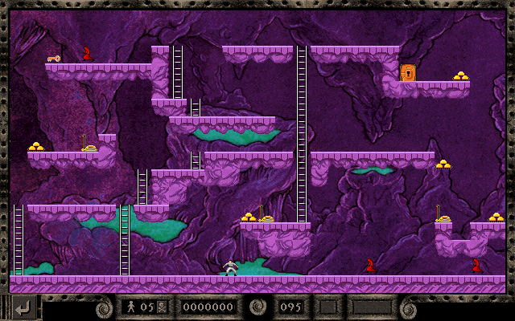

## Level 095
KEEP A EXISTENCE 
- [Schematic](pngs_schema/095_s.png)
- <a href="pngs_labeled/LR_EXTRA_1P - 095 - PHOS - KEEP A EXISTENCE.png">Labeled image</a>
  

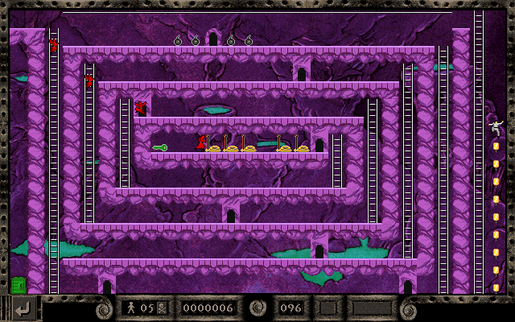

## Level 096
Y'S SPIRAL 
- [Schematic](pngs_schema/096_s.png)
- <a href="pngs_labeled/LR_EXTRA_1P - 096 - PHOS - Y'S SPIRAL.png">Labeled image</a>
  

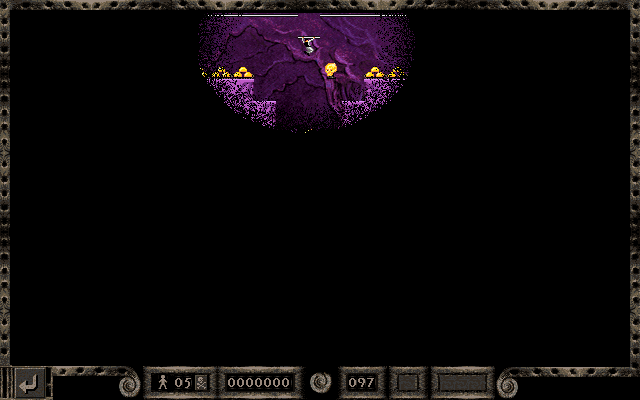

## Level 097
A STOPLIGHT 
- [Schematic](pngs_schema/097_s.png)
- <a href="pngs_labeled/LR_EXTRA_1P - 097 - PHOS - A STOPLIGHT.png">Labeled image</a>
  

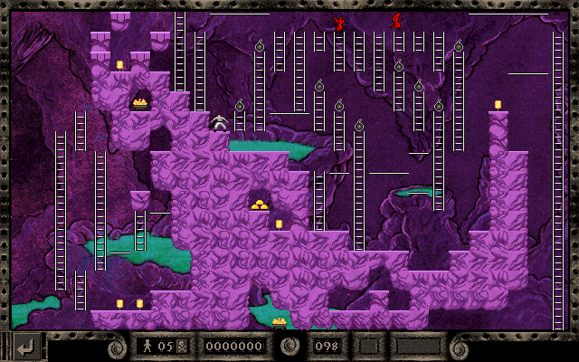

## Level 098
DRAGON SLAYER 
- [Schematic](pngs_schema/098_s.png)
- <a href="pngs_labeled/LR_EXTRA_1P - 098 - PHOS - DRAGON SLAYER.png">Labeled image</a>
  

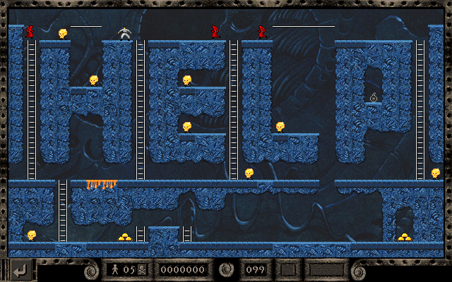

## Level 099
HELP! 
- [Schematic](pngs_schema/099_s.png)
- <a href="pngs_labeled/LR_EXTRA_1P - 099 - DARK - HELP.png">Labeled image</a>
  

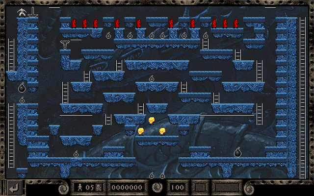

## Level 100
\<MOUNTAIN> 
- [Schematic](pngs_schema/100_s.png)
- <a href="pngs_labeled/LR_EXTRA_1P - 100 - DARK - MOUNTAIN.png">Labeled image</a>
  

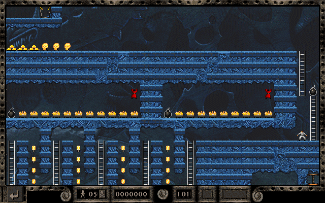

## Level 101
IMPORTANT BIG BOMBER 
- [Schematic](pngs_schema/101_s.png)
- <a href="pngs_labeled/LR_EXTRA_1P - 101 - DARK - IMPORTANT BIG BOMBER.png">Labeled image</a>
  

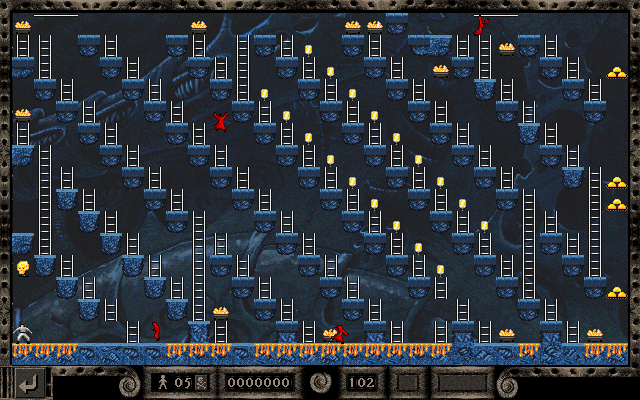

## Level 102
QUICK START 
- [Schematic](pngs_schema/102_s.png)
- <a href="pngs_labeled/LR_EXTRA_1P - 102 - DARK - QUICK START.png">Labeled image</a>
  

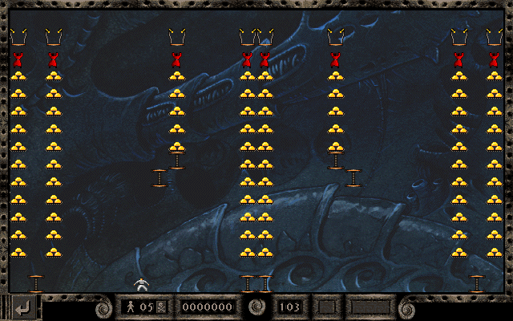

## Level 103
FALLING ON THE HEAD 
- [Schematic](pngs_schema/103_s.png)
- <a href="pngs_labeled/LR_EXTRA_1P - 103 - DARK - FALLING ON THE HEAD.png">Labeled image</a>
  

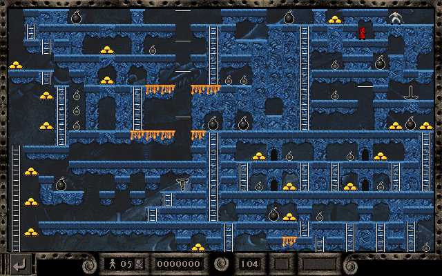

## Level 104
HARD TIME 
- [Schematic](pngs_schema/104_s.png)
- <a href="pngs_labeled/LR_EXTRA_1P - 104 - DARK - HARD TIME.png">Labeled image</a>
  

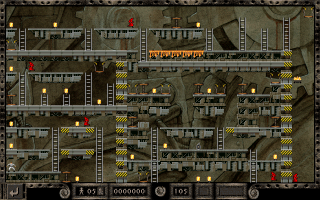

## Level 105
UZIIE2 
- [Schematic](pngs_schema/105_s.png)
- <a href="pngs_labeled/LR_EXTRA_1P - 105 - INDU - UZIIE2.png">Labeled image</a>
  

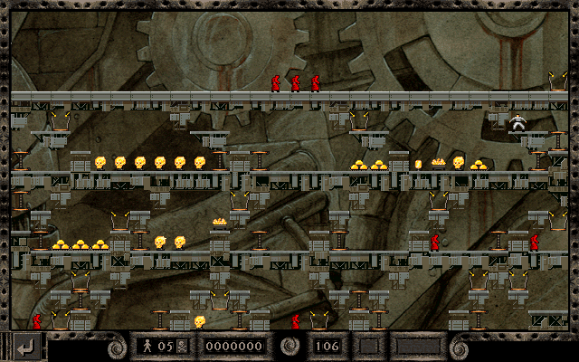

## Level 106
FOWARD MACHINE 
- [Schematic](pngs_schema/106_s.png)
- <a href="pngs_labeled/LR_EXTRA_1P - 106 - INDU - FOWARD MACHINE.png">Labeled image</a>
  

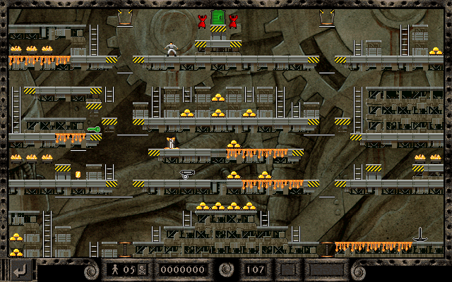

## Level 107
HIDDEN G 
- [Schematic](pngs_schema/107_s.png)
- <a href="pngs_labeled/LR_EXTRA_1P - 107 - INDU - HIDDEN G.png">Labeled image</a>
  

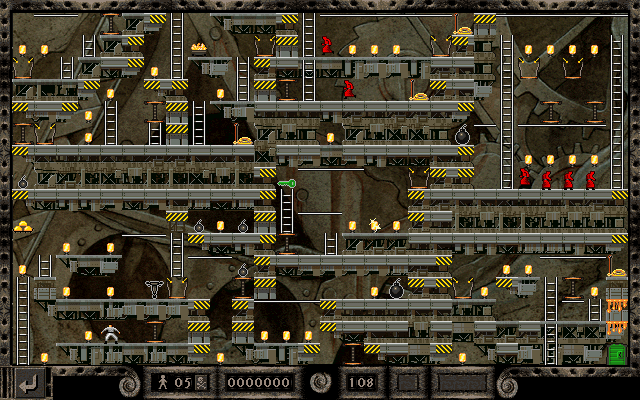

## Level 108
TREMENDOUS 
- [Schematic](pngs_schema/108_s.png)
- <a href="pngs_labeled/LR_EXTRA_1P - 108 - INDU - TREMENDOUS.png">Labeled image</a>
  

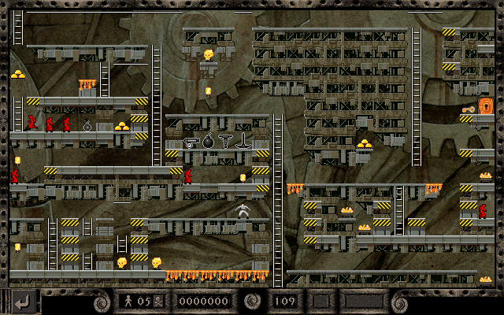

## Level 109
USE ITEM 
- [Schematic](pngs_schema/109_s.png)
- <a href="pngs_labeled/LR_EXTRA_1P - 109 - INDU - USE ITEM.png">Labeled image</a>
  

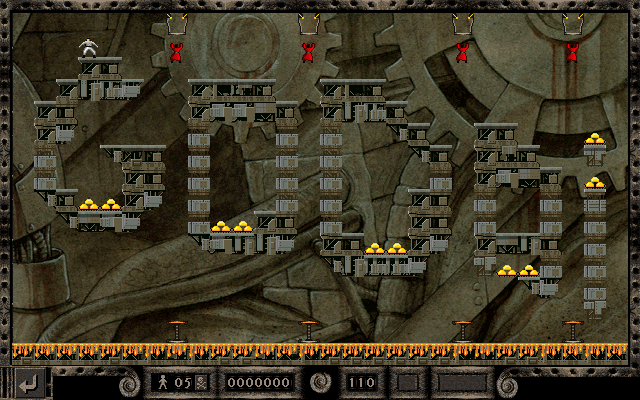

## Level 110
GODAI 
- [Schematic](pngs_schema/110_s.png)
- <a href="pngs_labeled/LR_EXTRA_1P - 110 - INDU - GODAI.png">Labeled image</a>
  

