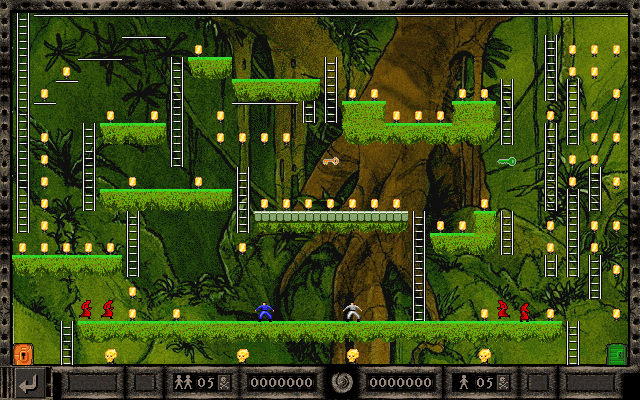

## Level 001
WELCOME!! 
- [Schematic](pngs_schema/001_s.png)
- <a href="pngs_labeled/LR_EXTRA_2P - 001 - MOSS - WELCOME.png">Labeled image</a>
  

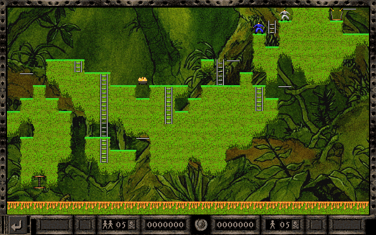

## Level 002
AROUND JAPAN 
- [Schematic](pngs_schema/002_s.png)
- <a href="pngs_labeled/LR_EXTRA_2P - 002 - MOSS - AROUND JAPAN.png">Labeled image</a>
  

## Level 003
CHARITY 
- [Schematic](pngs_schema/003_s.png)
- <a href="pngs_labeled/LR_EXTRA_2P - 003 - MOSS - CHARITY.png">Labeled image</a>
  

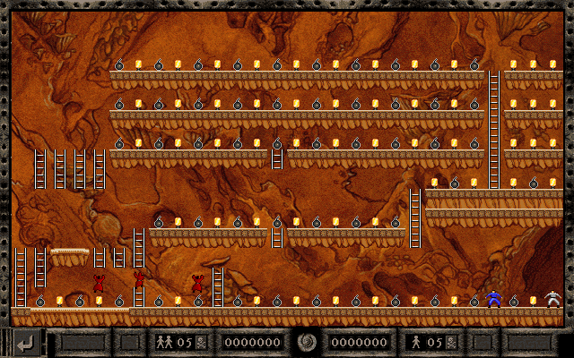

## Level 004
BOMB AND COINS 
- [Schematic](pngs_schema/004_s.png)
- <a href="pngs_labeled/LR_EXTRA_2P - 004 - FUNG - BOMB AND COINS.png">Labeled image</a>
  

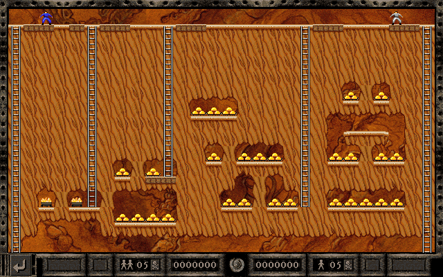

## Level 005
SHOTERS 
- [Schematic](pngs_schema/005_s.png)
- <a href="pngs_labeled/LR_EXTRA_2P - 005 - FUNG - SHOTERS.png">Labeled image</a>
  

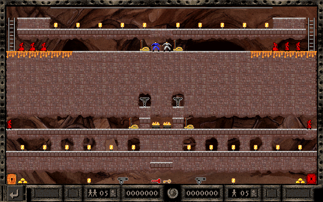

## Level 006
MIRROR 
- [Schematic](pngs_schema/006_s.png)
- <a href="pngs_labeled/LR_EXTRA_2P - 006 - ANCI - MIRROR.png">Labeled image</a>
  

## Level 007
ESCAPE&TRAPS 
- [Schematic](pngs_schema/007_s.png)
- <a href="pngs_labeled/LR_EXTRA_2P - 007 - ANCI - ESCAPE&TRAPS.png">Labeled image</a>
  

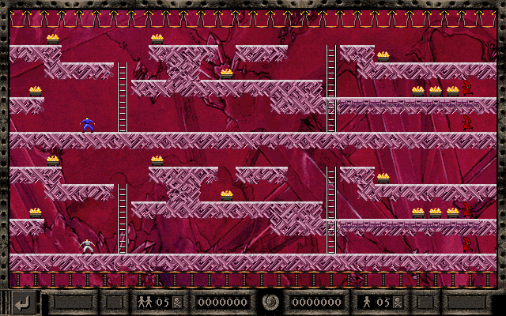

## Level 008
SYMMETRY-2 
- [Schematic](pngs_schema/008_s.png)
- <a href="pngs_labeled/LR_EXTRA_2P - 008 - CRYS - SYMMETRY-2.png">Labeled image</a>
  

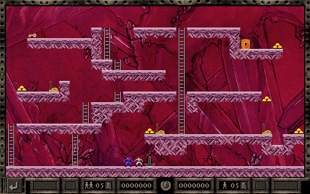

## Level 009
KEEP A LIFE 
- [Schematic](pngs_schema/009_s.png)
- <a href="pngs_labeled/LR_EXTRA_2P - 009 - CRYS - KEEP A LIFE.png">Labeled image</a>
  

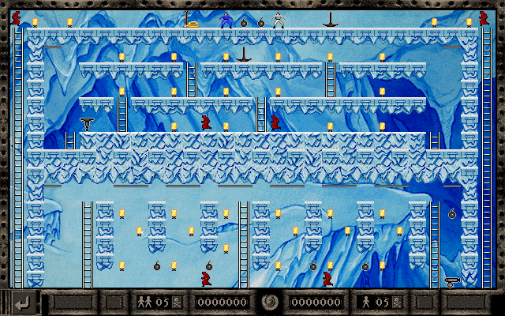

## Level 010
SEPARATE WAYS 
- [Schematic](pngs_schema/010_s.png)
- <a href="pngs_labeled/LR_EXTRA_2P - 010 - ICEW - SEPARATE WAYS.png">Labeled image</a>
  

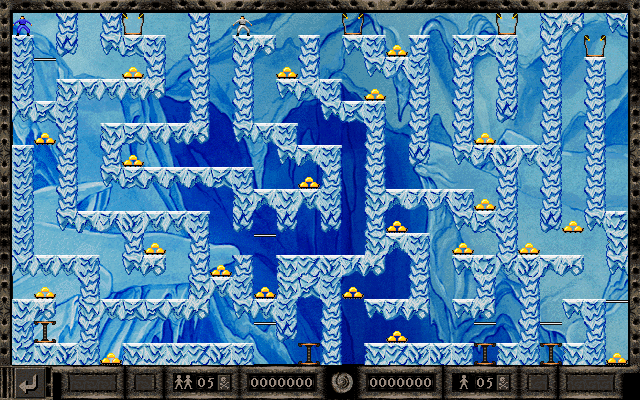

## Level 011
MAZE 
- [Schematic](pngs_schema/011_s.png)
- <a href="pngs_labeled/LR_EXTRA_2P - 011 - ICEW - MAZE.png">Labeled image</a>
  

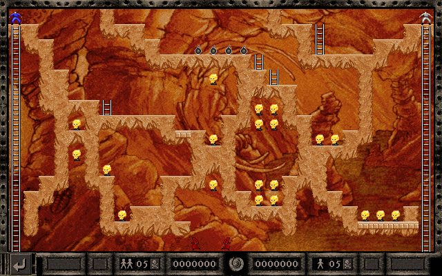

## Level 012
BUILDUP CONNECTION 
- [Schematic](pngs_schema/012_s.png)
- <a href="pngs_labeled/LR_EXTRA_2P - 012 - FOSS - BUILDUP CONNECTION.png">Labeled image</a>
  

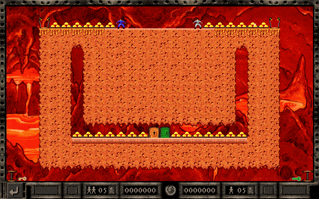

## Level 013
COOPERATION 
- [Schematic](pngs_schema/013_s.png)
- <a href="pngs_labeled/LR_EXTRA_2P - 013 - LAVA - COOPERATION.png">Labeled image</a>
  

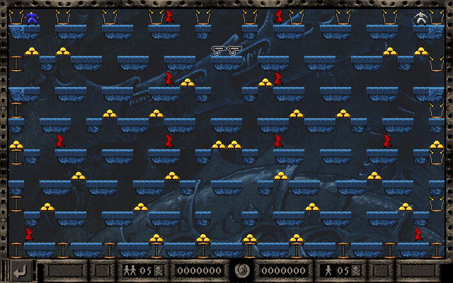

## Level 014
MOSAIC 
- [Schematic](pngs_schema/014_s.png)
- <a href="pngs_labeled/LR_EXTRA_2P - 014 - DARK - MOSAIC.png">Labeled image</a>
  

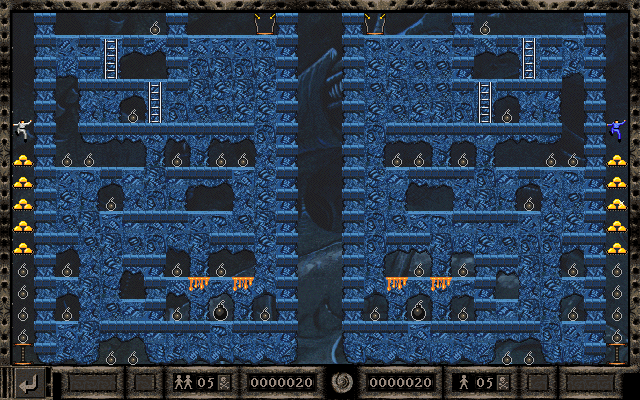

## Level 015
CASTLE 
- [Schematic](pngs_schema/015_s.png)
- <a href="pngs_labeled/LR_EXTRA_2P - 015 - DARK - CASTLE.png">Labeled image</a>
  

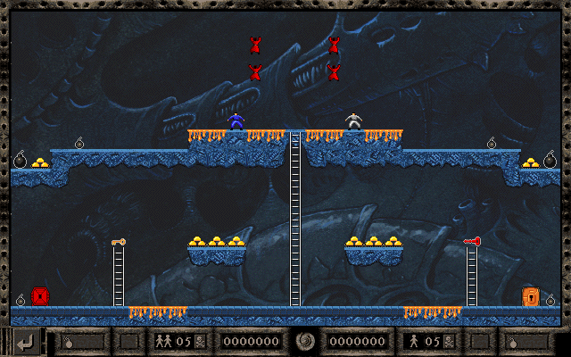

## Level 016
SYMMETRY 
- [Schematic](pngs_schema/016_s.png)
- <a href="pngs_labeled/LR_EXTRA_2P - 016 - DARK - SYMMETRY.png">Labeled image</a>
  

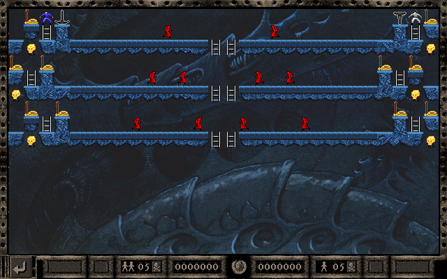

## Level 017
THREE SAUCERS 
- [Schematic](pngs_schema/017_s.png)
- <a href="pngs_labeled/LR_EXTRA_2P - 017 - DARK - THREE SAUCERS.png">Labeled image</a>
  

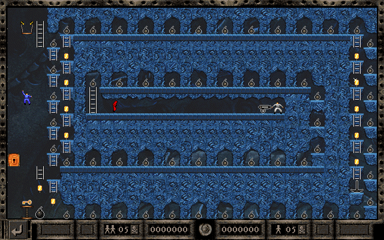

## Level 018
INSIDE & OUTSIDE 
- [Schematic](pngs_schema/018_s.png)
- <a href="pngs_labeled/LR_EXTRA_2P - 018 - DARK - INSIDE & OUTSIDE.png">Labeled image</a>
  

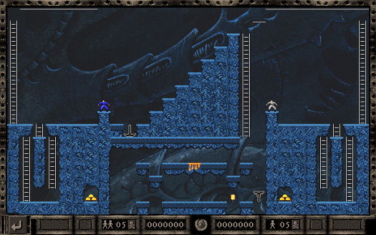

## Level 019
STAIRS 
- [Schematic](pngs_schema/019_s.png)
- <a href="pngs_labeled/LR_EXTRA_2P - 019 - DARK - STAIRS.png">Labeled image</a>
  

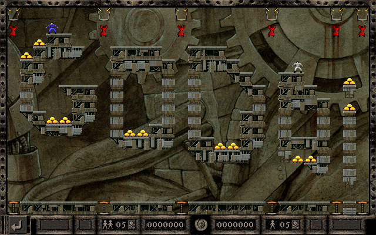

## Level 020
GODAI 
- [Schematic](pngs_schema/020_s.png)
- <a href="pngs_labeled/LR_EXTRA_2P - 020 - INDU - GODAI.png">Labeled image</a>
  

