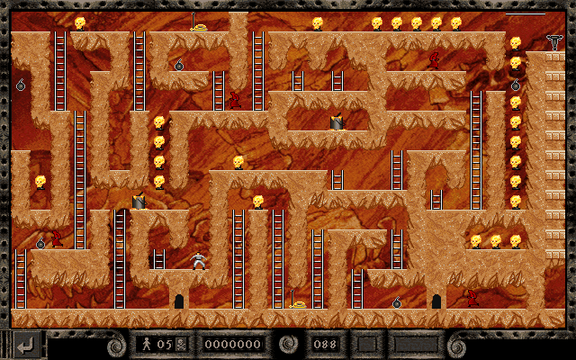

# The Lode Runner Gallery

<table>
<tr><td>
This repository is a tribute to the classic video game <a href="https://en.wikipedia.org/wiki/Lode_Runner">Lode Runner</a>, the Sierra variants in particular published in 1990's.   
  
Twin goals: showcasing uniqueness and beauty of LR levels, and providing the fan community with gold (pun intended!) data on officially released game levels. 
</td>
<td width=490> 
&nbsp; &nbsp; &nbsp; &nbsp; &nbsp; &nbsp;  &nbsp; &nbsp; <em>Can you identify this level? Bet you can (now)!</em> <!-- center tag does not work on GitHub -->
</td>
</tr>
</table>

<!--
This repository is a tribute to the classic video game [Lode Runner](https://en.wikipedia.org/wiki/Lode_Runner), the Sierra variants in particular.  Twin goals: showcasing uniqueness and beauty of LR levels, and providing the fan community with gold (pun intended!) data on officially released game levels. 

|  | 
|:--:| 
| *Can you identify this level? Bet you can (now)!* |
-->
	
<!--

Below works on GitHub, but impossible to put caption

--> 

<!-- works offline, but style does not work on GitHub
<figure style="float:right">

<figcaption><em>Can you identify this level? Bet you can (now)!</em></figcaption>

</figure>
-->

**WHAT:** 
Screenshots of individual levels, data points on levels (origin, 1-player vs. 2-player, "world" information, and title), trivia, pointers to walkthroughs. 

**WHY:** 
What makes Lode Runner so awesome is ingeniousness of individual levels, each of which constitutes a puzzle to solve, yet there hasn't been an easy "internet way" to reference them. With this repository, I finally can! 
Here is [Level 024 entitled "Think Ahead"](LRO_MMR_1P/index.md#level-024), which mystifies me every single time. 
How about <a href="LRO_MMR_1P/pngs_labeled/LRO_MMR_1P - 166 - REEF - MONK RAIN.png">this one aptly named "Monk Rain"</a>, or a [secret Easter-egg level](LRO_MMR_EE1P/index.md#level-002) that paid homage to an even more classic puzzle.  

<!-- [Level 083 "Disorderly Dig"](LRO_MMR_1P/index.md#level-083) which is a long-time favorite -->

**HOW:** 
Screenshots were taken on [_Lode Runner: The Legend Returns_](https://en.wikipedia.org/wiki/Lode_Runner:_The_Legend_Returns) (1994) and [_Lode Runner Online: Mad Monks' Revenge_](https://en.wikipedia.org/wiki/Lode_Runner_Online:_The_Mad_Monks%27_Revenge) (1995), emulated and patched to run on Windows 10. 
Apart from `LR_TLR`, all screenshots were taken on _Lode Runner Online_ (1995), including on the level packs originally published on a different platform (Apple II, PlayStation, etc.). They were produced using LRO-compatible `.pzl`copies, which were ported by fan community. Screenshots for such packs therefore may deviate from their original, "native" forms. 
Level titles and other additional information were scraped or keyed in by myself. 
Level trivia was sourced from fan sites (Jason Summer, etc.) and more. 

## Releases

### Lode Runner Online: Mad Monks' Revenge (`LRO_MMR`, 1995)

- [One-player level pack](LRO_MMR_1P/) (`1P`, 187 levels; [browse all levels here](LRO_MMR_1P/index.md)) 
- Two-player level pack (`2P`, 150 levels)
- [Secret Easter-egg levels](LRO_MMR_EE1P) (`EE1P`, 5 levels; [browse all levels here](LRO_MMR_EE1P/index.md))

### Lode Runner: The Legend Returns (`LR_TLR`, 1994)

- _150 one-player levels are included in_ `LRO_MMR_1P`
- [Two-player level pack](LR_TLR_2P/) (`2P`, 30 levels; [browse all levels here](LR_TLR_2P/index.md))

### Lode Runner Extra (`LR_EXTRA`, 1997, originally released on PlayStation)

- One-player level pack (`1P`, 110 levels; [browse all levels here](LR_EXTRA_1P/index.md))
- Two-player level pack (`2P`, 20 levels; [browse all levels here](LR_EXTRA_2P/index.md))
- Bonus levels (`BN1P`, 6 levels; also called "FORTEST"; [browse all levels here](LR_EXTRA_BN1P/index.md))

<!--

### Lode Runner 2 SuperLite 1500 (`LR2_SLITE`, 2000, originally released on PlayStation as a special-edition re-issue of `LR_EXTRA`)
- One-player level pack (`1P`, 23 additional levels after 110 from `LR_EXTRA_1P`)
- Two-player level pack (`2P`, 3 additional levels after 20 from `LR_EXTRA_2P`)
- _6 bonus levels are the same as_ `LR_EXRA_BN1P`
- THANKS pack (`TH1P`, 66 levels)

### Lode Runner (Original, 1983)
- One-player (150 levels)

### Championship Lode Runner (1984)
- One-player (50 levels)
-->

## Data Specs
Each level pack comes with some/all of the following data files (`LRO_MMR_1P` as example): 

| file/directory | content |
| --- | --- |
| [`index.md`](LRO_MMR_1P/index.md) | A flat web page showcasing all levels |
| [`level_data.tsv`](LRO_MMR_1P/level_data.tsv) 	| 4 columns: pack ID, level #, world ID, title |
| [`level_data_SUPPL.tsv`](LRO_MMR_1P/level_data_SUPPL.tsv) | Contains supplementary information on levels. Currently 3 columns: trivia, two walkthrough sources.  
| [`pngs/`](LRO_MMR_1P/pngs) | Level images in png format: `001.png`, `172.png`, etc.  |
| [`pngs_labeled/`](LRO_MMR_1P/pngs_labeled) | Images are labeled with level-identifying info at the bottom and have a long, descriptive name: `LRO_MMR_1P - 172 - REEF - CAN YOU FIND A SHORTCUT.png` (Special characters `?!<>"` and trailing punctuation such as `...` are stripped.) |
| [`pngs_schema/`](LRO_MMR_1P/pngs_schema) | Schematics of each level, named `001_s.png`, `172_s.png`, etc.  |

**World ID code**:  
There are 12 of them: 
`MOSS` ([Moss world](LRO_MMR_1P/pngs/001.png)), `FUNG` ([Fungus world](LRO_MMR_1P/pngs/016.png)), `ANCI` ([Ancient world](LRO_MMR_1P/pngs/031.png)), `CRYS` ([Crystal world](LRO_MMR_1P/pngs/046.png)), `ICEW` ([Ice world](LRO_MMR_1P/pngs/061.png)), `FOSS` ([Fossil world](LRO_MMR_1P/pngs/076.png)), `LAVA` ([Lava world](LRO_MMR_1P/pngs/091.png)), `PHOS` ([Phosphorus world](LRO_MMR_1P/pngs/106.png)), `DARK` ([Dark world](LRO_MMR_1P/pngs/121.png)), `INDU` ([Industrial world](LRO_MMR_1P/pngs/136.png)), `ASTR` ([Astral world](LRO_MMR_1P/pngs/151.png)), `REEF` ([Reef world](LRO_MMR_1P/pngs/166.png)). Plus, there's the occasional 'classic' theme seen in Easter-egg levels: `CLSC` ([Classic theme](LRO_MMR_EE1P/pngs/ee1.png)). 

## Want to Play?
All of these puzzle packs are bundled with Quark Robot's excellent re-implementation, [_Mad Monks' Revenge: Definitive Edition_](http://mmr.quarkrobot.com/). This is a faithful remake of the game that installs and runs natively on all modern operating systems (Windows, OS X, and Linux). Enjoy! 

## Acknowledgements
Thanks to...

## Disclaimer
Disclaim, disclaim...